# Wind Farm Cooperative Yaw Control Based on Deep Reinforcement Learning

# Wind Farm Cooperative Yaw Control Based on Deep Reinforcement Learning (暂定）

# Author Names

• 指定作者姓名和单位。

$$
\pi^ {*} (s _ {t}) = \arg m a x _ {\pi} \sum_ {t = t _ {0}} ^ {\infty} \gamma^ {t - t _ {0}} (\sum_ {i = 1} ^ {m} n \Delta P _ {i} (\theta_ {t}) + \lambda \cdot \sum_ {i \in U} \sum_ {j \in D o w n (i)} \Delta P _ {j} (\theta_ {t}))
$$

$$
\begin{array}{l} r t = C \cdot N 1 (T o t a l G a i n j = 1 \sum N \Delta P j + c S h a p i n g i \in / D \sum j \in S (i) \sum \Delta P j) = C \cdot \\ N 1 j = 1 \sum N (1 + c m j) \Delta P j. \end{array}
$$

$$
\underbrace {\pi^ {*} (s _ {t}) = a r g m a x} _ {\mathrm{最优策略函数}} \underbrace {\sum_ {t = t _ {0}} ^ {\infty} \gamma^ {t - t _ {0}}} _ {\mathrm{累积最优}} \underbrace {\sum_ {i = 1} ^ {N} \overbrace {(a \cdot P _ {i} (\beta_ {i})} ^ {\mathrm{功率项}} + \overbrace {b \cdot \delta_ {\beta_ {i , t} , \beta_ {i , t - 1}} ^ {\mathrm{动作项}})} ^ {\mathrm{动作项}}}
$$

# Highlights主要贡献

1. 提出了⼀种基于深度强化学习的⻛电场协同偏航控制算法。  
2. 构建了⾼精度尾流建模与控制框架，包含模型和优化算法。  
3. 在不同⻛电场场景中验证了模型的准确性和控制算法的效果。  
4. 对⽐实验结果表明，该⽅法在功率提升和尾流损失控制上优于传统⽅法。

• ⻛电场尾流问题及其对⻛机功率的影响。  
• 深度强化学习在协同优化中的优势。  
• 提出的⽅法、验证的场景及实验结果。   
突出结果与意义（如功率提升⽐例、控制收敛速度等）C

# Keywords关键词

• Wind farm optimization   
Wake modeling   
• Cooperative yaw control   
. Deep reinforcement learning   
• Power maximization   
• Turbulence intensity

# 1. Introduction

# • 主要内容：

# a. 背景：

⻛能的重要性及其在全球能源中的发展潜⼒。  
▪ ⻛电场尾流问题及其对功率和载荷的影响。

# b. 现状：

▪ 传统尾流模型和控制策略的优势与局限性。  
▪ 现有研究在模型精度、控制策略中的不⾜。

# 研究⽬标：

提出⼀种结合⾼精度尾流建模与深度强化学习的协同控制框架。  
验证⽅法的有效性和适⽤性。

⻛能已成为全球可再⽣能源战略的关键组成部分，虽然⻛能在近年来得到了⻓⾜的发展，但仍存在⼀些问题制约着⻛电项⽬的⾼效增⻓。其中⼀个关键问题就是电场中的尾流影响，下游⻛机在上游⻛机扰动的⽓流中运⾏，⼊流⻛速下降、湍流强度增⼤，从⽽导致下游机组输出功率降低。因⽽，准确预测⻛电场的尾流效应对于最⼤化功率输出和优化⻛电场的设计和运⾏⾄关重要。

许多致⼒于⻛机尾流的建模的研究不断在开展，涵盖实验、数值模拟以及分析模型等多种⽅法。尽管实验和数值⽅法，例如湍流解析计算流体动⼒学⽅法的最新进展，计算流体动⼒学（CFD）和⼤涡模拟（LES）能够详细表征⻛机的尾流，提供相对准确的结果，但其极⼤的计算需求量使其在⼤规模⻛电场优化中不太实际。相⽐之下，分析模型以其简洁性和低计算成本，成为⼀种具有吸引⼒的替代⽅案。

# 2. Methodology

# 2.1研究框架综述

⻛电场协同偏航控制是⼀个复杂的系统⼯程问题，涉及⻛机空⽓动⼒学、尾流相互作⽤以及控制决策等多个⽅⾯。本研究采⽤"先建模后控制"的⽅法论，分为两个主要阶段：⻛电场复杂尾流建模和基于此模型的偏航⻆控制优化。

# 2.1.1研究⽅法概述

近年来，⻛电场协同偏航控制研究主要采⽤五种⽅法：基于规则的⽅法、基于模型的⽅法、数值优化⽅法、数据驱动⽅法和强化学习⽅法。表1⽐较了这些⽅法的特点与优缺点。

<table><tr><td>控制方法类型</td><td>代表性方法</td><td>基本原理</td><td>优点</td><td>局限性</td></tr><tr><td>基于规则的方法</td><td>定时偏航、风向差阈值控制</td><td>根据预设规则(如风向差阈值)进行偏航调整</td><td>实现简单、计算负担小、稳定性高</td><td>无法应对复杂风况、不考虑尾流影响、难以达到全局最优</td></tr><tr><td>基于模型的方法</td><td>反馈控制、预测控制、模型预测控制(MPC)</td><td>基于精确的风机和尾流模型,解析计算最优偏航角</td><td>理论基础扎实、可解释性强、收敛性有保障</td><td>依赖高精度模型、计算复杂度高、难以适应模型不确定性</td></tr><tr><td>数值优化方法</td><td>粒子群优化(PSO)、遗传算法(GA)、模拟退火(SA)</td><td>通过数值搜索找到使目标函数(如总功率)最大的偏航角组合</td><td>不依赖精确模型、能找到全局最优解、可处理非凸优化问题</td><td>实时性差、计算成本高、难以应对动态变化的风况</td></tr><tr><td>数据驱动方法</td><td>风况聚类、案例推理、极限学习机</td><td>基于历史数据构建映射关系,直接预测最优偏航角</td><td>计算效率高、不依赖物理模型、适应性较强</td><td>泛化能力有限、需要大量高质量数据、难以解释</td></tr><tr><td>强化学习方法</td><td>Q学习、深度Q网络(DQN)、PPO、DDPG</td><td>通过与环境交互学习最优控制策略,最大化长期累积奖励</td><td>自主学习能力强、可适应环境变化、不依赖精确模型、在线决策快</td><td>训练过程复杂、需大量样本、难以解释、收敛性难保证</td></tr></table>

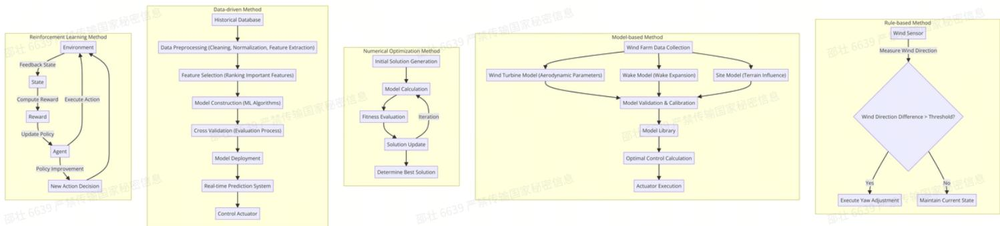

综合分析现有⽅法的优缺点，本研究提出了⼀种结合灰箱模型和深度强化学习的创新⽅法。

如图所⽰，我们的研究框架由两个紧密关联的部分组成：

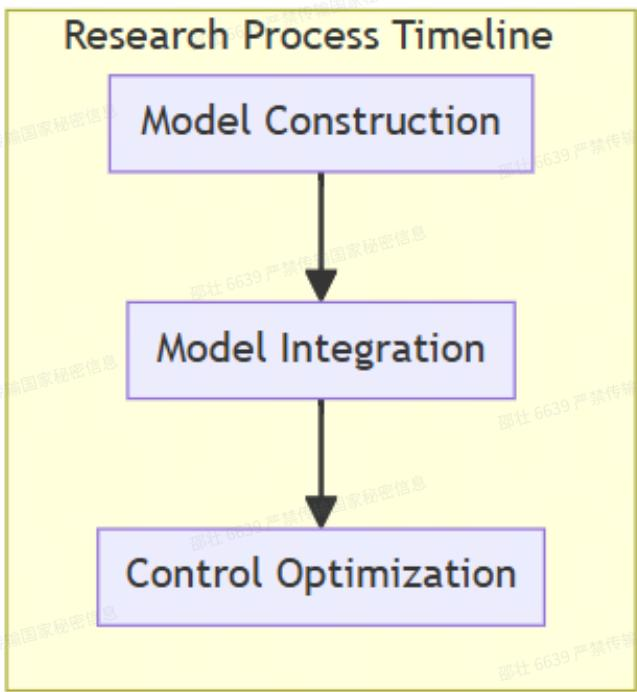

<details>
<summary>flowchart</summary>

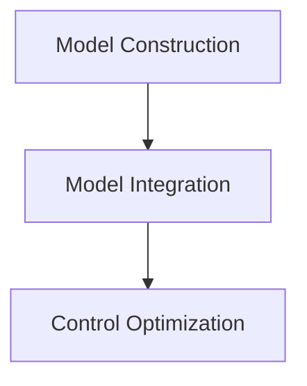
```mermaid
graph TD
    A["Model Construction"] --> B["Model Integration"]
    B --> C["Control Optimization"]
```
</details>

在⻛电场复杂尾流建模阶段，我们融合物理机制和数据驱动⽅法，开发了⼀种考虑偏航⻆、湍流强度和尾流相互作⽤的灰箱模型。相较于纯物理模型，这种灰箱模型在保持物理解释性的同时，通过参数优化提⾼了预测精度；相较于纯数据驱动的⿊箱模型，它具有更好的泛化能⼒和模型稳定性。

在基于深度强化学习的偏航控制优化阶段，我们利⽤构建的⾼精度尾流模型作为训练环境，采⽤PPO算法学习最优偏航控制策略。我们的⽅法引⼊下游⻛机识别与锁定机制，动态调整控制范围，有效减少了搜索空间，提⾼了优化效率。

# 2.1.2创新点与技术路线

本研究的主要创新点包括：

1. 创新的灰箱模型结构：同时考虑偏航⻆、湍流强度和尾流相互作⽤，避免了传统模型在这些因素综合影响下的局限性  
2. 基于多场景数据的参数优化：选取代表不同典型⼯况的数据集，通过加权优化确保模型在各种情况下的适⽤性  
3. 下游⻛机识别与锁定机制：根据⻛向动态识别最下游⻛机并锁定其偏航⻆，减少⽆效搜索空间  
4. 时序状态表⽰：设计基于历史信息的状态矩阵，使控制决策能够充分利⽤系统动态特性

5. 多⽬标奖励设计：综合考虑功率输出和设备使⽤寿命，实现经济效益和可靠性的平衡

我们的技术路线如下：⾸先构建包含⻛速-功率模型、尾流损失模型和⻛场叠加模型的⻛电场复杂尾流模型；通过多场景数据优化模型参数；然后基于优化后的模型，设计强化学习环境并训练PPO智能体；最后通过不同尺度⻛场案例验证⽅法的有效性。

在接下来的章节中，我们将详细介绍⻛电场灰箱模型构建（2.2节）和基于深度强化学习的偏航控制优化（2.3节）两个部分的具体⽅法。

# 2.2复杂尾流及偏航⻆⻛电场模型

经过对相关⽂献的⼴泛研究以及基于现有数学模型的迭代改进，我们开发了⼀个综合考虑偏航⻆效应、湍流强度和尾流相互作⽤的⻛电场模型。该模型主要由三个功能部分组成：⻛速-功率模型、尾流模型、⻛场叠加模型及优化算法。

# 2.2.1 ⻛速-功率模型

⻛机的功率输出是来流⻛速和⻛机特性的函数。⼀般情况下，功率输出P的计算公式为[]：

$$
P = \frac {1}{2} \rho C _ {P} S v ^ {3}
$$

式中：

• ρ ：为空⽓密度， $k g / m ^ { 3 }$   
$C _ { P }$ ：为⻛能利⽤系数： CP =  ρSu 2 1  rated 3 $C _ { P } = \frac { P _ { r a t e d } } { \frac { 1 } { 2 } \rho S u _ { r a t e d } ^ { 3 } }$ Prated  
• $S$ ：为⻛机的叶轮扫⻛⾯积， $m ^ { 2 } : \ { \cal S } = \pi R ^ { 2 }$   
• v ：为⻛机的有效⻛速， $m / s$

在这个模型中，考虑偏航失准（偏航⻆ ）对功率输出的影响，参考了蔡玮[]等⼈的⽅法，并结合实γ验研究数据⽀持，我们在功率输出计算上引⼊了⼀个功率衰减因⼦ $c o s \gamma ^ { 1 . 8 8 }$ 来描述功率损失。修改后的功率输出公式为：

$$
P = \frac {1}{2} \rho C _ {P} S v ^ {3} (c o s \gamma) ^ {1. 8 8}
$$

式中：

• γ ：为偏航⻆，rad ：定义为⻛向与⻛机转⼦法线之间的夹⻆。  
• 指数1.88是⼀个经验系数，通过实验/数值模拟获得，适⽤于低⾄中等偏航⻆的情况。

# 2.2.2 尾流模型

⻛机的尾流特征为⻛速的降低和下游湍流的增加。准确地模拟这些尾流对于预测⻛电场的功率损失⾄关重要。

分析性⻛电场模型主要可分为两⼤类：运动学模型和分布式粗糙度模型。

运动学模型分别考虑每个⻛机的尾流，并应⽤叠加原理来解决相邻尾流的相互作⽤。在分布式粗糙度模型中，⻛机则充当分布式粗糙度元素，修改周围的⼤⽓流动。此外，⼀些模型将两种⽅法特点进⾏了结合。

已有多种分析性尾流模型被开发⽤于估算⻛电场内的尾流。

⽽当⻛机转⼦未与来流⻛向垂直时，会发⽣偏航失准，这可能是有意的（⽤于尾流引导）或由于环境因素造成的。

在已有研究中，⾼斯尾流模型和偏航⻆效应分别⽤于描述尾流分布和其不对称性，但对湍流强度和偏航⻆综合影响的研究仍有⼀定局限性。

为解决这⼀问题，本研究开发了⼀种新型分析⻛电场模型，整合了尾流扩展与恢复过程中的湍流强度变化，并进⼀步优化了偏航⻆对尾流分布影响的描述：

$$
\frac {\Delta U}{U _ {\infty}} = \left(1 - \sqrt {1 - \frac {C _ {T} c o s \gamma}{8 (\sigma_ {y} \sigma_ {z} / d _ {0} ^ {2})}}\right) \times e x p \left(- \frac {1}{2} \left\{\left(\frac {z - z _ {h}}{\sigma_ {z}}\right) ^ {2} + \left(\frac {y - y _ {d}}{\sigma_ {y}}\right) ^ {2} \right\}\right)
$$

式中：

• $k _ { y } = k _ { z } = k ^ { * } = 0 . 3 8 3 7 I + 0 . 0 0 3 6 7 8$   
. $\frac { \sigma _ { y } } { d _ { 0 } } = k ^ { * } \ \frac { x - x _ { 0 } } { d _ { 0 } } \ + \ \frac { c o s \gamma } { \sqrt { 8 } }$ d0   
• $\frac { \sigma _ { z } } { d _ { 0 } } = k ^ { * } \ \frac { x - x _ { 0 } } { d _ { 0 } } \ + \ \frac { 1 } { \sqrt { 8 } }$ =   
• $\frac { x _ { 0 } } { d _ { 0 } } = \frac { c o s \gamma ( 1 + \sqrt { 1 - C _ { T } } ) } { \sqrt { 2 } ( \alpha ^ { * } I + \beta ^ { * } ( 1 - \sqrt { 1 - C _ { T } } ) ) }$ ，式中 $\alpha ^ { * }$ 和 $\beta ^ { * }$ 的值通过后续的优化算法确认  
• 偏航导致的尾流偏转 $y _ { d }$ ：

◦ 对于 $x \leq x _ { 0 }$ ， $y _ { d } = \theta _ { 0 } \cdot \boldsymbol { x }$

◦ 对于 $x > x _ { 0 }$ ：

$$
y _ {d} = \theta_ {0} \cdot x _ {0} + \frac {\theta_ {0}}{1 4 . 7} \sqrt {\frac {c o s \gamma}{k ^ {* 2} C _ {T}}} (2. 9 + 1. 3 \sqrt {1 - C _ {T}} - C _ {T})
$$

$$
\times l n \left[ \frac {\left(1 . 6 + \sqrt {C _ {T}}\right) \left(1 . 6 \sqrt {\frac {8 \sigma_ {y} \sigma_ {z}}{d _ {0} ^ {2} c o s \gamma}} - \sqrt {C _ {T}}\right)}{\left(1 . 6 - \sqrt {C _ {T}}\right) \left(1 . 6 \sqrt {\frac {8 \sigma_ {y} \sigma_ {z}}{d _ {0} ^ {2} c o s \gamma}} + \sqrt {C _ {T}}\right)} \right] \cdot d _ {0}
$$

◦ 当 $x \to \infty$ ：

$$
y _ {d} = \theta_ {0} \cdot x _ {0} + \frac {\theta_ {0}}{1 4 . 7} \sqrt {\frac {c o s \gamma}{k _ {y} k _ {z} C _ {T}}} (2. 9 + 1. 3 \sqrt {1 - C _ {T}} - C _ {T}) l n \left(\frac {1 . 6 + \sqrt {C _ {T}}}{1 . 6 - \sqrt {C _ {T}}}\right) \cdot d _ {0}
$$

式中：

$$
\theta_ {0} = \frac {0 . 3 \gamma}{c o s \gamma} (1 - \sqrt {1 - C _ {T} c o s \gamma})
$$

该模型在保持理论⼀致性的基础上，针对⻛电场的实际运⾏特点进⾏了适应性改进，使其在不同规模和布局下具有更⼴泛的适⽤性。

# 2.2.3⻛场叠加模型

在⼤型⻛电场中，由于⻛机的布局和⻛向的变化，下游⻛机经常受到多个上游⻛机尾流的影响。这种多重尾流的叠加会导致下游⻛机的来流⻛速显著降低，从⽽影响整个⻛电场的功率输出。因此，准确地模拟多个尾流的相互作⽤对于⻛电场性能预测⾄关重要。

为实现这⼀点，⻛电场模型通过将独⽴的尾流模型应⽤于每个单独的⻛机，并结合叠加原理来表⽰多个重叠尾流的综合效应，来预测累积尾流效应。

在传统的尾流叠加模型中，通常假设尾流之间的相互作⽤可以通过固定的叠加原则进⾏处理。然⽽，这种⽅法可能⽆法准确反映复杂的尾流相互作⽤特性。为此，参考张⼦良等⼈的修正的能量守恒模型，引⼊了⼀个基于使⽤优化算法的进⾏求值的混合因⼦ ⽤于调整尾流叠加的效果，能够根据实际α情况动态调整尾流叠加效果，从⽽更灵活地表征尾流之间的相互影响，提⾼模型的预测精度：

$$
U _ {i} = U _ {\infty} - \alpha \sqrt {\sum_ {j} (\Delta U _ {j , i}) ^ {2}}
$$

式中：

• α ：混合因⼦，其值基于优化算法确定，旨在最⼩化模型预测与实际测量之间的误差。  
• $\Delta U _ { j , i }$ ：为上游⻛机 j 对⻛机 i 的尾流速度亏损。  
. 尾流中⼼偏移判定：

为了判断下游⻛机 是否受到上游⻛机 的尾流影响，需要计算尾流中⼼横向横向偏移i j

$$
\Delta y _ {w a k e}: \Delta y _ {w a k e} = y _ {i} - \left(y _ {j} + y _ {d}\right)
$$

◦ 基于尾流⾼斯分布特性，若满⾜ $| \Delta y _ { w a k e } | \le 3 \sigma _ { y }$ ，则认为下游⻛机 位于上游⻛机 的尾流i j影响范围内

# 2.2.4 优化算法Parameter Optimization of the Controlled Model

传统的⻛场尾流模型主要分为两类：基于物理机制的⽩箱模型和纯数据驱动的⿊箱模型。如Fleming等⼈[13]提出的基于物理规律的流体动⼒学模型，虽然能够提供尾流演化的清晰物理解释，但在复杂环境下计算成本⾼且精度有限。⽽Göçmen等⼈[14]开发的纯数据驱动模型虽能捕捉复杂模式，但缺乏物理基础，泛化能⼒较弱。

本研究提出的灰箱模型结合了两者优势：保留了物理模型的基本框架，同时引⼊待定参数并通过数据优化进⾏调整。这种⽅法既保持了模型的物理解释性，⼜提⾼了预测精度，特别适合⻛电场这类复杂系统的建模[15]。在保留⽓动和尾流传播物理规律的同时，通过优化算法校准关键参数，从⽽在计算效率和预测精度之间取得良好平衡。

在模型的前三个部分中，我们建⽴了⻛⼒发电机的功率输出计算模型、尾流模型和⻛场叠加模型，这些模型中包含了⼀些待定参数，如尾流扩展参数 $\alpha ^ { * }$ 和 $\beta ^ { * }$ ，⻛场叠加参数 以及湍流强度 。为了提 α I⾼模型对实际⻛电场性能的预测精度，我们需要通过优化算法对这些参数进⾏校准。

# 2.2.4.1数值模拟数据集选择

为了使模型具有⼴泛的适⽤性和准确性，我们选择了三种具有代表性的⻛场配置数据集作为参数优化的基础。这些数据集代表了⻛电场中的典型情况，能够全⾯验证模型的有效性，类似于Gebraad等⼈[16]在⻛场优化研究中采⽤的多场景验证⽅法：

1. 三⻛机串联案例：代表⻛机沿⻛向串联排布的极端情况，⽤于验证模型在强尾流⼲扰条件下的表现。  
2. ⼤型⻛场案例：代表实际⽣产中的常⻅⼤型⽹格状⻛电场，⽤于验证模型在复杂多重尾流⼲扰条件下的表现。  
3. 双⻛机串联偏航案例：特别关注偏航⻆对尾流特性的影响，这是本研究的重点，也是后续⻛场协同偏航控制优化的基础。

这三个数据集分别来⾃于段鑫泽等⼈[17]、李鹏⻜等⼈[18]以及Huang和Wan[19]所进⾏的CFD数值模拟结果，其可靠性已得到充分验证。由于本研究后续将重点关注⻛场偏航控制优化，因此在权重设置中对双⻛机串联偏航案例赋予了更⾼的权重，这种基于任务⽬标的权重分配⽅法在Campagnolo等⼈[20]的研究中也有类似应⽤。

# 2.2.4.2 优化⽬标函数

为了优化模型参数，我们定义了⼀个⽬标函数来衡量模型预测结果与数值模拟结果之间的误差。⽬标函数由三个部分组成，分别对应上述三个数据集，这种多⽬标优化⽅法已在Annoni等⼈[21]的研究中被证明能有效提⾼模型的综合表现。

# 2.2.4.2.1 误差定义

对于三⻛机串联案例，关注每台⻛机的功率输出与⽬标值之间的差异，误差定义为：

$$
E _ {3 t} = \sum_ {i = 1} ^ {3} (P _ {i, m o d e l} - P _ {i, C F D}) ^ {2}
$$

式中：

• $P _ { i , m o d e l }$ ：为模型预测的第i台⻛机的功率输出。  
• $P _ { i , C F D }$ ：为数值模拟得到的第i台⻛机的功率输出。

对于⼤型⻛电场案例，关注每列⻛机总功率与⽬标值之间的差异，误差定义为：

$$
E _ {l a r g e} = \sum_ {j = 1} ^ {7} (P _ {c o l, j, m o d e l} - P _ {c o l, j, C F D}) ^ {2}
$$

式中：

. $P _ { c o l , j , m o d e l }$ ：为模型预测的⻛场中第 j 列⻛机的总功率输出。  
? $P _ { c o l , j , C F D }$ ：为数值模拟得到的⻛场中第 j 列⻛机的总功率输出。

对于双⻛机案例，关注⻛机2的功率输出与⽬标值之间的差异，误差定义为：

$$
E _ {2 t} = \sum_ {n = 1} ^ {N} \left(P _ {2, m o d l e} ^ {(n)} - P _ {2, C F D} ^ {(n)}\right) ^ {2}
$$

式中：

• $P _ { 2 , m o d l e } ^ { ( n ) }$ ：为模型预测的⻛机2在偏航⻆ ${ \mathsf n } ^ { \circ }$ 下的功率输出  
• $P _ { 2 , C F D } ^ { ( n ) }$ P2,CFD ：为数值模拟得到的的⻛机 2 在偏航⻆ n° 下的功率输出(n) ${ \mathsf n } ^ { \circ }$

# 2.2.4.2.2 加权总误差函数

综合上述误差，并引⼊权重系数，定义总误差函数为：

$$
E _ {t o t a l} = w _ {3 t} E _ {3 t} + w _ {l a r g e} E _ {l a r g e} + w _ {2 t} E _ {2 t}
$$

式中：

• ${ \boldsymbol { w } } _ { 3 t }$ 、 $w _ { l a r g e }$ 、 $w _ { 2 t }$ 分别为三个数据集的权重参数，满⾜： $w _ { 3 t } + w _ { l a r g e } + w _ { 2 t } = 1$   
根据实际需求，为了使模型在优先需求的数据集上表现更精确，在此处设定权重为：

$$
w _ {3 t} = 0. 2 \left(w _ {3 t - 5 d _ {0}} = 0. 1, w _ {3 t - 7 d _ {0}} = 0. 1\right) 、 w _ {\text { large }} = 0. 2 、 w _ {2 t} = 0. 6
$$

这种权重设置反映了我们对双⻛机串联偏航案例的特别关注，因为该案例直接关系到后续⻛场协同偏航控制优化的核⼼⽬标。类似的加权优化⽅法在Doekemeijer等⼈[23]的⻛场模型参数估计研究中也有应⽤。

# 2.2.4.3优化算法参数设置

我们采⽤⾮线性最⼩⼆乘优化⽅法，调整尾流扩展参数 $\alpha ^ { * }$ 和 $\beta ^ { * }$ ，⻛场叠加参数 以及湍流强度 ， α I以最⼩化总误差函数 $E _ { t o t a l }$ 。这种⽅法在Bottasso等⼈[24]的⻛场模型校准研究中被证明是有效的。

结合⽂献和经验值：

设置参数的初始值为： $\alpha _ { i n i t i a l } ^ { * } = 2 . 3 2$ ， $\beta _ { i n i t i a l } ^ { * } = 0 . 1 5 4$ ， $I _ { i n i t i a l } = 0 . 1 $ ， $\alpha _ { i n i t i a l } = 1 . 0$   
• 参数的取值范围为： $0 . 4 \leq \alpha ^ { * } \leq 3 . 0$ ， $0 . 1 \le \beta ^ { * } \le 0 . 3$ ， $0 . 0 6 5 \leq I \leq 0 . 1 5$ ， $0 . 5 \leq \alpha \leq 1 . 5$

其中初始值的选择参考了Bastankhah和Porté-Agel[25]的研究结果，⽽取值范围则根据Niayifar和Porté-Agel[26]的实验观测确定。需要说明的是，虽然湍流强度 通常是环境参数，但由于在⼤部分数I值模拟给出的环境数据中并不包括湍流强度信息，因此我们将其作为待定参数通过优化算法求值，这种将环境参数纳⼊灰箱模型优化范围的⽅法也在Schreiber等⼈[27]的研究中有所体现。

对于给定的参数组合，计算每个数据集的模型预测结果，使⽤⾮线性最⼩⼆乘算法（Levenberg-Marquardt⽅法）迭代调整参数，使总误差函数 $E _ { t o t a l }$ 最⼩化。当总误差 $E _ { t o t a l }$ 收敛到最⼩值，或者参数的变化⼩于预设阈值时，停⽌迭代，并记录此时的参数组合，类似的优化流程在Fleming等⼈[28]的研究中也有详细描述。

# 2.3 基于深度强化学习的⻛电场协同偏航控制（6.19迭代版）

在完成复杂尾流及偏航⻆⻛电场模型的构建并通过实际⻛场布局案例验证其准确性后（详⻅2.2部分），我们引⼊先进的控制优化算法以确定⻛场的最优协同偏航策略。本节详细介绍⼀种基于深度强化学习（DeepReinforcementLearning,DRL）的⻛电场协同偏航控制⽅法，阐述其算法原理、环境设计、实现细节，并与传统优化⽅法进⾏对⽐分析。

# 2.3.1强化学习在⻛电场控制中的应⽤与挑战

强化学习（ReinforcementLearning,RL）为⻛电场控制提供了⼀种有别于传统⽅法的、具有学习和适应能⼒的解决⽅案。传统控制策略常依赖于固定的逻辑或简化的模型，难以应对⻛况的动态变化和⻛机间复杂的尾流交互。相⽐之下，RL智能体通过与环境（模拟或真实⻛场）的持续交互，在"试错"中学习，能够⾃主发现优化⻛场整体性能的复杂控制策略[33]。

# 其关键优势在于：

• 数据驱动与⾃适应性：RL能够从⾼维、⾮线性的交互数据中学习控制规律，适应不同⻛况和布局。  
策略优化：能够学习⻓期回报最优的策略，⽽不仅是基于当前状态的贪婪决策。  
鲁棒性：训练良好的RL策略对于传感器噪声和模型不确定性具有⼀定的鲁棒性[33]。

然⽽，将RL应⽤于⻛电场协同偏航控制仍⾯临诸多挑战，现有研究存在许多局限：

• 环境模型精度不⾜：已有的部分研究采⽤简化的尾流模型[37]或⻛况模型[36]，未能充分捕捉偏航状态下的复杂尾流演变及真实⻛场的时空变化特性，导致训练出的策略在实际应⽤中效果⽋佳。RL策略的性能⾼度依赖于训练环境的保真度[39]。  
奖励设计不当：多数研究采⽤简单的瞬时功率作为奖励[35]，或添加复杂的多⽬标权衡，这可能导致训练不稳定或陷⼊局部最优。如何设计既能引导有效学习⼜不过度约束探索的奖励函数是⼀个关键挑战。  
• 协同性不⾜或效率低下：⼀些⽅法仅关注单机控制[34]，或虽考虑协同但优化空间巨⼤、学习效率不⾼。针对⻛电场控制问题的结构特性进⾏算法设计，对于提升学习效率⾄关重要[40]。  
• 状态表⽰不充分：未能有效利⽤历史信息来捕捉⻛况和系统状态的时间依赖性，限制了策略的预⻅性和性能[41]。  
• 评估体系不完善：缺乏与基线策略在不同条件下的全⾯对⽐，或评估⽅法不够鲁棒，难以客观评价算法的实际应⽤价值[38]。

# 2.3.2邻近策略优化算法(PPO)算法选择

为解决上述挑战，我们选⽤邻近策略优化（Proximal Policy Optimization, PPO）算法[Schulman etal.,2017]作为核⼼学习算法。PPO属于策略梯度⽅法，以其在连续动作空间任务中优异的样本效率、

训练稳定性和易于实现的特点⽽备受⻘睐。

选择PPO的主要原因包括：

1. 稳定性：通过限制策略更新幅度，PPO避免了传统策略梯度⽅法中常⻅的性能崩溃问题，这对于需要⻓时间训练的⻛电场控制任务尤为重要。  
2. 适⽤性：PPO特别适合处理⻛电场控制中涉及的多智能体（⻛机）交互、⾼维状态/动作空间以及⾮线性动态等复杂问题[36]。  
3. 实现简洁：相⽐其他⾼级算法（如TRPO），PPO的实现更加直接，计算效率更⾼，便于在实际⼯程中部署。

PPO算法的核⼼思想在于通过限制策略更新的幅度来改进策略梯度⽅法的稳定性。其⽬标函数通过裁剪机制限制新旧策略的⽐率变化：

$$
J ^ {C L I P} (\theta) = \hat {E} _ {t} [ \min (r _ {t} (\theta) \hat {A} _ {t}, \operatorname{clip} (r _ {t} (\theta), 1 - \epsilon , 1 + \epsilon) \hat {A} _ {t}) ]
$$

其中：

. θ 是策略⽹络的参数

. $E _ { t }$ 表⽰对时间步 t 采样数据的经验平均

$r _ { t } ( \theta ) = \frac { \pi _ { \theta } ( a _ { t } | s _ { t } ) } { \pi _ { \theta _ { o l d } } ( a _ { t } | s _ { t } ) }$ 是新策略 $\pi _ { \theta }$ 相对于收集数据时的旧策略 $\pi _ { \theta _ { o l d } }$ 的概率⽐。

. $\hat { A } _ { t }$ 是在时间步 的优势函数（Advantage Function）的估计值，通常使⽤⼴义优势估计t（Generalized Advantage Estimation, GAE）[Schulman et al., 2016]计算，表⽰当前动作 $a _ { t }$ 相对于平均动作的好坏程度。

• ϵ 是裁剪参数（Hyperparameter），控制策略更新的允许范围（本研究设为0.2）

$\mathrm { c l i p } ( x , m i n , m a x )$ 将⽐率限制在 $[ m i n , m a x ]$ 区间内

该⽬标函数通过取两种计算⽅式的最⼩值，有效地将策略更新限制在⼀个信任区域内：当 $\hat { A } _ { t } > 0$ 时，⿎励增加 $a _ { t }$ 的概率，但 $r _ { t } ( \theta )$ 最⼤不超过 $1 + \epsilon \ : ;$ ；当 $\hat { A } _ { t } < 0$ 时，⿎励减⼩ $a _ { t }$ 的概率，但$r _ { t } ( \theta )$ 最⼩不低于 $1 - \epsilon$ 。PPO通常还包含值函数损失和熵奖励项，以稳定训练并⿎励探索。


# 2.3.3深度强化学习控制框架设计

针对⻛电场协同偏航控制的特点和前述挑战，本研究设计并实现了⼀套完整的基于PPO的深度强化学习控制框架。该框架以经过验证的⾼精度⻛电场模型（详⻅章节2.2）为基础，并结合多项针对性设计以提升性能和实⽤性：

1. ⾼保真训练环境：利⽤前⽂构建的考虑湍流强度和偏航⻆综合影响的灰箱尾流模型作为RL环境的核⼼，确保智能体在物理准确的模拟环境中学习。

2. 精细化奖励设计：设计了复合奖励函数，包含基线对⻬的功率增益项（⿎励超越⽆偏航状态的发电量）和个体⻛机动作惩罚项，基于单个⻛机⾏为⽽⾮平均动作进⾏惩罚，实现发电效益与设备维护成本的综合考量。  
3. 下游⻛机锁定机制：基于物理模型的下游⻛机识别机制，根据实时⻛向和尾流撞击分析⾃动识别并"锁定"下游⻛机。对所有⻛向采⽤统⼀的基于物理模型的判断标准（消除硬编码的特殊情况），识别其尾流不会对场内其他⻛机造成显著影响的⻛机，有效降低控制策略的学习难度，符合⼯程实际。  
4. 时序状态表⽰：构建包含历史状态信息（⻛况、偏航⻆、⼊流速度、锁定状态）的时序矩阵作为智能体的输⼊，使其能够感知系统动态，做出更具预⻅性的决策。  
5. 鲁棒的训练与评估流程：采⽤StableBaselines3框架，结合并⾏环境训练、状态/奖励归⼀化、断点续训和带有置信区间的性能评估，确保训练效率、稳定性和结果可信度。

通过这些创新设计，我们的⽅法能够适应⻛况变化、实现⻛机协同控制，并在实际应⽤中表现出良好的响应速度和控制效率。

# 2.3.4强化学习环境的实现

RL环境是智能体学习的交互对象，其设计的合理性直接影响训练效果。本研究的环境基于GymnasiumAPI标准构建，主要包含以下要素：

# 2.3.4.1 状态空间 (Observation Space)

为了使智能体能够基于充分信息进⾏决策，状态空间被设计为⼀个包含历史信息的时序矩阵。该矩阵存储了过去j个时间步（本研究中 ）的关键系统状态。在每个时间步 ，状态j = 1 t $S _ { t }$ 的构成如下：

$$
S _ {t} \text {   components   } = [ \gamma_ {t}, \boldsymbol {u} _ {t}, \phi_ {t}, v _ {t}, \boldsymbol {l} _ {t} ]
$$

其中：

• $\gamma _ { t }$ ：N维向量，表⽰时刻t各⻛机的当前偏航⻆（单位：度）  
. $\mathbf { \Delta } \mathbf { u } _ { t }$ ：N 维向量，表⽰时刻 t 各⻛机计算得到的⼊流⻛速（单位：m/s）  
• ⻛况信息：三维向量，包含时刻t的⻛向的正余弦编码和⾃由来流⻛速 $\left[ c o s ( \phi _ { t } ) , s i n ( \phi _ { t } ) , v _ { t } \right]$ ，这种表⽰⽅式将周期性的⻛向⻆度映射到连续的⼆维空间，有效解决了⻆度在边界处的突变问题，更有利于神经⽹络的稳定学习。  
• $\mathbf { \xi } _ { l _ { t } }$ ：N维向量（0或1），表⽰时刻t各⻛机的锁定状态（1表⽰为下游锁定⻛机，偏航⻆强制为0）因此，在每个时间步，状态信息是⼀个维度为 的向量。若j>1，则将j个这样的向量堆叠并3N + 3展平（flatten），构成⼀个维度为j×(3N+3)的⼀维向量，作为最终的观测状态输⼊给PPO⽹络的输⼊层。这种设计有助于智能体捕捉系统动态，尤其是在⻛况变化的场景下。

# 2.3.4.2 动作空间 (Action Space)

动作空间定义了智能体在每个时间步可以执⾏的操作。

本研究中，动作为连续型：

每个动作是⼀个 N 维向量 $a _ { t } = [ \Delta \gamma _ { 1 , t } , \Delta \gamma _ { 2 , t } , . . . , \Delta \gamma _ { N , t } ]$ 。  
. $\Delta \gamma _ { i , t }$ 代表第 i 台⻛机在时间步 t 的偏航⻆调整量（单位：度）。  
• 调整量被限制在[−5,+5]度之间，以模拟实际偏航驱动机构的速度限制，避免不切实际的剧烈调整。  
• 对于被识别为下游锁定的⻛机，其对应的 $\Delta \gamma _ { i , t }$ 会在环境内部被强制设为 $0 _ { \circ }$

# 2.3.4.3 奖励函数 (Reward Function)

奖励函数的设计是强化学习成功的关键。本研究采⽤了⼀种精⼼设计的基于基线对⽐的奖励机制，其核⼼理念是直接衡量协同偏航策略带来的每台⻛机的平均功率增益：

$$
R _ {t} = \left(\frac {P _ {\text {current}} - P _ {\text {baseline}}}{N}\right) \times C
$$

其中：

• $P _ { b a s e l i n e }$ ：在当前⻛况下，所有⻛机偏航⻆为零时的基线总功率（单位：MW）。该值在每个reset周期开始时计算⼀次。  
• $P _ { c u r r e n t }$ ：智能体采取动作后，各⻛机在其实际偏航⻆下的当前⻛场总功率 （单位：MW）。  
. N ：⻛机总数  
• :⼀个常数缩放因⼦（代码中设为10），⽤于将归⼀化后的奖励信号调整到合适的数值范围，便C于神经⽹络进⾏有效的梯度更新。

这种设计具有以下关键特性：

1. 清晰的优化⽬标：奖励直接反映了协同偏航策略带来的功率增益（或损失），为智能体提供了明确的学习信号。  
2. 内在的平衡机制：当偏航策略导致总功率低于基线时，奖励⾃然为负值，⾃然地平衡了追求功率提升和避免不当控制之间的权衡。  
3. ⿎励充分探索：这种纯粹基于性能改进的奖励函数允许智能体在训练过程中充分探索各种偏航策略。在⻛电场控制中，由于⻛况的复杂性和尾流相互作⽤的⾮线性，最优策略往往需要多台⻛机的协同偏航，⽽这种策略可能需要通过⼤量探索才能发现。  
4. 归⼀化设计：通过除以⻛机数量 进⾏归⼀化，使得奖励信号的尺度与⻛场规模⽆关。这极⼤地N提升了算法的稳定性，并有助于将在特定规模⻛场上训练好的模型泛化应⽤到其他规模的⻛场中。

这种简洁⽽有效的奖励设计，结合PPO算法的稳定性和我们⾼保真的⻛场模型，使得智能体能够学习到在不同⻛况下的最优协同偏航策略。

# 2.3.4.4下游⻛机识别与锁定

为简化控制问题、提升学习效率并符合⼯程实践，本研究实现了⼀套基于尾流影响的下游⻛机动态识别与锁定机制。

其核⼼思想是：如果⼀台⻛机的尾流不会对⻛场中其他任何更下游的⻛机产⽣显著的负⾯影响（即速度亏损低于某⼀阈值），则该⻛机被视为“最终下游”⻛机，并将其偏航控制锁定（即不参与主动偏航调整）。

具体识别过程如下：

1. 对于⻛场中的每⼀台⻛机 $T _ { i }$ （作为潜在的尾流产⽣者）：

◦ 遍历⻛场中所有其他⻛机 $T _ { j }$ 。  
◦ 判断 $T _ { j }$ 是否位于 $T _ { i }$ 的下游（即 $T _ { j }$ 是否可能受到 $T _ { i }$ 尾流的影响）。这涉及到将⻛场坐标根据当前⻛向旋转到⻛向对⻬坐标系下，然后⽐较⻛机间的相对位置。  
◦ 如果 $T _ { j }$ 位于 $T _ { i }$ 的下游，则利⽤章节2.2中所述的尾流模型，计算在 $T _ { i }$ 当前偏航⻆ $\gamma _ { i }$ 的情况下，其尾流在 $T _ { j }$ 位置处产⽣的速度亏损 $\Delta U _ { i j }$ 。此计算会考虑尾流的偏转和扩展。  
◦ 将计算得到的 $\Delta U _ { i j }$ 与⼀个预设的显著性阈值（例如，⾃由来流⻛速的1%）进⾏⽐较。  
◦ 如果对于所有的下游⻛机 $T _ { j }$ ， $\Delta U _ { i j }$ 均未超过该显著性阈值，则表明⻛机 $T _ { i }$ 的尾流不会对后续⻛机造成明显⼲扰。这种情况下，⻛机 $T _ { i }$ 被识别为“最终下游”⻛机。

2. 在环境的每个时间步（ step 函数内）：

◦ 所有被识别为“最终下游”的⻛机，其⽬标偏航调整量 $\Delta \gamma _ { d o w n s t r e a m , t }$ 被强制设为0。  
◦ 同时，这些⻛机的状态偏航⻆ γdownstream,t 也被强制维持在0度。

该机制通过物理上更合理的判据来确定哪些⻛机⽆需参与协同偏航，从⽽有效地降低了控制策略需要探索的动作空间维度。

这不仅有助于加速强化学习算法的收敛，也避免了对那些偏航调整⼏乎⽆益（甚⾄可能因⾃⾝⼩⻆度偏航⽽损失功率）的⻛机进⾏不必要的控制动作，更贴近实际⻛电场的优化运⾏逻辑。

# 2.3.5模型训练、评估与优化

# 2.3.5.1算法实现与环境配置

我们在 Stable Baselines 3 [Raffin et al., 2021] 框架下实现了PPO算法，具体配置如下：

⽹络结构：

策略⽹络和值⽹络均采⽤多层感知机（MLP）  
• ⽹络架构：[256, 256, 128]神经元， $\mathsf { l o g \_ s t d \_ i n i t { = } } 0 . 0$

核⼼超参数：

. n\_steps:4096：较⼤的rollout缓冲区确保了每次更新使⽤更多样化的经验数据，这对于捕捉⻛场中的各种⻛况变化⾄关重要。

• batch\_size:512：适中的批量⼤⼩平衡了梯度估计的准确性和计算效率。  
• n\_epochs: 10：在每次数据收集后进⾏充分的优化迭代，充分利⽤收集到的经验。  
• gamma:0.999：接近1的折扣因⼦使模型策略能够考虑⻓远收益，这在⻛电场控制中尤为重要短期的功率损失可能换来⻓期的整体收益提升，有助于突破局部最优。  
gae\_lambda:0.95：较⾼的GAE参数有效平衡了偏差和⽅差，提供稳定的优势估计。  
clip\_range: 0.2：标准的裁剪参数设置，在保证训练稳定性的同时允许适度的策略更新。  
vf\_coef:0.5：平衡的值函数系数确保价值估计的准确性，这对于⻓期规划⾄关重要。  
• max\_grad\_norm:0.5：梯度裁剪防⽌了在复杂⻛况下可能出现的梯度爆炸问题。

# 学习率调度：

• 学习率：从3e-5线性衰减到3e-6：初始较⼩的学习率确保稳定起步，线性衰减策略在训练后期实现精细调整，有助于收敛到更优解。（调整）  
• 熵系数：从0.02线性衰减到0.002：初始较⾼的熵系数⿎励充分探索各种偏航策略，随训练进展逐渐减少但保留最低下限（0.002），确保即使在训练后期也维持必要的探索能⼒，避免过早收敛到次优策略。这种带下限约束的设计特别适合⻛电场控制这种需要持续适应的任务。

以下伪代码概述了基于PPO的⻛电场协同偏航控制训练流程：  
```txt
算法：PPO 用于风电场协同偏航控制（基于 Stable Baselines 3 实现）
初始化：
策略网络 π_θ（参数 θ）和值网络 V_φ（参数 φ）
目标网络参数 θ_old ← θ
初始化 Rollout 缓冲区 D
设置超参数：并行环境数 N_envs，每次更新步数 N_steps，优化轮数 K (n_epochs)，minibatch 大小 M (batch_size)，裁剪参数 ε (clip_range)，折扣因子 γ (gamma)，GAE 参数 λ (gae_lambda)，值函数系数 c1 (vf_coef)，熵系数 c2 (ent_coef，可能随时间衰减)，学习率 α (learning_rate)
初始化 N_envs 个并行的、经过 VecNormalize 包装的风电场环境实例
加载检查点（如果存在且未强制重新训练），恢复模型参数 θ, φ, VecNormalize 统计量，以及优化器状态和总步数 current_total_steps
for 迭代次数 t = 1, 2, ...（直到达到 total_timesteps）do
// --- 数据收集阶段（Rollout）---
for 步数 step = 1 to N_steps do
// 在 N_envs 个环境中并行执行：
获取当前归一化状态 s_t（来自 VecNormalize）
根据当前策略 π_θ(·|s_t) 采样动作 a_t 并计算 log π_θ(a_t|s_t)
执行动作 a_t，环境返回原始奖励 r_raw，下一原始状态 s_raw，终止标志 done
```

```txt
VecNormalize 处理 s_raw 得到 s_{t+1}，处理 r_raw 得到归一化奖励 r_t
将 (s_t, a_t, r_t, done, log π_θ(a_t|s_t), V_φ(s_t)) 存储到缓冲区 D
end for

// --- 优势计算阶段 ---
获取最后一个状态 s_{N_steps} 的值估计 V_last = V_φ(s_{N_steps})
使用缓冲区 D 中的 r_t, V_φ(s_t) 和 V_last,
利用 GAE 计算每个时间步的优势估计 Â_t 和回报目标 ˆY_t = Â_t + V_φ(s_t)

// --- 优化阶段 ---
更新旧策略参数 θ_old ← θ
for 优化轮数 k = 1 to K do
    从缓冲区 D 中随机抽取 minibatch（大小 M）的数据 {s, a, log π_old(a|s), Â, ˆY}
    // 对 minibatch 中的每个样本 (s_j, a_j, log π_old(a_j|s_j), Â_j, ˆY_j):
    计算新策略的 log概率：log π_θ(a_j|s_j)
    计算概率比：r_j(θ) = exp(log π_θ(a_j|s_j) - log π_old(a_j|s_j))
    计算 PPO 裁剪目标损失：
    L^{CLIP}_j(θ) = -min(r_j(θ)ˆA_j, clip(r_j(θ), 1-ε, 1+ε)ˆA_j)
    计算值函数损失 (MSE):
    L^{VF}_j(φ) = (V_φ(s_j) - ˆY_j)^2
    计算熵损失（鼓励探索）：
    L^{S}_j(θ) = -H(π_θ(·|s_j)) // H 是熵函数
    计算总损失（对 minibatch 求平均）：
    L(θ, φ) = mean(L^{CLIP}_j(θ) + c1 * L^{VF}_j(φ) - c2 * L^{S}_j(θ))
    使用 Adam 优化器更新参数 θ 和 φ：
    θ ← θ - α ∇_θ L(θ, φ)
    φ ← φ - α ∇_φ L(θ, φ)
end for
清空 Rollout 缓冲区 D

// --- 调用回调函数 ---
执行 EvalPlotCallback（定期评估模型，保存最佳模型，绘制曲线）
执行 CheckpointResumeCallback（定期保存检查点）
执行 EntropyFloorCallback（更新熵系数 c2）
更新总步数 current_total_steps
end for

返回：最终训练好的策略网络参数 θ（或评估中表现最佳的参数）
```

环境的物理核⼼基于第2.2节的尾流模型，为确保优化过程的物理合理性，本研究使⽤了以下⻛机参数和布局：

• ⻛机型号：NREL 5MW   
. 推⼒系数：CT = 0.8 （假定）

功率系数： $C _ { P }$ 按以下公式计算： $C _ { P } = \frac { P _ { r a t e d } } { \frac { 1 } { 2 } \rho S u _ { r a t e d } ^ { 3 } }$ ，其中 ρSu 2 1  rated 3 Prated $P _ { r a t e d }$ 为⻛机额定功率，$u _ { r a t e d } = 1 1 . 4 m / s$ 为额定⻛速  
• 模型参数： α = ， ， ∗ 3.0 β = ∗ 0.3 α = 1.034718025799208  
• 来流条件：湍流系数 （同此前优化算法确定），⾃由流⻛速I = 0.10354130989971169$U _ { \infty } = 1 1 . 4 m / s$ （同额定⻛速）  
• ⻛场布局：可配置，例如通过 build\_layout 函数⽣成 $N _ { r o w s } \times N _ { c o l s }$ 的规则布局，或使⽤⾃定义坐标。  
• 训练⼯况:在训练阶段，环境设置为随机模式(randomize\_wind=True)。在每个新回合开始时，环境会从⼀个预设的分布中独⽴随机采样⻛况，其中⻛向 $\phi _ { t }$ 的采样范围为 [173°, 353°]，⻛速 $v _ { t }$ 的采样范围为[6,16]m/s。这迫使智能体学习⼀个能够在⼴阔⼯况范围内都表现良好的通⽤策略。  
• 评估⼯况:在性能评估与验证阶段，⻛况则根据测试⽬的被设定为固定值。例如，在进⾏动态稳定性分析时，会采⽤固定的挑战性⼯况（如270°,11.4m/s），以确保不同模型或策略之间⽐较的公平性和可复现性。

# 2.3.5.2训练环境、训练评估与最优模型选择

采⽤StableBaselines3库进⾏模型训练，具体流程和技术特点如下：

• 并⾏训练与环境封装:为⼤幅提升数据采样效率，我们采⽤SubprocVecEnv，通过spawn启动⽅法创建多个（例如8个）并⾏的环境实例进⾏同步数据采集。所有并⾏环境均通过VecNormalize封装，对观测值进⾏实时归⼀化，这对稳定PPO算法的训练⾄关重要。  
. 随机化训练⼯况与泛化能⼒：为确保训练出的策略具有强⼤的泛化能⼒和鲁棒性，所有训练环境均运⾏在随机⼯况模式下。在每个训练回合开始时，⻛况会从以下预设的、具有⼴泛覆盖性的范围内进⾏随机采样：

◦ ⻛速( ):[6,16]m/s，覆盖了NREL5MW⻛机从切⼊⻛速附近到远超额定⻛速的主要运⾏区间v（Region2及部分Region3），以确保智能体能学习在不同功率输出区域的控制策略。  
◦ ⻛向( ):[173°,353°]，覆盖了约180°的⼴⻆，这对于类⽹格布局⽽⾔，已包含了所有独特ϕ的、⾮对称的尾流交互⼏何构型。

通过在这种多样化且充满不确定性的环境中进⾏训练，我们迫使DRL智能体放弃针对特定⼯况的“过拟合”解，转⽽学习⼀个能够在⼴阔运⾏条件下都表现稳健的通⽤协同控制策略。

断点续训与恢复：训练过程具备完整的断点续训能⼒。通过⾃定义的

CheckpointResumeCallback，系统会定期（例如每10万步）保存完整的训练状态，该状态包括PPO模型参数，VecNormalize的统计量以及定义了⻛场布局等关键信息的环境参数。当训练任务重启时，系统会⾃动检测并加载最新的检查点，确保模型和环境状态的⽆缝恢复，这对于需要数千万步⻓周期的训练任务是不可或缺的。

可复现性与训练周期: 设置全局随机种⼦ ( args.seed=42 ) 以保证实验的可复现性。根据⻛场布局的复杂度，总训练步数（args.total\_steps）设定在2000万⾄4000万步之间。需要强调的是，此总步数并⾮⼀个期望的“收敛点”，⽽是作为⼀个充⾜的“计算预算”，旨在确保训练过程能够完整地覆盖策略学习的所有关键阶段：从初步探索，到收敛⾄局部最优，再到可能出现的、发现⾼级协同策略的“⻜跃”，以及“⻜跃”后充分的策略稳定与演化期。

为了客观、鲁棒地评估训练过程中智能体策略的性能：

. 随机化⼯况下的泛化能⼒评估:使⽤⼀组独⽴的并⾏环境（例如4个）进⾏周期性评估。为全⾯检验策略的泛化能⼒，这些评估环境与训练环境⼀样，均设置为⻛况随机模式（randomize\_wind=True）。这意味着，在⼀次评估的多个回合中（例如n\_eval\_episodes=100），每⼀个回合开始时，环境都会从预设的运⾏范围内重新随机采样⼀组⻛况。智能体必须在这⼀百个不同的、随机⽣成的场景下完成任务。  
• 性能指标与置信区间:记录每个评估回合的最终累积奖励。此奖励直接对应于2.3.4.3节中定义的、⽆惩罚的归⼀化功率增益，⽤以衡量策略的纯粹优化效益。这⼀组（100个）奖励值反映了策略在整个⼯况分布上的性能样本集，我们基于此计算其均值和95%置信区间。因此，该置信区间直观地体现了策略性能在不同⻛况下的波动性与稳定性。  
• 基于置信下界（LCB）的最优模型保存:采⽤⽐单纯平均值更鲁棒的置信区间下界（LCB）作为最优模型的选择标准。LCB值最⾼的模型，代表其策略在统计意义上不仅平均回报⾼，⽽且表现稳定、⻛险更低。仅当新模型在LCB指标上超越历史最佳时，我们才将其作为新的“最佳检查点”进⾏保存，并记录其完整的评估历史。  
可视化与历史记录:将每轮评估的步数、平均奖励、置信区间上下限记录到eval\_history\_ci.json ⽂件，并绘制带有置信区间的学习曲线图( eval\_mean\_ci.png )，直观展⽰学习进程和性能波动。回调函数能够加载历史记录并恢复best\_mean\_reward 的跟踪。

# 2.3.5.3 最终评估

我们将通过以下两种核⼼可视化图表，从动态稳定性和综合泛化性两个维度，对最终选定的最优模型进⾏全⾯评估：

1. 闭环控制曲线 (Closed-Loop Control Curve): ⽤于评估策略在特定⼯况下的动态响应和最终稳定性。

在⼀个预设的标准测试⼯况(270°,11.4m/s)下，模型从零偏航初始状态开始，进⾏连续的多步决策调整，直⾄达到或接近⼀个稳定的控制状态。我们将记录并展⽰此过程中各⻛机偏航⻆及⻛场总功率的完整变化轨迹。

该标准⼯况的选择旨在提供⼀个最具代表性且富有挑战性的测试基准。270°⻛向使得⻛机阵列的各⾏基本处于彼此的正下游，构成了最严重的尾流⼲扰场景；11.4m/s的额定⻛速则确保了⻛机运⾏在⾼推⼒、强尾流区域，为偏航控制提供了最⼤的优化潜⼒。在该⼯况下对策略稳定性的评估，能够有效检验其在实际应⽤中应对极端挑战的能⼒。

2. 全⻛向优化率曲线 (Full Wind-Rose Optimization Curve): ⽤于评估策略在整个运⾏⻛向范围内的综合性能与泛化能⼒。

该曲线并⾮单次评估的结果，⽽是⼀系列独⽴评估的集合。我们以⼀个固定的⻛速（同样采⽤11.4m/s以最⼤化优化潜⼒），在[173°,353°]的⻛向范围内以1°为间隔进⾏扫描。在每⼀个⻛向下，我们均执⾏⼀次独⽴的闭环控制测试，待策略稳定后，记录其相较于⽆控制基线的最⼤功率优化率。最终，将所有⻛向下的优化率连接成⼀条曲线。

此曲线全⾯地展⽰了单⼀DRL策略在不同运⾏条件下的适应性和表现。它不仅能揭⽰策略在某些特定⻆度下的优势与权衡（如3.2.2节将要讨论的），其曲线下的积分⾯积也直接关联到⻛电场年发电量（AEP）的提升，是衡量策略综合经济效益和泛化能⼒的核⼼指标。

通过上述设计与实现，本研究构建了⼀个功能完善、训练稳定、评估可靠的DRL⻛电场协同偏航控制框架，为后续的性能分析和对⽐研究奠定了坚实基础。

# 3. Experiments / Case Study案例分析

# 3.1 模型优化与验证案例

在本研究中，我们采⽤了两个阶段的案例分析⽅法：⾸先使⽤三个典型数值模拟案例对模型参数进⾏优化，然后利⽤经典的HornsRev海上⻛电场案例验证优化后模型的适⽤性和准确性。

# 3.1.1模型参数优化数据集

为了使灰箱模型达到最佳预测精度，我们选择了三种具有代表性的⻛场配置数据集进⾏参数优化。这些数据集均基于美国国家可再⽣能源实验室（NREL）开发的5MW标准⻛机，其主要参数如下：

<table><tr><td colspan="2">NREL 5MW 风机主要参数</td></tr><tr><td>参数</td><td>数值</td></tr><tr><td>功率/MW</td><td>5.29</td></tr><tr><td>叶片数</td><td>3</td></tr><tr><td>风轮直径/m</td><td>126</td></tr><tr><td>轮毂高度/m</td><td>87.6</td></tr><tr><td>仰角/(°)</td><td>5</td></tr><tr><td>切入风速/(m/s)</td><td>3</td></tr><tr><td>切出风速/(m/s)</td><td>25</td></tr><tr><td>额定风速/(m/s)</td><td>11.4</td></tr><tr><td>额定转速/(r/min)</td><td>12.1</td></tr><tr><td>锥角/(°)</td><td>2.5</td></tr></table>

# 3.1.1.1 三⻛机串联案例

• 参数：三⻛机串联排布考虑了不同纵向间距的影响，沿⻛向间距分别为 $5 d _ { 0 }$ 和 $7 d _ { 0 }$ ，坐标为：

```python
1 turbine_positions_3t_1 = [(0, 0, z_h), (5 * d_0, 0, z_h), (10 * d_0, 0, z_h)]
2
3 turbine_positions_3t_2 = [(0, 0, z_h), (7 * d_0, 0, z_h), (14 * d_0, 0, z_h)] 
```

. ⽰意图：

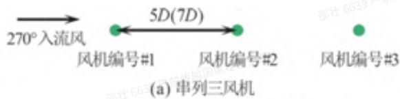

<details>
<summary>text_image</summary>

270°入流风
风机编号#1
5D(7D)
风机编号#2
风机编号#3
(a)串列三风机
</details>

• 数值模拟结果（功率单位：MW）：

<table><tr><td></td><td colspan="4">流向间距 5d0时的功率/MW</td></tr><tr><td>风机编号</td><td>1</td><td>2</td><td>3</td><td>总和</td></tr><tr><td>CFD输出功率</td><td>5.067</td><td>2.116</td><td>1.892</td><td>9.075</td></tr></table>

<table><tr><td></td><td colspan="4">流向间距  $7d_{0}$  时的功率/MW</td></tr><tr><td>风机编号</td><td>1</td><td>2</td><td>3</td><td>总和</td></tr><tr><td>CFD输出功率</td><td>5.067</td><td>2.559</td><td>2.338</td><td>9.964</td></tr></table>

# 3.1.1.2 ⼤型⻛场案例

参数：由35台⻛机组成的⼤型⻛电场，纵向间距为 ，横向间距为 ，⼊流⻛速为4.3d0 3.3d0$1 1 . 4 m / s$ （额定⻛速），⻛机布局为正对⻛向7列排布，每列5个⻛机  
⽰意图：

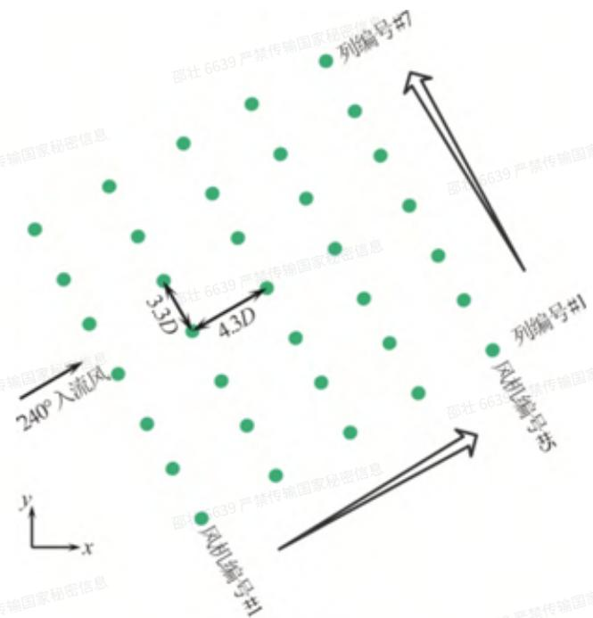

<details>
<summary>text_image</summary>

240°入流风
列编号#7
3.3D
4.3D
列编号#1
风机编号#5
部壮6639严禁传输国家秘密信息
部壮6639严禁传输国家秘密信息
部壮6639严禁传输国家秘密信息
部壮6639严禁传输国家秘密信息
风机编号#1
部壮6639严禁传输国家秘密信息
部壮6639严禁传输国家秘密信息
</details>

. 数值模拟结果（功率单位：MW）

<table><tr><td>列编号</td><td>1</td><td>2</td><td>3</td><td>4</td><td>5</td><td>6</td><td>7</td><td>总和</td></tr><tr><td>CFD输出功率</td><td>12.623</td><td>12.842</td><td>12.735</td><td>12.162</td><td>13.088</td><td>13.664</td><td>13.055</td><td>90.169</td></tr></table>

# 3.1.1.3双⻛机串联偏航案例

. 参数：双⻛机串联排布，间距为5d0 ，坐标为：

```python
1 turbine_positions_2t = [(0, 0, z_h), (5 * d_0, 0, z_h)] 
```

? 引⼊上游⻛机偏航⻆γ ，范围从0到50°  
. 图⽰：

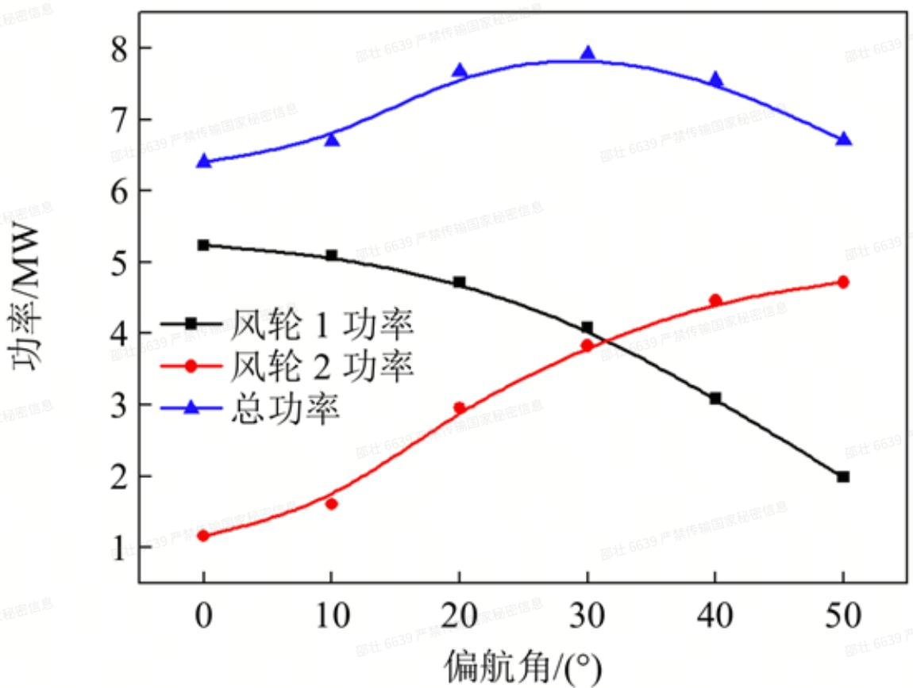

<details>
<summary>line</summary>

| 偏航角/(°) | 风轮 1 功率 (MW) | 风轮 2 功率 (MW) | 总功率 (MW) |
| ---------- | ----------------- | ----------------- | ----------- |
| 0          | 5.2               | 1.1               | 6.4         |
| 10         | 5.0               | 1.6               | 6.7         |
| 20         | 4.7               | 2.9               | 7.6         |
| 30         | 4.0               | 3.8               | 7.9         |
| 40         | 3.0               | 4.4               | 7.5         |
| 50         | 2.0               | 4.7               | 6.7         |
</details>

. 数值模拟结果显⽰：

◦ 上游⻛机（⻛机1）功率逐渐减⼩。  
◦ 下游⻛机（⻛机2）功率逐渐增⼤。  
◦ 总功率先增⼤后减⼩，在偏航⻆为 $3 0 ^ { \circ }$ 时达到最⼤值7.91MW。

在原数据集中，偏航⻆从0°到 $5 0 ^ { \circ }$ 的模拟结果包括三条曲线：⻛机1的输出功率、⻛机2的输出功率以及总输出功率。研究的⽬标是匹配总输出功率曲线的趋势，以找到最优偏航⻆（即曲线呈现先上升后下降的拐点）。由于⻛机1为上游⻛机，⼊流⻛速为⾃然⻛，总输出功率曲线的趋势主要受⻛机2影响，因⽽应将优化条件设置为⻛机2的输出功率。

模型中设置的偏航⻆输⼊范围为[0,50]，步⻓为1。然⽽，原数据集中仅提供了总输出功率曲线的五个读数点：

```python
1 gamma_points = [0, 10, 20, 30, 40, 50]
2 power_points = [1.1, 1.6, 2.99, 3.9, 4.4, 4.8]。 
```

因⽽需要对这些离散点进⾏插值，⽣成⼀条连续的曲线⽤于对⽐分析，根据以上取点分别进⾏线性插值和⾮线性插值得：

Linear and Nonlinear Interpolation   
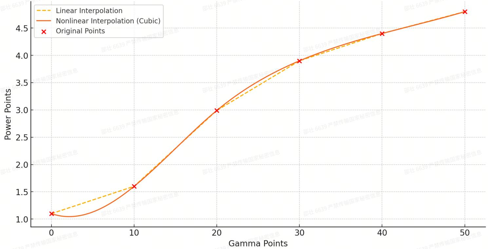

<details>
<summary>line</summary>

| Gamma Points | Linear Interpolation | Nonlinear Interpolation (Cubic) | Original Points |
| ------------ | -------------------- | ------------------------------- | --------------- |
| 0            | 1.1                  | 1.1                             | 1.1             |
| 10           | 1.6                  | 1.6                             | 1.6             |
| 20           | 3.0                  | 3.0                             | 3.0             |
| 30           | 3.9                  | 3.9                             | 3.9             |
| 40           | 4.4                  | 4.4                             | 4.4             |
| 50           | 4.8                  | 4.8                             | 4.8             |
</details>

. 其中⾮线性插值更能匹配原数据曲线的实际趋势。  
. 优化条件：(0,50,1)范围的⻛机2⾮线性插值曲线输出功率数据。

# 3.1.1.4 优化结果分析

通过上述优化算法，我们得到了修正后的模型参数，使得模型在三个数值模拟数据集下的预测结果与实际结果更为接近。经过优化，得到以下参数取值：

∗ = ，2.7276529318810914• α  
. $\beta ^ { * } = 0 . 1$ ，  
• I = 0.065 ，  
• α = 0.5399628787810578

与数值模拟结果相⽐，优化前和优化后的模型在各个案例中的预测结果和误差如下：

<table><tr><td colspan="7">三风机串联案例</td></tr><tr><td></td><td>风机编号</td><td>CFD(MW)</td><td>模型预测(优化前)(MW)</td><td>误差(%)</td><td>模型预测(优化后)(MW)</td><td>误差(%)</td></tr><tr><td rowspan="3">流向间距 $5d_0$ 时的功率</td><td>风机1</td><td>5.067</td><td>5.290</td><td>4.401</td><td>5.29</td><td>4.40</td></tr><tr><td>风机2</td><td>2.116</td><td>1.620</td><td>23.440</td><td>2.16</td><td>2.08</td></tr><tr><td>风机3</td><td>1.892</td><td>1.443</td><td>23.732</td><td>1.96</td><td>3.59</td></tr><tr><td></td><td>总功率</td><td>9.075</td><td>8.353</td><td>7.956</td><td>9.25</td><td>3.69</td></tr><tr><td rowspan="4">流向间距 7d0时的功率</td><td>风机1</td><td>5.067</td><td>5.290</td><td>4.401</td><td>5.29</td><td>4.40</td></tr><tr><td>风机2</td><td>2.559</td><td>2.575</td><td>0.625</td><td>2.96</td><td>15.67</td></tr><tr><td>风机3</td><td>2.338</td><td>2.435</td><td>4.149</td><td>2.80</td><td>19.76</td></tr><tr><td>总功率</td><td>9.964</td><td>10.300</td><td>3.372</td><td>11.05</td><td>10.90</td></tr></table>

⼤型⻛场案例

<table><tr><td>列编号</td><td>CFD (MW)</td><td>模型预测(优化前)(MW)</td><td>误差(%)</td><td>模型预测(优化后)(MW)</td><td>误差(%)</td></tr><tr><td>1</td><td>12.623</td><td>9.663</td><td>23.44926</td><td>11.7854</td><td>6.6355</td></tr><tr><td>2</td><td>12.842</td><td>9.663</td><td>24.75471</td><td>11.7854</td><td>8.2277</td></tr><tr><td>3</td><td>12.735</td><td>9.663</td><td>24.1225</td><td>11.7854</td><td>7.4566</td></tr><tr><td>4</td><td>12.162</td><td>9.663</td><td>20.54761</td><td>11.7854</td><td>3.0965</td></tr><tr><td>5</td><td>13.088</td><td>9.663</td><td>26.16901</td><td>11.7854</td><td>9.9526</td></tr><tr><td>6</td><td>13.664</td><td>9.663</td><td>29.28132</td><td>11.7854</td><td>13.7485</td></tr><tr><td>7</td><td>13.055</td><td>9.663</td><td>25.98238</td><td>11.7854</td><td>9.7250</td></tr><tr><td>总和</td><td>90.169</td><td>67.641</td><td>24.9842</td><td>82.4978</td><td>8.5076</td></tr></table>

双⻛机串联偏航案例

<table><tr><td></td><td>最优偏航角</td><td>风机1功率(MW)</td><td>风机2功率(MW)</td><td>总输出功率(MW)</td><td>趋势图像/关键参数</td></tr><tr><td>数值模拟</td><td>30°</td><td>约4.1</td><td>约3.81</td><td>7.91</td><td></td></tr><tr><td rowspan="2"></td><td rowspan="2"></td><td rowspan="2"></td><td rowspan="2"></td><td rowspan="2"></td><td>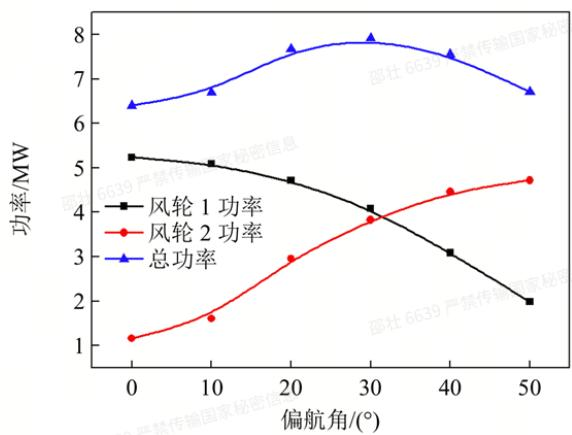</td></tr><tr><td>风机2功率:Yaw=0° 1.100 MWYaw=15° 2.294 MW)Yaw=30° 3.900 MW)Yaw=45° 4.675 MW)</td></tr><tr><td>模型预测(优化前)</td><td colspan="5">Yaw=0° -&gt; Predicted T2 Power: 1.620 MWYaw=15° -&gt; Predicted T2 Power: 1.938 MWYaw=30° -&gt; Predicted T2 Power: 2.764 MWYaw=45° -&gt; Predicted T2 Power: 3.729 MW</td></tr><tr><td>模型预测(优化后)</td><td>29°</td><td>4.11</td><td>3.56</td><td>7.68</td><td>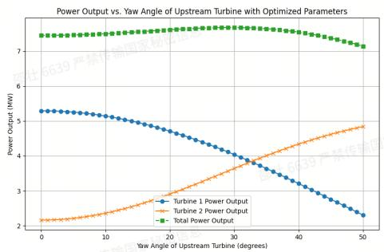</td></tr></table>

# 分析以上结果可以发现：

? 在三⻛机串联案例中，在 （较近距离）场景下，优化显著校准了模型，使其预测精度⼤幅提5d升；对于流向间距 （中距离尾流）⼯况优化前，模型对该⼯况的预测已相当准确，总功率误差7d0仅为3.37%。然⽽，优化后的模型在该⼯况下的预测精度反⽽下降，总功率误差增⼤⾄10.90%。这揭⽰了⼀个关键现象：为了完美拟合的强尾流数据，优化后的参数组合牺牲了部分其在不同间距下的泛化能⼒。  
• 在⼤型⻛场案例中，优化后的模型能够在较⼤规模的⻛场中提供更精确的预测，误差维持在10%左右。  
在双⻛机串联偏航案例中，优化后的模型⼤幅减少了误差，能准确预测下游⻛机功率，更能准确识别出最优的控制⾏为，为后续的强化学习等智能控制算法提供了可靠的仿真基础。  
. 优化过程中采⽤了针对不同数据集的权重设定：

◦ 三⻛机串联（流向间距 $5 d _ { 0 }$ 和 $7 d _ { 0 } )$ ）权重：0.2  
◦ ⼤型⻛场案例权重：0.2  
◦ 双⻛机串联偏航案例权重：0.6

这⼀权重的设定⽤以反映不同⻛场模型和应⽤场景的不同重要性。在此设定下，双⻛机串联偏航案例被赋予了最⾼的权重（0.6），期望其对整体优化结果的影响最⼤，⽽优化结果也体现出更多地关注于双⻛机串联偏航案例的精度提⾼，这说明优化⽅案可以根据具体⻛场类型的需求进⾏灵活调整，以达到最佳的预测精度。

总体⽽⾔，相较于优化前，优化后的模型在多个数据集的预测精度上都有了不同程度的提升，尤其是对双⻛机串联偏航案例，优化带来了显著的精度提升。优化不仅提升了模型预测的准确性，有效地平衡了模型在不同场景中的表现，还增强了其在⻛场规划中的应⽤价值，提升了模型对多种⻛场布局和⻛机布局的适应性和准确性。

在后续的案例分析中，我们将使⽤这组优化参数来验证模型在不同⻛场配置下的表现，并进⼀步探究协同偏航控制策略对⻛场总功率输出的影响。

# 3.1.2 Horns Rev海上⻛电场验证（这部分采⽤的是V-80⻛机，缺失NREL 5⻛机案例）

在完成复杂尾流及偏航⻆⻛电场模型的开发和参数优化后，需要通过实际案例验证模型的准确性和适⽤性。本节将利⽤优化后的模型参数对HornsRev海上⻛电场进⾏仿真分析，并将结果与其他模型进⾏对⽐，以验证模型的性能。

HornsRev海上⻛电场位于北海，距离丹⻨最西端约15公⾥，⾯积约为20平⽅公⾥，由80台VestasV-80⻛⼒涡轮机组成。每台⻛机的⻛轮转⼦直径为 $d _ { 0 } = 8 0 m$ ，轮毂⾼度为 $z _ { h } = 7 0 m$ （海拔⾼度），总额定功率为160MW。

• HornsRev的⻛电场布局⽰意图如下：

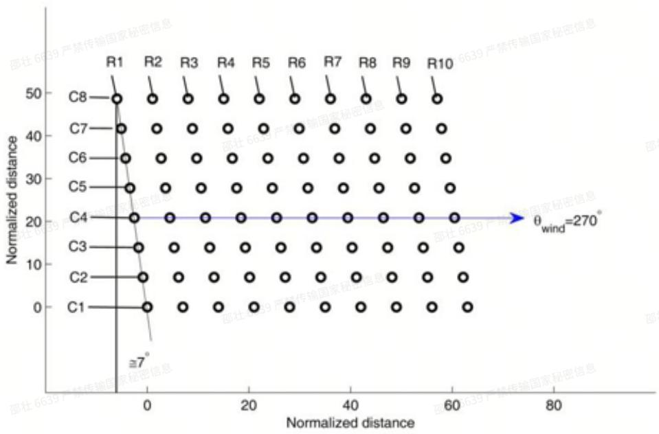

<details>
<summary>scatter</summary>

| City | Normalized distance | Notes                     |
|------|---------------------|---------------------------|
| C8   | 50                  |                           |
| C7   | 40                  |                           |
| C6   | 35                  |                           |
| C5   | 30                  |                           |
| C4   | 20                  |                           |
| C3   | 15                  |                           |
| C2   | 10                  |                           |
| C1   | 0                   |                           |
</details>

⻛电场呈菱形结构，⻛机排列成8列（东西⽅向）和10⾏（与南北⽅向逆时针旋转约7°）。⻛机之间间距均匀，任意两个相邻⻛机的最⼩间距为7倍转⼦直径。

• 指定来流条件为：

◦ 海⾯的⽓动表⾯粗糙度： $z _ { 0 } = 0 . 0 0 0 2 m$   
◦ 在轮毂⾼度的湍流强度： $I = 7 . 7 \%$   
◦ 相同⾼度的平均来⻛⻛速： $U _ { \infty } = 8 m / s$

# 3.1.2.1⻛速-功率特性曲线分析

为了分析⻛电场模型性能，需引⼊⻛机的标准功率特性曲线作为输⼊数据。⼚家提供的VestasV-80⻛机数据如下：

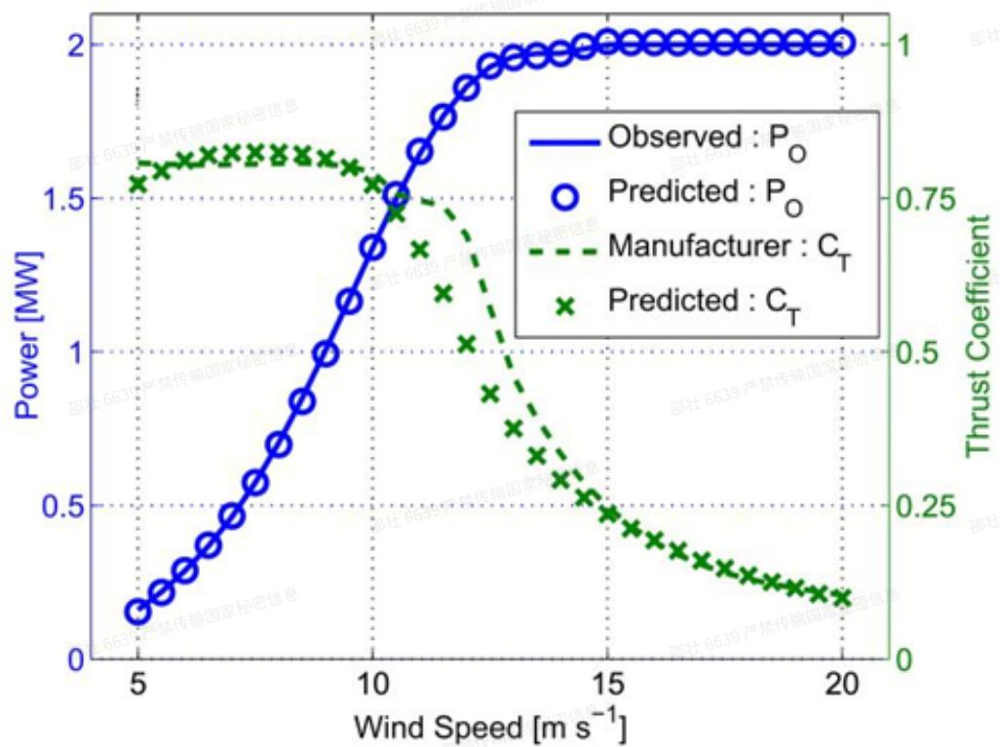

<details>
<summary>bar_line</summary>

| Wind Speed [m s⁻¹] | Observed : Pₒ | Predicted : Pₒ | Manufacturer : Cₜ | Predicted : Cₜ |
| ------------------ | ------------- | -------------- | ----------------- | -------------- |
| 5                  | 0.1           | 0.1            | 0.75              | 0.75           |
| 6                  | 0.2           | 0.2            | 0.7               | 0.7            |
| 7                  | 0.3           | 0.3            | 0.65              | 0.65           |
| 8                  | 0.4           | 0.4            | 0.6               | 0.6            |
| 9                  | 0.5           | 0.5            | 0.55              | 0.55           |
| 10                 | 0.6           | 0.6            | 0.5               | 0.5            |
| 11                 | 0.7           | 0.7            | 0.45              | 0.45           |
| 12                 | 0.8           | 0.8            | 0.4               | 0.4            |
| 13                 | 0.9           | 0.9            | 0.35              | 0.35           |
| 14                 | 1.0           | 1.0            | 0.3               | 0.3            |
| 15                 | 1.1           | 1.1            | 0.25              | 0.25           |
| 16                 | 1.2           | 1.2            | 0.2               | 0.2            |
| 17                 | 1.3           | 1.3            | 0.15              | 0.15           |
| 18                 | 1.4           | 1.4            | 0.1               | 0.1            |
| 19                 | 1.5           | 1.5            | 0.05              | 0.05           |
| 20                 | 1.6           | 1.6            | 0.0               | 0.0            |
</details>

分别对⼚家提供的⻛速- $C _ { T }$ 曲线和⻛速-输出功率曲线进⾏⼿动取点得到数据集，⽽后通过插值得到函数，从⽽向模型中引⼊VestasV-80⻛机的 $C _ { T }$ -⻛速函数，⻛速与 $C _ { P }$ 的关系通过公式：

$$
C _ {P} = \frac {P}{\frac {1}{2} \rho S u ^ {3}} \mathrm{转换得到}
$$

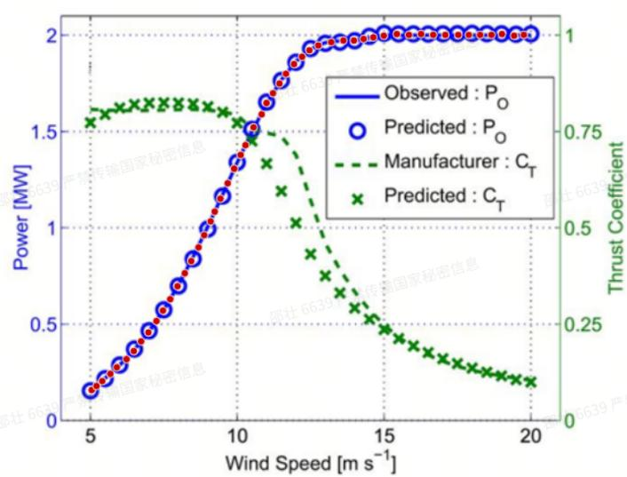

<details>
<summary>line</summary>

| Wind Speed [m s⁻¹] | Observed : P₀ (MW) | Predicted : P₀ (MW) | Manufacturer : Cₜ (MW) | Predicted : Cₜ (MW) | Thrust Coefficient |
| ------------------ | ------------------ | ------------------- | ---------------------- | ------------------- | ------------------ |
| 5                  | 0.1                | 0.1                 | 0.75                   | 0.75                | 0.639              |
| 6                  | 0.2                | 0.2                 | 0.75                   | 0.75                | 0.639              |
| 7                  | 0.3                | 0.3                 | 0.75                   | 0.75                | 0.639              |
| 8                  | 0.4                | 0.4                 | 0.75                   | 0.75                | 0.639              |
| 9                  | 0.5                | 0.5                 | 0.75                   | 0.75                | 0.639              |
| 10                 | 0.6                | 0.6                 | 0.75                   | 0.75                | 0.639              |
| 11                 | 0.7                | 0.7                 | 0.75                   | 0.75                | 0.639              |
| 12                 | 0.8                | 0.8                 | 0.75                   | 0.75                | 0.639              |
| 13                 | 0.9                | 0.9                 | 0.75                   | 0.75                | 0.639              |
| 14                 | 1.0                | 1.0                 | 0.75                   | 0.75                | 0.639              |
| 15                 | 1.1                | 1.1                 | 0.75                   | 0.75                | 0.639              |
| 16                 | 1.2                | 1.2                 | 0.75                   | 0.75                | 0.639              |
| 17                 | 1.3                | 1.3                 | 0.75                   | 0.75                | 0.639              |
| 18                 | 1.4                | 1.4                 | 0.75                   | 0.75                | 0.639              |
| 19                 | 1.5                | 1.5                 | 0.75                   | 0.75                | 0.639              |
| 20                 | 1.6                | 1.6                 | 0.75                   | 0.75                | 0.639              |
</details>

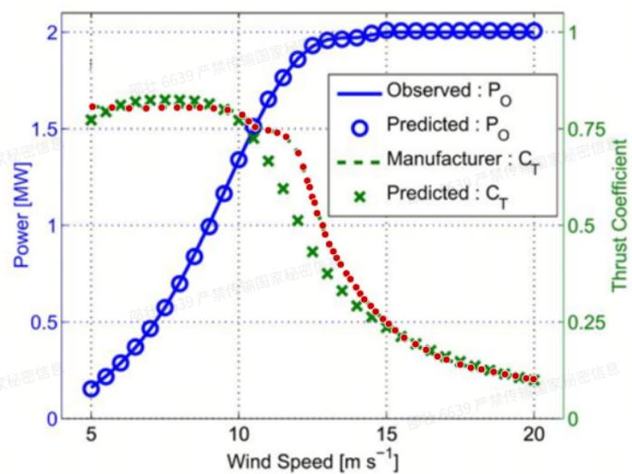

<details>
<summary>line</summary>

| Wind Speed [m s⁻¹] | Observed : P_O | Predicted : P_O | Manufacturer : C_T | Predicted : C_T |
| ------------------ | -------------- | --------------- | ------------------ | --------------- |
| 5                  | 0.2            | 0.2             | 0.75               | 0.75            |
| 6                  | 0.4            | 0.4             | 0.75               | 0.75            |
| 7                  | 0.6            | 0.6             | 0.75               | 0.75            |
| 8                  | 0.8            | 0.8             | 0.75               | 0.75            |
| 9                  | 1.0            | 1.0             | 0.75               | 0.75            |
| 10                 | 1.2            | 1.2             | 0.75               | 0.75            |
| 11                 | 1.4            | 1.4             | 0.75               | 0.75            |
| 12                 | 1.6            | 1.6             | 0.75               | 0.75            |
| 13                 | 1.8            | 1.8             | 0.75               | 0.75            |
| 14                 | 1.9            | 1.9             | 0.75               | 0.75            |
| 15                 | 2.0            | 2.0             | 0.75               | 0.75            |
| 16                 | 2.0            | 2.0             | 0.75               | 0.75            |
| 17                 | 2.0            | 2.0             | 0.75               | 0.75            |
| 18                 | 2.0            | 2.0             | 0.75               | 0.75            |
| 19                 | 2.0            | 2.0             | 0.75               | 0.75            |
| 20                 | 2.0            | 2.0             | 0.75               | 0.75            |
</details>

得到模型⽣成的⻛速功率曲线如下，与⼚家提供的曲线⾼度⼀致：

Simulated power curve of the Vestas V-80 2 MW wind turbine,for a range of wind speeds (gamma = 0°)   
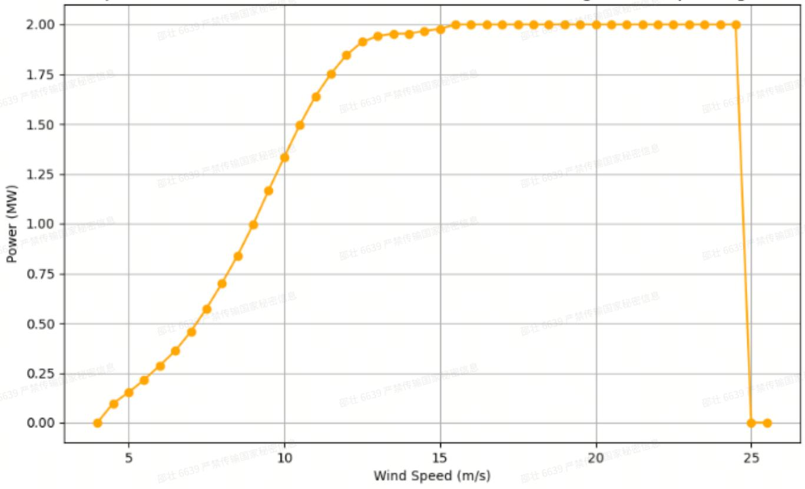

<details>
<summary>line</summary>

| Wind Speed (m/s) | Power (MW) |
|---|---|
| 3.5 | 0.00 |
| 4.0 | 0.10 |
| 4.5 | 0.15 |
| 5.0 | 0.20 |
| 5.5 | 0.25 |
| 6.0 | 0.30 |
| 6.5 | 0.35 |
| 7.0 | 0.40 |
| 7.5 | 0.45 |
| 8.0 | 0.50 |
| 8.5 | 0.55 |
| 9.0 | 0.60 |
| 9.5 | 0.65 |
| 10.0 | 0.70 |
| 10.5 | 0.75 |
| 11.0 | 0.80 |
| 11.5 | 0.85 |
| 12.0 | 0.90 |
| 12.5 | 0.95 |
| 13.0 | 1.00 |
| 13.5 | 1.05 |
| 14.0 | 1.10 |
| 14.5 | 1.15 |
| 15.0 | 1.20 |
| 15.5 | 1.25 |
| 16.0 | 1.30 |
| 16.5 | 1.35 |
| 17.0 | 1.40 |
| 17.5 | 1.45 |
| 18.0 | 1.50 |
| 18.5 | 1.55 |
| 19.0 | 1.60 |
| 19.5 | 1.65 |
| 20.0 | 1.70 |
| 20.5 | 1.75 |
| 21.0 | 1.80 |
| 21.5 | 1.85 |
| 22.0 | 1.90 |
| 22.5 | 1.95 |
| 23.0 | 2.00 |
| 23.5 | 2.00 |
| 24.0 | 2.00 |
| 24.5 | 2.00 |
| 25.0 | 2.00 |
| 25.5 | 0.00 |
The chart displays a single line representing the power output of the '严禁传输国家秘密信息' series across wind speeds from approximately 3 to 26 m/s, with a step increase in power as wind speed rises from ~3 to ~12 m/s, followed by a plateau and then a sharp drop at the end of the range (24–26 m/s). The legend is labeled '邵壮6639严禁传输国家秘密信息'.
</details>

# 3.1.2.2⻛向⻆-功率曲线分析

为了全⾯评估模型在全尾流和部分尾流条件下的表现，我们使⽤优化后的模型对HornsRev⻛电场在不同⻛向（173° ⾄ 353°）的功率输出进⾏预测，并与 Amin Niayifar 和 Fernando Porté-Agel 提出的分析模型、LES模拟以及均匀分布模型结果对⽐。具体过程如下：

1. ⻛场⻛向坐标转化：将⻛电场初始布局坐标转换为⻛向坐标系（注：这是对⻛向⻆的研究，不引⼊偏航⻆ γ ，即γ = 0），调整⻛机在上下游的相对位置。  
2. 归⼀化功率输出：为更直观展⽰⻛向⻆对⻛场总功率的影响，输出功率归⼀化为⻛场总功率与相同来⻛条件下独⽴运⾏的同等数量⻛机的总功率的⽐值。  
3. 其中，均匀分布模型的尾流增⻓率设置为常数（空间均匀）值0.04

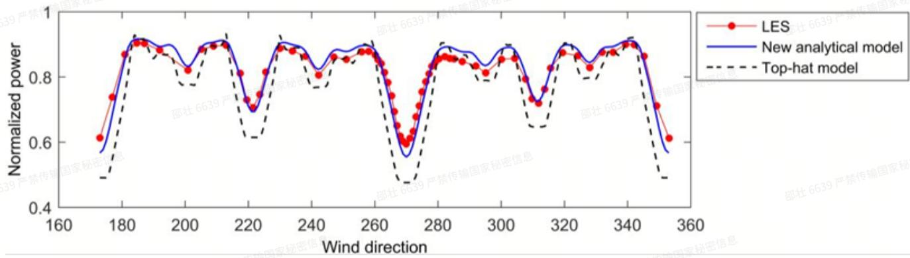

<details>
<summary>line</summary>

| Wind direction | LES   | New analytical model | Top-hat model |
| -------------- | ----- | -------------------- | ------------- |
| 160            | 0.62  | 0.57                 | 0.50          |
| 180            | 0.90  | 0.92                 | 0.88          |
| 200            | 0.82  | 0.85                 | 0.80          |
| 220            | 0.72  | 0.70                 | 0.62          |
| 240            | 0.88  | 0.89                 | 0.85          |
| 260            | 0.89  | 0.90                 | 0.87          |
| 280            | 0.85  | 0.86                 | 0.83          |
| 300            | 0.87  | 0.88                 | 0.85          |
| 320            | 0.89  | 0.90                 | 0.87          |
| 340            | 0.91  | 0.92                 | 0.90          |
| 360            | 0.61  | 0.57                 | 0.50          |
</details>

Figure 5. Distribution of the normalized Horns Rev wind farm power output obtained with the new analytical model and LES for different wind directions.

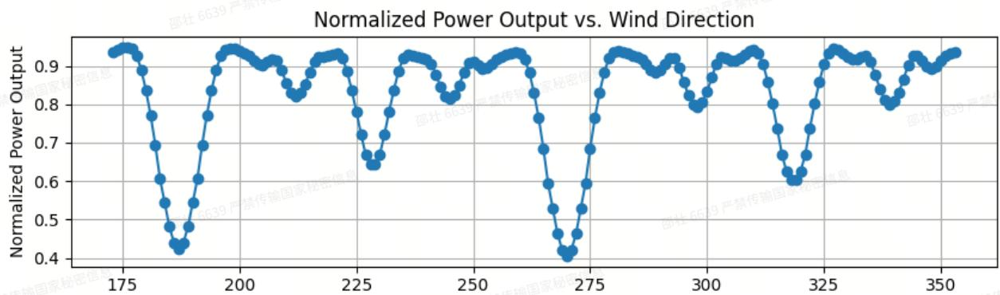

<details>
<summary>line</summary>

| Wind Direction | Normalized Power Output |
| -------------- | ------------------------ |
| 175            | 0.9                      |
| 180            | 0.8                      |
| 185            | 0.7                      |
| 190            | 0.6                      |
| 195            | 0.5                      |
| 200            | 0.4                      |
| 205            | 0.5                      |
| 210            | 0.6                      |
| 215            | 0.7                      |
| 220            | 0.8                      |
| 225            | 0.9                      |
| 230            | 0.8                      |
| 235            | 0.7                      |
| 240            | 0.6                      |
| 245            | 0.5                      |
| 250            | 0.4                      |
| 255            | 0.5                      |
| 260            | 0.6                      |
| 265            | 0.7                      |
| 270            | 0.8                      |
| 275            | 0.9                      |
| 280            | 0.8                      |
| 285            | 0.7                      |
| 290            | 0.6                      |
| 295            | 0.5                      |
| 300            | 0.4                      |
| 305            | 0.5                      |
| 310            | 0.6                      |
| 315            | 0.7                      |
| 320            | 0.8                      |
| 325            | 0.9                      |
| 330            | 0.8                      |
| 335            | 0.7                      |
| 340            | 0.6                      |
| 345            | 0.5                      |
| 350            | 0.4                      |
</details>

对⽐分析表明，我们的优化模型预测结果与其他先进模型和LES模拟结果⾼度⼀致。在不同⻛向⻆条件下，模型都能准确捕捉到⻛场功率输出的变化趋势。特别是在⻛向与⻛场主轴对⻬（全尾流条件）的情况下，模型准确预测了功率的显著下降；⽽在⻛向与⻛场主轴成⼀定⻆度（部分尾流条件）时，也能准确反映功率的相对恢复。

相⽐于均匀分布模型，我们的优化模型在捕捉尾流损失⽅⾯显⽰出更⾼的精度，这归功于模型中考虑了湍流强度对尾流扩展的影响以及尾流的⾼斯分布特性。此外，与Niayifar和Porté-Agel的分析模型相⽐，我们的模型在参数优化后能更好地适应HornsRev⻛电场的特定环境条件。

这⼀验证结果表明，我们开发的复杂尾流及偏航⻆⻛电场模型在实际海上⻛电场环境中具有良好的适⽤性和预测准确性，为后续研究⻛场协同偏航控制策略提供了可靠的基础模型。

# 3.2强化学习控制算法实验案例

在3.1节中，我们已通过数值模拟及HornsRev⻛电场案例，完成了对⻛电场仿真环境核⼼的尾流模型的验证与校准。

以该⾼保真模型为基础，并依托第⼆章所构建的深度强化学习控制框架，本节将通过在多个典型⻛场布局下的仿真实验，对PPO控制策略的实际性能进⾏深⼊的验证与分析。我们将系统性地评估该策略在不同规模⻛电场中的学习过程、最终性能、策略⾏为及可扩展性，以全⾯考察该DRL控制框架的综合效能。

# 3.2.1 实验设置

为了全⾯评估PPO控制策略，我们设计了涵盖不同规模的⻛电场布局，并采⽤第⼆章中制定的统⼀训练和评估流程。

本研究采⽤四种不同规模的⻛电场布局进⾏案例分析，布局参数均参考北海HornsRevI⻛电场的部分特征，采⽤了7度的⾏列偏转⻆，以模拟实际⻛场中为优化尾流影响⽽设计的⾮正交布局。所有布局均使⽤第⼆章所述的NREL5MW⻛机模型参数和基础环境参数。

1x2线性布局(N=2):最简单的串列布局，⽤于初步验证算法在直接尾流⼲扰下的控制能⼒。包含2台⻛机。  
3x3⽹格布局(N=9):⼩型⽹格布局，开始出现更复杂的⼆维尾流交互。包含9台⻛机。  
5x5⽹格布局(N=25):中等规模⽹格布局，尾流交互效应更为显著，控制难度增加。包含25台⻛机。  
8x10⼤型⽹格布局(N=80):模拟⼤型海上⻛电场的布局，⽤于评估算法在复杂⼤规模系统中的可扩展性和性能极限。包含80台⻛机。

所有布局均通过build\_layout函数⽣成，所⽤的核⼼PPO算法超参数已在⽅法论部分的2.3.5节中详细列出，并在所有实验中保持⼀致，以确保可⽐性。

# 3.2.2 案例⼀ (1x2⻛场)：策略最优性与泛化能⼒的权衡

我们⾸先在⼀个仅包含两台⻛机的1x2串列布局上对DRL控制策略进⾏评估。此布局是分析直接尾流相互作⽤的基础验证场景，能够清晰地揭⽰控制算法的基本性能与决策机理。

# 3.2.2.1训练过程与策略探索

下图展⽰了在1x2⻛场布局下，DRL智能体在2000万步训练中的性能演化曲线。横坐标为训练总步数，纵坐标为周期性评估中获得的平均奖励（归⼀化功率增益），阴影部分代表95%置信区间。

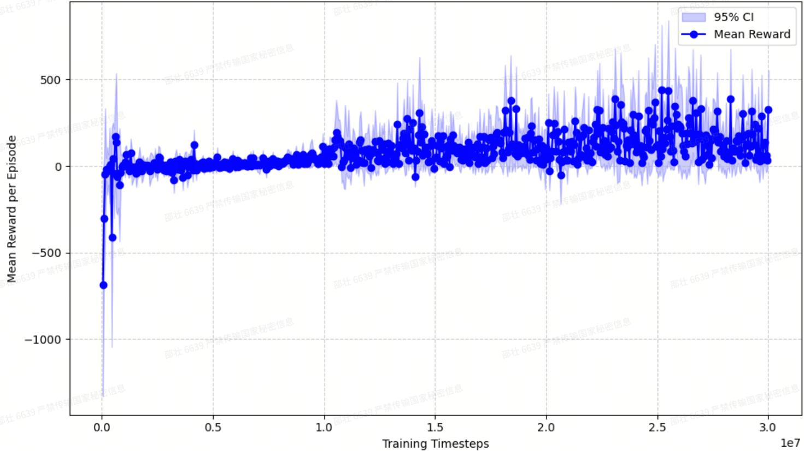

<details>
<summary>line</summary>

| Training Timesteps | Mean Reward per Episode |
| ------------------ | ------------------------ |
| 0.0                | -700.0                   |
| 0.1                | -200.0                   |
| 0.2                | 0.0                      |
| 0.3                | 0.0                      |
| 0.4                | 0.0                      |
| 0.5                | 0.0                      |
| 0.6                | 0.0                      |
| 0.7                | 0.0                      |
| 0.8                | 0.0                      |
| 0.9                | 0.0                      |
| 1.0                | 0.0                      |
| 1.1                | 0.0                      |
| 1.2                | 0.0                      |
| 1.3                | 0.0                      |
| 1.4                | 0.0                      |
| 1.5                | 0.0                      |
| 1.6                | 0.0                      |
| 1.7                | 0.0                      |
| 1.8                | 0.0                      |
| 1.9                | 0.0                      |
| 2.0                | 0.0                      |
| 2.1                | 0.0                      |
| 2.2                | 0.0                      |
| 2.3                | 0.0                      |
| 2.4                | 0.0                      |
| 2.5                | 0.0                      |
| 2.6                | 0.0                      |
| 2.7                | 0.0                      |
| 2.8                | 0.0                      |
| 2.9                | 0.0                      |
| 3.0                | 0.0                      |
</details>

如图所⽰，智能体的学习过程呈现出以下特征：

• 在训练初期，策略性能从负值迅速提升⾄零值附近，表明智能体快速掌握了避免负向优化的基本能⼒，其性能与⽆控制基线持平。  
• 在性能达到接近基线⽔平后，评估曲线并未收敛到⼀个平稳的静态值，⽽是表现出持续的震荡。这种现象是本研究DRL框架设计下的预期⾏为。由于我们为最⼤化探索效果⽽未引⼊动作惩罚，并为避免过早收敛⽽保留了熵的探索下限（详⻅2.3.5节），智能体被持续激励去“测试”现有最优策略边界附近的微⼩变化。因此，这种震荡是算法健康、持续探索策略空间的外部体现。

正由于这种探索性震荡的存在，凸显了我们最优模型选择协议（LCB标准）的关键价值。它使我们能够从整个动态的训练历史中，科学地识别并捕获被验证具有最⾼统计鲁棒性的策略检查点，⽽不是简单地采⽤不确定性较⾼的最终模型。对于1x2⻛场，由于交互简单，曲线未出现显著的“⻜跃”，但择优机制同样确保了我们能获得其探索到的最稳定、⾼效的策略。

# 3.2.2.2PSO寻优：特定⼯况下的静态最优解基准

为建⽴⼀个可供⽐较的理论性能基准，我们⾸先需要确定在特定⼯况下的最优静态控制策略。本研究采⽤粒⼦群优化（Particle Swarm Optimization, PSO）算法来求解此问题。

PSO是⼀种成熟的、基于群体的启发式全局优化算法，其通过模拟⻦群等社会群体的协作⾏为，在复杂解空间中进⾏搜索。尽管其迭代寻优的计算密集型特性，使其难以应对⻛况多变的实时控制需求，但其在求解单⼀、确定性⼯况下的静态最优化问题时具有强⼤的全局搜索能⼒。因此，我们仍可将其寻优结果作为评估DRL策略在特定⼯况下寻优能⼒的可靠基准，即该⼯况下静态控制所能达到的理论性能上限。

在本研究中，我们将⻛场总输出功率设为⽬标函数，将 台⻛机的静态偏航⻆组合 作N [γ1 , γ2 , ..., γN ]为优化变量，针对标准测试⼯况 进⾏寻优。其结果代表了在该固定⼯况下，静态偏(270°, 11.4m/s)航控制所能达到的理论性能上限。

PSO寻优结果表明，在此⻛况下:

• Average Yaw Angles: [20.12193482 0. ]   
• Average Total Power Output: 8337826.58 W   
• Power Optimization Rate: 1.09%

# 3.2.2.3 DRL策略的演化与权衡分析

我们从训练过程中选取了两个不同阶段的代表性模型，在标准测试⼯况下进⾏闭环控制测试，以分析策略的演化过程。

# 1. 训练中模型:

标准测试⻛况闭环控制：

Actions Taken at Each Step (Yaw Angle Increments)   
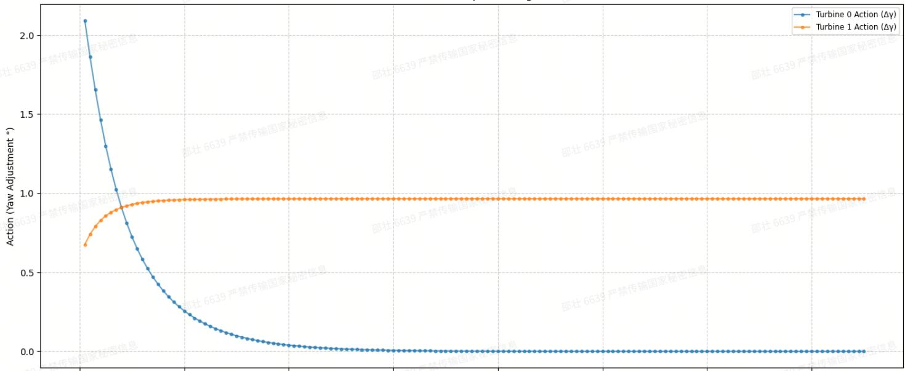

Turbine Absolute Yaw Angle Changes (0 is Initial State)   
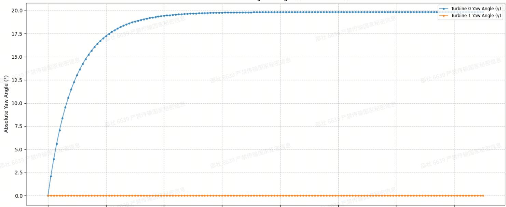

Total Output Power Changes   
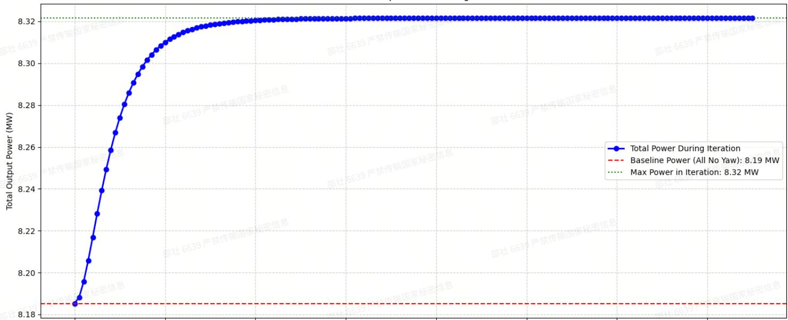

<details>
<summary>line</summary>

| X-axis Label | Total Power During Iteration (MW) |
|---|---|
| 1 | 8.18 |
| 2 | 8.19 |
| 3 | 8.20 |
| 4 | 8.21 |
| 5 | 8.22 |
| 6 | 8.23 |
| 7 | 8.24 |
| 8 | 8.25 |
| 9 | 8.26 |
| 10 | 8.27 |
| 11 | 8.28 |
| 12 | 8.29 |
| 13 | 8.30 |
| 14 | 8.31 |
| 15 | 8.31 |
| 16 | 8.31 |
| 17 | 8.31 |
| 18 | 8.31 |
| 19 | 8.31 |
| 20 | 8.31 |
| 21 | 8.31 |
| 22 | 8.31 |
| 23 | 8.31 |
| 24 | 8.31 |
| 25 | 8.31 |
| 26 | 8.31 |
| 27 | 8.31 |
| 28 | 8.31 |
| 29 | 8.31 |
| 30 | 8.31 |
| 31 | 8.31 |
| 32 | 8.31 |
| 33 | 8.31 |
| 34 | 8.31 |
| 35 | 8.31 |
| 36 | 8.31 |
| 37 | 8.31 |
| 38 | 8.31 |
| 39 | 8.31 |
| 40 | 8.31 |
| 41 | 8.31 |
| 42 | 8.31 |
| 43 | 8.31 |
| 44 | 8.31 |
| 45 | 8.31 |
| 46 | 8.31 |
| 47 | 8.31 |
| 48 | 8.31 |
| 49 | 8.31 |
| 50 | 8.31 |
| 51 | 8.31 |
| 52 | 8.31 |
| 53 | 8.31 |
| 54 | 8.31 |
| 55 | 8.31 |
| 56 | 8.31 |
| 57 | 8.31 |
| 58 | 8.31 |
| 59 | 8.31 |
| 60 | 8.31 |
| 61 | 8.31 |
| 62 | 8.31 |
| 63 | 8.31 |
| 64 | 8.31 |
| 65 | 8.31 |
| 66 | 8.31 |
| 67 | 8.31 |
| 68 | 8.31 |
| 69 | 8.31 |
| 70 | 8.31 |
| 71 | 8.31 |
| 72 | 8.31 |
| 73 | 8.31 |
| 74 | 8.31 |
| 75 | 8.31 |
| 76 | 8.31 |
| 77 | 8.31 |
| 78 | 8.31 |
| 79 | 8.31 |
| 80 | 8.31 |
| 81 | 8.31 |
| 82 | 8.31 |
| 83 | 8.31 |
| 84 | 8.31 |
| 85 | 8.31 |
| 86 | 8.31 |
| 87 | 8.31 |
| 88 | 8.31 |
| 89 | 8.31 |
| 90 | 8.31 |
| 91 | 8.31 |
| 92 | 8.31 |
| 93 | 8.31 |
| 94 | 8.31 |
| 95 | 8.31 |
| 96 | 8.31 |
| 97 | 8.31 |
| 98 | 8.31 |
| 99 | 8.31 |
| Note: The chart displays a single data series with values ranging from approximately -0.05 to +0.05 (likely representing a normalized or scaled metric). The legend indicates that the blue line represents 'Total Power During Iteration', the red dashed line represents 'Baseline Power (All No Yaw)', and the black dotted line represents 'Max Power in Iteration'. The chart is saved as a PNG file named '国家秘密信息'.
</details>

Iteration Step (O is Initial State)

• 最优偏航⻆组合: [19.832401°, 0°]   
• 优化后输出功率：8.32162857055664 MW  
• 功率优化率:1.67%

该结果与PSO寻优得到的理论最优解在偏航⻆设定和性能增益上均⾼度吻合，证明了DRL框架具备发现并执⾏特定⼯况下最优策略的能⼒。

全⻛向优化率曲线：  
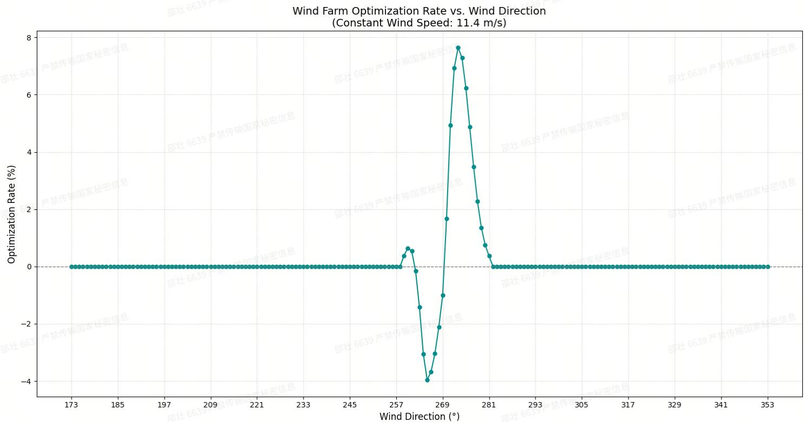

<details>
<summary>line</summary>

| Wind Direction (°) | Optimization Rate (%) |
| ------------------ | --------------------- |
| 173                | 0.0                   |
| 185                | 0.0                   |
| 197                | 0.0                   |
| 209                | 0.0                   |
| 221                | 0.0                   |
| 233                | 0.0                   |
| 245                | 0.0                   |
| 257                | 0.0                   |
| 269                | -4.0                  |
| 281                | 0.0                   |
| 293                | 0.0                   |
| 305                | 0.0                   |
| 317                | 0.0                   |
| 329                | 0.0                   |
| 341                | 0.0                   |
| 353                | 0.0                   |
</details>

# Overall Average Optimization Rate:

For wind directions 173° to 353° (at 11.4 m/s constant speed)

Average Optimization Rate: 0.17%

(Based on 181 valid evaluation points within the specified range)

然⽽，当我们对该模型进⾏全⻛向综合评估时，其平均优化率仅为0.17%。这表明，此阶段的策略虽然在特定⼯况下表现优异，但其泛化能⼒有限。

# 2. 最优模型:转向泛化性能最优

我们转⽽测试通过LCB标准最终选出的最优模型。

Best Checkpoint From Valid Evaluation Points   
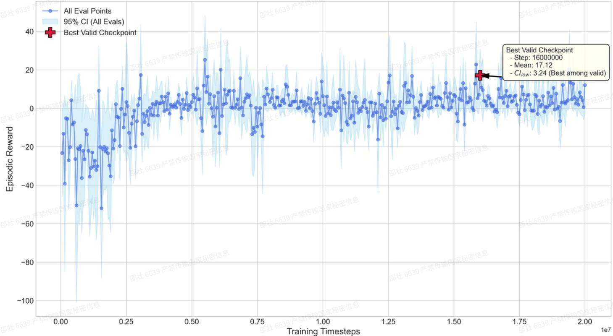

<details>
<summary>line</summary>

| Training Timesteps | Episodic Reward |
| ------------------ | --------------- |
| 0.00               | -40             |
| 0.25               | -20             |
| 0.50               | 0               |
| 0.75               | -10             |
| 1.00               | 0               |
| 1.25               | -10             |
| 1.50               | 0               |
| 1.75               | 0               |
| 2.00               | 0               |
</details>

其闭环控制过程同样稳定，如下图所⽰。

标准测试⻛况闭环控制：

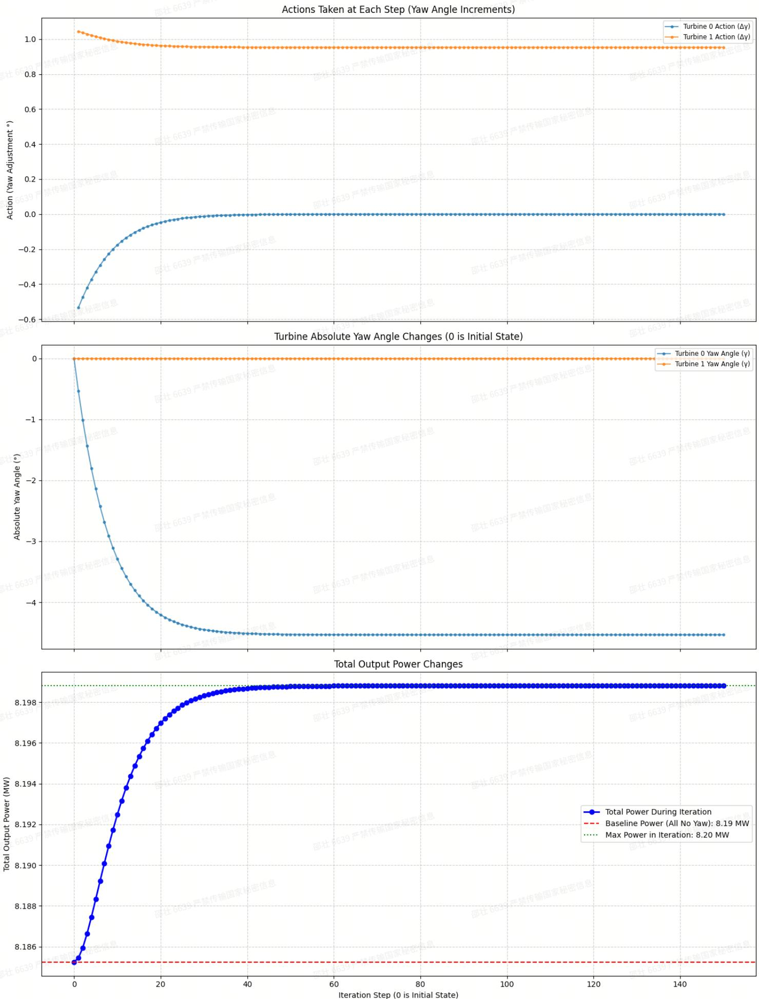  
Iteration Step (O is Initial State)

• 最优偏航⻆组合: [-4.534362°, 0°]   
• 优化后输出功率：8.198805809020996 MW   
• 功率优化率: 0.16565547562918506%

与训练中模型相⽐，最终择优模型的策略在270°这⼀特定⽅向上似乎表现得⾮常保守，仅获得了微⼩的功率增益。然⽽：

全⻛向优化率曲线：

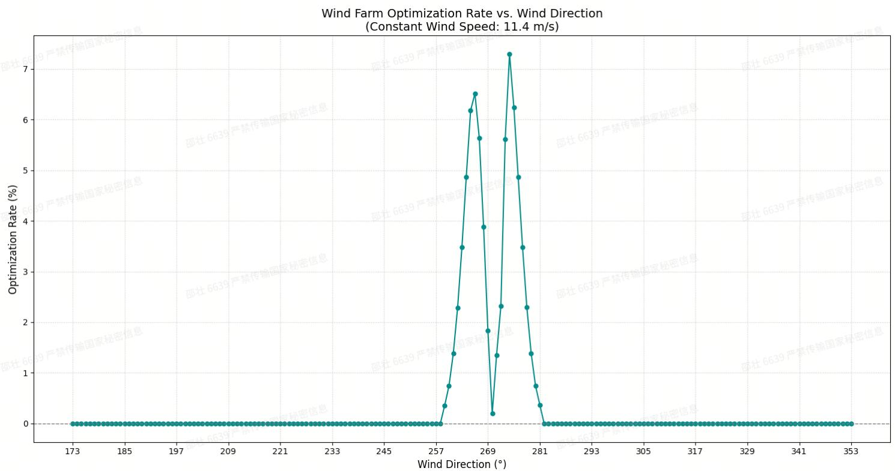

<details>
<summary>line</summary>

| Wind Direction (°) | Optimization Rate (%) |
| ------------------ | --------------------- |
| 173                | 0.0                   |
| 185                | 0.0                   |
| 197                | 0.0                   |
| 209                | 0.0                   |
| 221                | 0.0                   |
| 233                | 0.0                   |
| 245                | 0.0                   |
| 257                | 0.0                   |
| 269                | 6.5                   |
| 281                | 0.0                   |
| 293                | 0.0                   |
| 305                | 0.0                   |
| 317                | 0.0                   |
| 329                | 0.0                   |
| 341                | 0.0                   |
| 353                | 0.0                   |
</details>

Overall Average Optimization Rate:

For wind directions 173° to 353° (at 11.4 m/s constant speed)

Average Optimization Rate: 0.41%

(Based on 181 valid evaluation points within the specified range)

策略的显著正向优化作⽤集中在以270°为中⼼的⼀个狭窄⻛向带内（约255°⾄285°），这符合1x2串列布局的物理特性。该模型在全⻛向下的平均优化率达到了0.41%，相较于训练中模型提升了70%以上。

对⽐两个阶段的模型可以发现，随着在随机⼯况分布上训练的深⼊，策略的优化重点发⽣了从“特定⼯况最优”向“全局泛化最优”的转变。算法的优化过程最终选择牺牲在单⼀理想⼯况下的峰值性能，以换取在整个运⾏⼯况分布上更⾼的平均性能。这种现象并⾮算法未能找到最优点，⽽是其成功地优化了在不确定环境下⻓期累积收益这⼀更⾼级、更具实际价值的⽬标。

此外，观测此时的全⻛向优化率曲线可以发现，优化率的峰值并未出现在理论最优的270°⻛向，⽽是出现在其两侧的邻近⻛向（如272°附近）。在270°⻛向点，优化率反⽽存在明显的局部凹陷。

这种⾮对称的性能剖⾯是DRL策略⾃适应学习的结果，其机理可从奖励函数对策略梯度的影响来解释：

• 在270°完美对⻬⼯况下:下游⻛机T1位于上游⻛机T0尾流的中⼼线上。此时，T0进⾏⼩⻆度的正向偏航或负向偏航，对T1造成的影响在初始阶段是对称的，导致奖励函数在该点的响应曲⾯（RewardLandscape）相对“平坦”，提供给策略优化的梯度信号微弱且模糊。算法难以快速、确定地找到最优的偏航⽅向和⼤⼩。  
• 在邻近的⾮对⻬⼯况下（如272°）:下游⻛机T1在初始状态下就已经偏离了T0尾流的中⼼线。这种初始的⼏何不对称性，使得偏航控制的效果变得⾼度不对称。例如，T0向⼀侧偏航可能会将尾流完全推离T1，带来巨⼤且即时的正向奖励；⽽向另⼀侧偏航则可能使尾流更直接地冲击T1，带来显著的负向奖励。在这种情况下，奖励函数响应曲⾯变得“陡峭”，为策略梯度提供了清晰、强烈且⽅向明确的优化信号。

因此，智能体在训练过程中发现，在⾮对⻬⻛向下进⾏偏航控制的“信噪⽐”更⾼，更容易学习到有效的控制动作。最终，策略收敛为在这些“容易优化”的邻近⻛向上表现得更激进、效果更好，⽽在“难以优化”的270°完美对⻬⼯況下则采取了更为保守的策略。

1x2⻛场的案例分析表明，本研究提出的DRL框架展现了超越简单数值优化的复杂适应性。其最终策略并⾮静态最优解的简单复现，⽽是在综合考量了不同⼯况下的优化难度和学习信号强度后，在特定⼯况最优性与跨⼯况泛化性之间达成的精妙平衡。这种对不确定环境的⾃适应能⼒，是衡量该⽅法在实际⼯程应⽤中潜⼒的关键指标。

# 3.2.3案例⼆(3x3⻛场)：协同策略的突破与稳定性分析

当⻛场规模扩⼤⾄3x3布局（N=9）时，⻛机间的尾流交互不再是简单的线性串列，⽽是呈现出更复杂的⼆维⽹络状耦合关系。这为DRL策略发现更⾼级的协同⾏为提供了空间，同时也对策略的稳定性和训练⽅法提出了更⾼的要求。本节旨在深⼊剖析DRL在这⼀复杂场景下的独特表现。

# 3.2.2.1训练过程与策略探索

下图展⽰了在3x3⻛场布局下，DRL智能体在2200万步训练中的性能演化曲线。

Wind Farm Yaw Opt-Eval at Step 22000000   
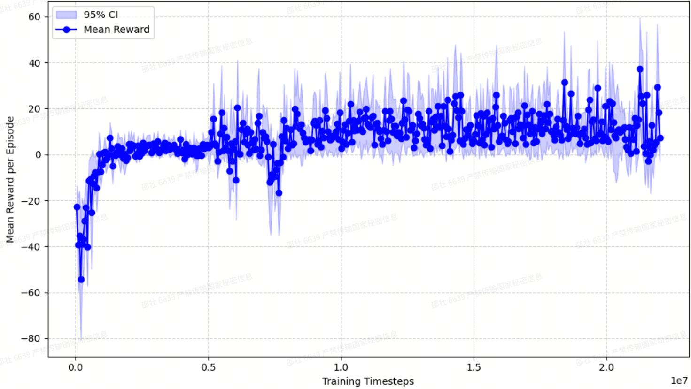

<details>
<summary>line</summary>

| Training Timesteps | Mean Reward per Episode |
| ------------------ | ------------------------ |
| 0.0                | -55.0                    |
| 0.1                | -20.0                    |
| 0.2                | 0.0                      |
| 0.3                | 5.0                      |
| 0.4                | 10.0                     |
| 0.5                | 15.0                     |
| 0.6                | 20.0                     |
| 0.7                | 10.0                     |
| 0.8                | 5.0                      |
| 0.9                | 10.0                     |
| 1.0                | 15.0                     |
| 1.1                | 20.0                     |
| 1.2                | 15.0                     |
| 1.3                | 20.0                     |
| 1.4                | 25.0                     |
| 1.5                | 20.0                     |
| 1.6                | 25.0                     |
| 1.7                | 30.0                     |
| 1.8                | 25.0                     |
| 1.9                | 35.0                     |
| 2.0                | 30.0                     |
| 2.1                | 25.0                     |
| 2.2                | 30.0                     |
| 2.3                | 25.0                     |
| 2.4                | 35.0                     |
| 2.5                | 30.0                     |
</details>

与1x2布局相⽐，3x3⻛场的训练曲线呈现出不同的、更具特征性的三阶段过程：

• 局部最优收敛期:在训练的前期（约0-500万步），策略性能迅速提升并稳定在⼀个较低的正奖励区间内。这代表智能体已学会在不造成严重尾流⼲扰的情况下运⾏，达到了⼀个“平凡”的局部最优点。  
策略“⻜跃”期 (Policy Breakthrough): 在训练进⾏到约500万步时，评估曲线突然出现了⼀个急剧的、⼤幅度的跃升，平均奖励提升了⼀个数量级。这⼀“⻜跃”现象，是DRL智能体通过持续探索，最终发现了某种⾼度协同的、⾮直观的偏航控制策略的标志。该策略能够带来巨⼤的全局功率增益，从⽽突破了初期的局部最优解。这充分证明了DRL在⾼维、复杂问题中发现⾮凡解的强⼤能⼒。  
• ⾼位探索震荡期:在完成“⻜跃”后，策略性能并未收敛⾄新的平台，⽽是在⼀个远⾼于前期的奖励区间内持续震荡，这与1x2案例中观察到的探索⾏为⼀致，同样凸显了我们择优协议的必要性。

# 3.2.2.2DRL策略的演化与稳定性分析

“⻜跃”后的持续探索带来了更⾼的性能，但也对策略的稳定性提出了挑战。对于旨在实现稳定实时控制的终极⽬标⽽⾔，策略的不可预测的震荡或性能回退是不可接受的。为此，我们对“⻜跃”后的两个不同阶段的模型进⾏了深⼊的稳定性对⽐分析。

# 1. 局部最优探索期模型(500万步)

该模型取⾃训练曲线第⼀次进⼊平稳期、但在“⻜跃”发⽣之前的阶段。它代表了DRL在未发现⾼级协同策略时的性能基线。

标准测试⻛况闭环控制：

Actions Taken at Each Step (Yaw Angle Increments)   
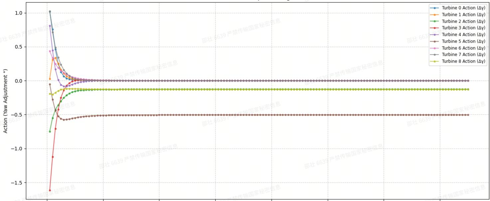

<details>
<summary>line</summary>

| Turbine | Action (Δy) |
| ------- | ----------- |
| Turbine 0 | 1.0 |
| Turbine 1 | 0.3 |
| Turbine 2 | -0.7 |
| Turbine 3 | -1.5 |
| Turbine 4 | 0.8 |
| Turbine 5 | -0.6 |
| Turbine 6 | 0.4 |
| Turbine 7 | 0.1 |
| Turbine 8 | -0.1 |
| Turbine 0 (Turbine) | 0.0 |
| Turbine 1 (Turbine) | 0.0 |
| Turbine 2 (Turbine) | 0.0 |
| Turbine 3 (Turbine) | 0.0 |
| Turbine 4 (Turbine) | 0.0 |
| Turbine 5 (Turbine) | 0.0 |
| Turbine 6 (Turbine) | 0.0 |
| Turbine 7 (Turbine) | 0.0 |
| Turbine 8 (Turbine) | 0.0 |
</details>

Turbine Absolute Yaw Angle Changes (0 is Initial State)   
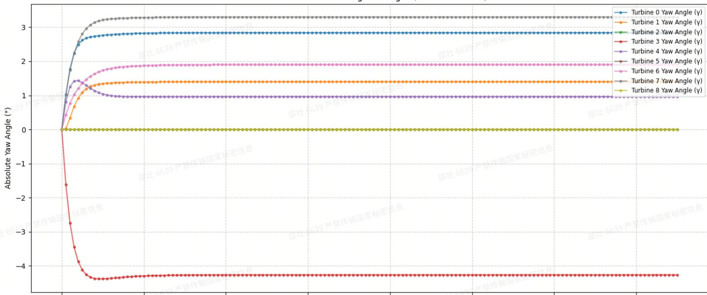

<details>
<summary>line</summary>

| Turbine | Absolute Yaw Angle (γ) |
| ------- | ---------------------- |
| Turbine 0 | 2.8 |
| Turbine 1 | 1.4 |
| Turbine 2 | 1.4 |
| Turbine 3 | -4.5 |
| Turbine 4 | 1.0 |
| Turbine 5 | 1.0 |
| Turbine 6 | 1.9 |
| Turbine 7 | 3.2 |
| Turbine 8 | 0.0 |
</details>

Total Output Power Changes

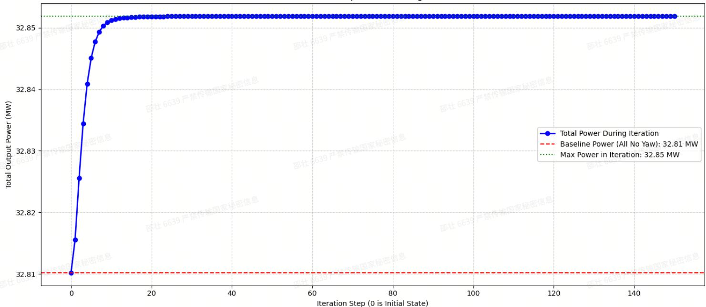

• 最优偏航⻆组合:

[ 2.838154 1.4015943 0.

-4.263859 0.96182287 0.

1.9017348 3.2974792 0. ]

• 优化后输出功率：32.85188293457031 MW  
• 功率优化率: 0.1270204855847559 %

全⻛向优化率曲线：  
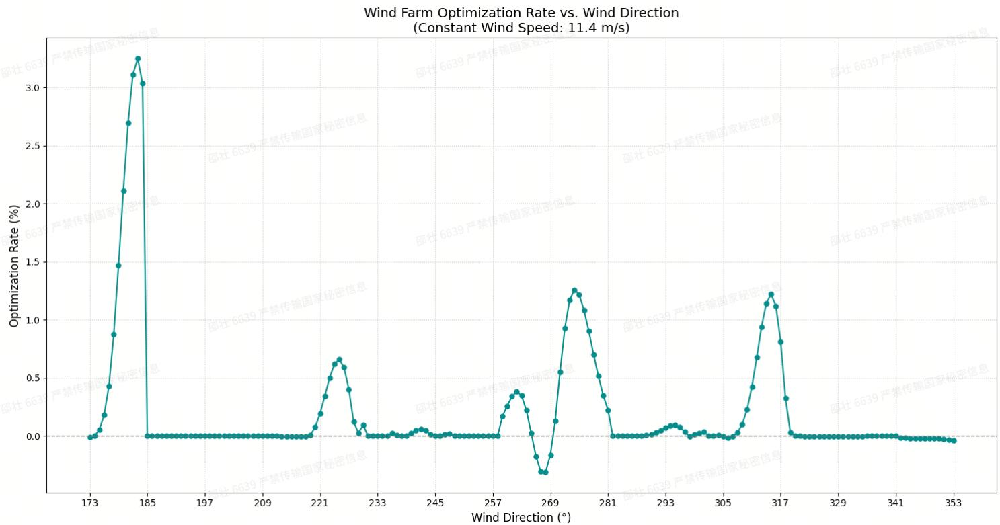

<details>
<summary>line</summary>

| Wind Direction (°) | Optimization Rate (%) |
| ------------------ | --------------------- |
| 173                | 0.0                   |
| 174                | 0.2                   |
| 175                | 0.4                   |
| 176                | 0.8                   |
| 177                | 1.4                   |
| 178                | 2.1                   |
| 179                | 2.7                   |
| 180                | 3.1                   |
| 181                | 3.2                   |
| 182                | 3.0                   |
| 183                | 0.0                   |
| 184                | 0.0                   |
| 185                | 0.0                   |
| 186                | 0.0                   |
| 187                | 0.0                   |
| 188                | 0.0                   |
| 189                | 0.0                   |
| 190                | 0.0                   |
| 191                | 0.0                   |
| 192                | 0.0                   |
| 193                | 0.0                   |
| 194                | 0.0                   |
| 195                | 0.0                   |
| 196                | 0.0                   |
| 197                | 0.0                   |
| 198                | 0.0                   |
| 199                | 0.0                   |
| 200                | 0.0                   |
| 201                | 0.0                   |
| 202                | 0.0                   |
| 203                | 0.0                   |
| 204                | 0.0                   |
| 205                | 0.0                   |
| 206                | 0.0                   |
| 207                | 0.0                   |
| 208                | 0.0                   |
| 209                | 0.0                   |
| 210                | 0.0                   |
| 211                | 0.2                   |
| 212                | 0.4                   |
| 213                | 0.6                   |
| 214                | 0.7                   |
| 215                | 0.6                   |
| 216                | 0.4                   |
| 217                | 0.2                   |
| 218                | 0.1                   |
| 219                | 0.0                   |
| 220                | 0.0                   |
| 221                | 0.1                   |
| 222                | 0.3                   |
| 223                | 0.5                   |
| 224                | 0.7                   |
| 225                | 0.6                   |
| 226                | 0.4                   |
| 227                | 0.3                   |
| 228                | 0.2                   |
| 229                | 0.1                   |
| 230                | 0.0                   |
| 231                | 0.0                   |
| 232                | 0.0                   |
| 233                | 0.0                   |
| 234                | 0.0                   |
| 235                | 0.0                   |
| 236                | 0.0                   |
| 237                | 0.0                   |
| 238                | 0.0                   |
| 239                | 0.0                   |
| 240                | 0.1                   |
| 241                | 0.2                   |
| 242                | 0.3                   |
| 243                | 0.4                   |
| 244                | 0.5                   |
| 245                | 0.6                   |
| 246                | 0.7                   |
| 247                | 0.8                   |
| 248                | 0.9                   |
| 249                | 1.0                   |
| 250                | 1.1                   |
| 251                | 1.2                   |
| 252                | 1.3                   |
| 253                | 1.4                   |
| 254                | 1.5                   |
| 255                | 1.6                   |
| 256                | 1.7                   |
| 257                | 1.8                   |
| 258                | 1.9                   |
| 259                | 2.0                   |
| 260                | -1.5                  |
| 261                | -1.8                  |
| 262                | -2.5                  |
| 263                | -3.5                  |
| 264                | -4.5                  |
| 265                | -5.5                  |
| 266                | -6.5                  |
| 267                | -7.5                  |
| 268                | -8.5                  |
| 269                | -9.5                  |
| 270                | -10.5                 |
| 271                | -11.5                 |
| 272                | -12.5                 |
| 273                | -13.5                 |
| 274                | -14.5                 |
| 275                | -15.5                 |
| 276                | -16.5                 |
| 277                | -17.5                 |
| 278                | -18.5                 |
| 279                | -19.5                 |
| 280                | -20.5                 |
| 281                | -21.5                 |
| 282                | -22.5                 |
| 283                | -23.5                 |
| 284                | -24.5                 |
| 285                | -25.5                 |
| 286                | -26.5                 |
| 287                | -27.5                 |
| 288                | -28.5                 |
| 289                | -29.5                 |
| 290                | -30.5                 |
| 291                | -31.5                 |
| 292                | -32.5                 |
| 293                | -33.5                 |
| 294                | -34.5                 |
| 295                | -35.5                 |
| 296                | -36.5                 |
| 297                | -37.5                 |
| 298                | -38.5                 |
| 299                | -39.5                 |
| 300                | -40.5                 |
| Note: The actual values may vary due to the random nature of the data generation process (e.g., wind direction). The provided values are placeholders or not explicitly stated in the code.
</details>

# Overall Average Optimization Rate:

For wind directions 173° to 353° (at 11.4 m/s constant speed)

Average Optimization Rate: 0.21%

(Based on 181 valid evaluation points within the specified range)

分析上图及其数据可⻅，此阶段的策略虽然控制过程稳定，但其偏航⻆调整量较⼩且缺乏明显的协同模式，仅获得了⾮常有限的功率增益。这表明，智能体已学会在不造成严重负⾯影响的前提下进⾏⼩范围探索，但其策略仍陷于⼀个性能平庸的局部最优点。

# 2. “甜蜜点”⸺协同策略的突破模型(最优模型):

该模型通过LCB择优协议选出，代表了“⻜跃”之后、兼具⾼性能与⾼稳定性的策略，是我们的最终择优策略。

标准测试⻛况闭环控制：

Actions Taken at Each Step (Yaw Angle Increments)   
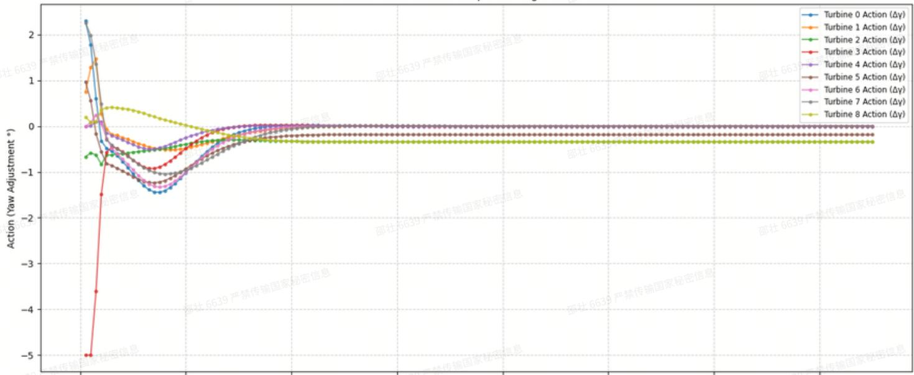

<details>
<summary>line</summary>

| Time Point | Turbine 0 Action (Δy) | Turbine 1 Action (Δy) | Turbine 2 Action (Δy) | Turbine 3 Action (Δy) | Turbine 4 Action (Δy) | Turbine 5 Action (Δy) | Turbine 6 Action (Δy) | Turbine 7 Action (Δy) | Turbine 8 Action (Δy) |
| ---------- | --------------------- | --------------------- | --------------------- | --------------------- | --------------------- | --------------------- | --------------------- | --------------------- | --------------------- |
| Peak       | 2.5                   | 1.5                   | -0.5                  | -5.0                  | 0.0                   | -0.5                  | 0.0                   | -0.5                  | 0.0                   |
| Midpoint   | -1.5                  | -0.5                  | -0.5                  | -1.0                  | -0.5                  | -0.5                  | -0.5                  | -0.5                  | -0.5                  |
| Final      | 0.0                   | 0.0                   | 0.0                   | 0.0                   | 0.0                   | 0.0                   | 0.0                   | 0.0                   | 0.0                   |
</details>

Turbine Absolute Yaw Angle Changes (O is Initial State)   
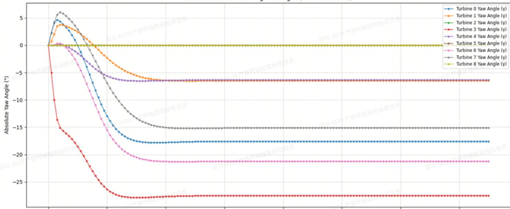

<details>
<summary>line</summary>

| Turbine | Absolute Yaw Angle (γ) |
| ------- | ---------------------- |
| Turbine 0 | -18.0 |
| Turbine 1 | -16.0 |
| Turbine 2 | -15.0 |
| Turbine 3 | -28.0 |
| Turbine 4 | -7.0 |
| Turbine 5 | -7.0 |
| Turbine 6 | -21.0 |
| Turbine 7 | -15.0 |
| Turbine 8 | 0.0 |
</details>

Total Output Power Changes

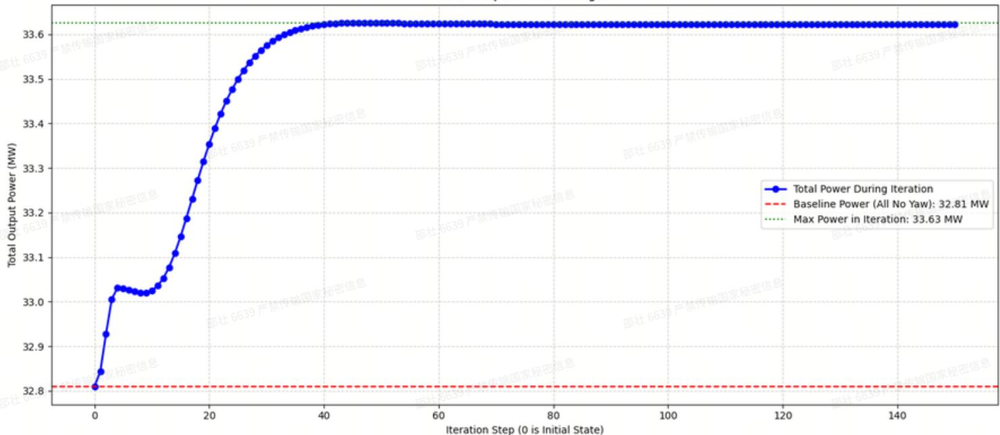

<details>
<summary>line</summary>

| Iteration Step | Total Power During Iteration (MW) | Baseline Power (All No Yaw) (MW) |
| -------------- | --------------------------------- | -------------------------------- |
| 0              | 32.8                              | 32.8                             |
| 10             | 33.0                              | 32.8                             |
| 20             | 33.4                              | 32.8                             |
| 30             | 33.5                              | 32.8                             |
| 40             | 33.6                              | 32.8                             |
| 50             | 33.6                              | 32.8                             |
| 60             | 33.6                              | 32.8                             |
| 70             | 33.6                              | 32.8                             |
| 80             | 33.6                              | 32.8                             |
| 90             | 33.6                              | 32.8                             |
| 100            | 33.6                              | 32.8                             |
| 110            | 33.6                              | 32.8                             |
| 120            | 33.6                              | 32.8                             |
| 130            | 33.6                              | 32.8                             |
| 140            | 33.6                              | 32.8                             |
| 150            | 33.6                              | 32.8                             |
</details>

• 最优偏航⻆组合:

[-17.670782 -6.5126724 0.

-27.574734 -6.3726473 0.

-21.29735 -15.197677 0. ]

• 优化后输出功率：33.6255989074707 MW  
• 功率优化率: 2.4851767965309195 %

全⻛向优化率曲线：  
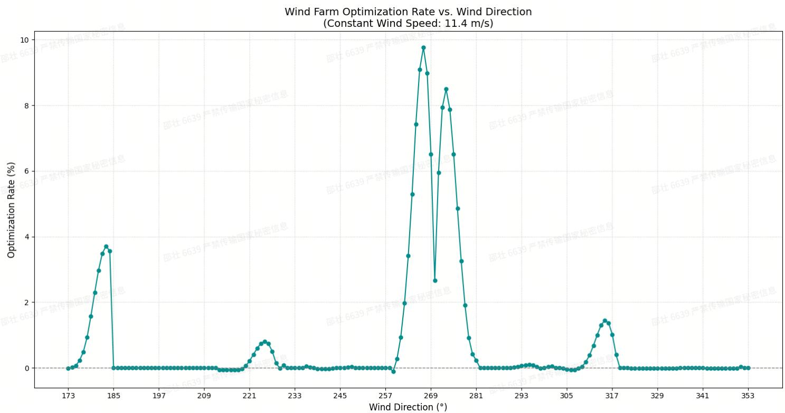

<details>
<summary>line</summary>

| Wind Direction (°) | Optimization Rate (%) |
| ------------------ | --------------------- |
| 173                | 0.0                   |
| 185                | 3.7                   |
| 221                | 0.8                   |
| 233                | 0.0                   |
| 245                | 0.0                   |
| 257                | 0.0                   |
| 269                | 9.8                   |
| 281                | 0.0                   |
| 293                | 0.0                   |
| 305                | 0.0                   |
| 317                | 1.5                   |
| 329                | 0.0                   |
| 341                | 0.0                   |
| 353                | 0.0                   |
</details>

| [173-185], [219-230], [258-282], [309-319]

# Overall Average Optimization Rate:

For wind directions 173° to 353° (at 11.4 m/s constant speed)

Average Optimization Rate: 0.75%

(Based on 181 valid evaluation points within the specified range)

与阶段⼀模型相⽐，“甜蜜点”策略在性能上实现了质的⻜跃。观察上图我们可以发现：

• 复杂的协同⾏为:模型给出了⼤⻆度、⾮对称、且⾼度协同的偏航⻆组合。例如，第⼀列⻛机（T0,T3,T6）均采取了⼤幅度的负向偏航，这显然是⼀种通过集体牺牲为后续整场⻛机创造更优来流条件的复杂策略，是⽆法通过简单规则或局部寻优发现的。  
• 性能的巨⼤突破:策略在标准⼯况和全⻛向下的性能均实现了超过300%的提升，这证明了DRL发现的复杂协同⾏为具有巨⼤的应⽤价值，是能够为⻛电场带来显著经济效益的重⼤技术突破。

• 卓越的控制稳定性:尽管执⾏的是复杂的协同策略，其闭环控制过程依然平滑、稳定，所有可控⻛机的偏航⻆均能快速收敛⾄稳态，所有可控⻛机的偏航⻆均能快速、⽆超调地收敛⾄稳态。这种可预测、可信赖的稳定性，是任何控制策略能够从理论⾛向实际、实现稳定实时控制的根本前提。。

# 3. 阶段三：后期训练的不确定性与策略退化

在达到“甜蜜点”后，若继续进⾏训练，策略⾏为将进⼊⼀个充满不确定性的阶段。通过⼤量测试发现，随着训练的继续，模型会随机地表现出以下⼏种现象，使得“取最新模型”的策略完全不可⾏：

• 策略振荡(PolicyOscillation):模型在闭环测试中表现出不规则的、持续的控制动作调整，⽆法收敛到⼀个稳态。  
策略回退 (Policy Regression): 在闭环测试中，⻛场总功率在初始⼏步可能上升，但随后反⽽下降，最终稳定在⼀个低于“甜蜜点”甚⾄低于基线的⽔平。这可能是因为后期训练出的价值⽹络存在偏差，使得智能体“误认为”某个瞬时状态更优，但该状态在物理系统中的⻓期演化结果却是有害的。  
• 偶然恢复 (Apparent Recovery): 有时，某个更后期的模型可能在标准测试⼯况下偶然表现出与“甜蜜点”类似的稳定性和⾼性能。然⽽，这种表现是不可预测的，且在其他⻛况下可能依然存在不稳定性。我们不能将⼯程应⽤的可靠性寄希望于这种随机出现的“好状态”。

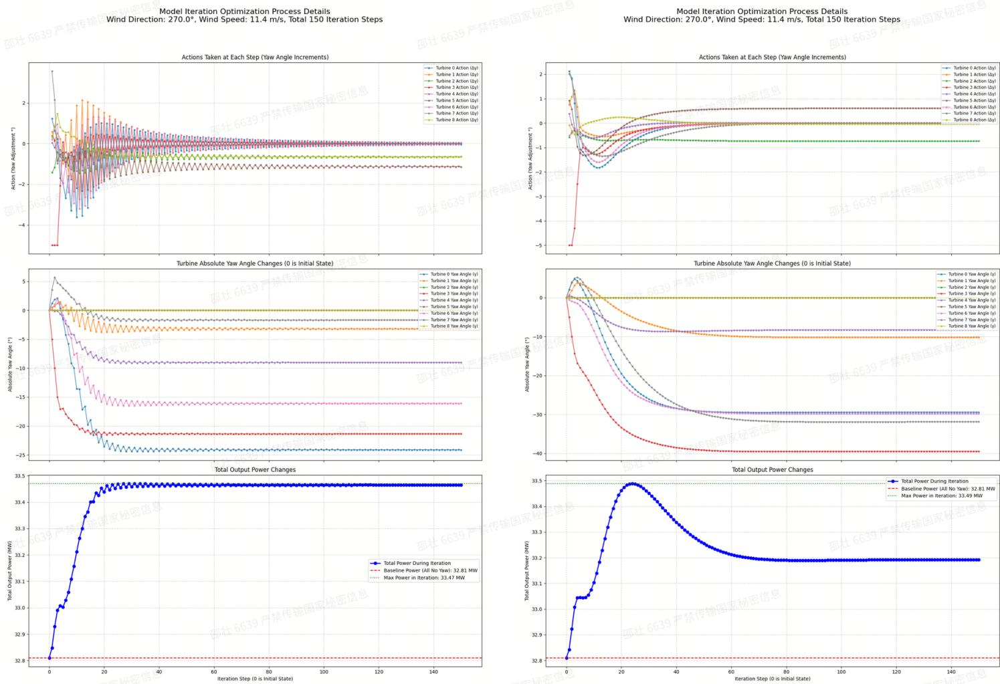

这种现象的机理在于，⽆惩罚的智能体为追求边际奖励，可能过度拟合价值⽹络的微⼩误差，导致策略对状态变化过度敏感。

然⽽，对于旨在实现稳定实时控制的应⽤⽬标，策略的稳定性和可预测性与性能的峰值同等重要。持续训练带来的不稳定性⻛险是不可接受的。因此，“⽆惩罚探索+LCB择优”的⽅法论闭环是⾄关重要的。它允许算法通过⾃由探索发现突破性的协同策略，同时通过科学、鲁棒的评估和存档机制，确保我们能够准确地“捕获”并最终部署那个已经过验证的、兼具卓越性能与⾼度稳定性的“甜蜜点”模型。

# 3.2.2.3对照分析：引⼊动作惩罚的有效性探讨

前⽂分析揭⽰了⽆惩罚探索在训练后期可能引发的稳定性问题。在控制理论与强化学习实践中，⼀个直观且常⽤的解决⽅案是在奖励函数中引⼊对控制动作的惩罚项，以实现对策略⾏为的正则化。然⽽，这种⽅法在本研究的复杂协同任务中是否是⼀种有效的权衡？本节将通过⼀组严谨的对照实验来回答这⼀问题。

# 1. 动作惩罚机制的设计

为进⾏对照分析，我们设计并实现了⼀个 YawPenaltyWrapper 环境封装器，它在原始功率增益奖励R的基础上，引⼊了两种精细化的惩罚项：

◦ 动作幅度惩罚(ActionMagnitudePenalty):该惩罚并⾮针对所有动作，⽽是只对超过预设阈值($\theta _ { a c t i o n } = 1 . 5 ^ { \circ }$ )的⼤幅度动作进⾏线性惩罚。其⽬的是在抑制过⼤的单步偏航调整的同时，允许智能体进⾏必要的微调。

惩罚项 $P _ { m a g }$ 计算如下：

$$
P _ {m a g} = \lambda_ {m a g} \cdot \frac {1}{N} \sum_ {i = 1} ^ {N} m a x (| \Delta \gamma_ {i} | - \theta_ {a c t i o n}, 0)
$$

◦ 动作变化率惩罚 (Action Rate-of-Change Penalty): 该惩罚项旨在促进控制策略的时间平滑性，避免⾼频振荡。它通过计算连续两个时间步之间动作向量变化的均⽅值来实现。

惩罚项 $P _ { r a t e }$ 计算如下：

$$
P _ {r a t e} = \lambda_ {r a t e} \cdot \frac {1}{N} \sum_ {i = 1} ^ {N} (\Delta \gamma_ {i, t} - \Delta \gamma_ {i, t - 1}) ^ {2}
$$

最终，智能体接收到的总奖励为 $R _ { t o t a l } = R - \left( P _ { m a g } + P _ { r a t e } \right)$ 。

# 2. 惩罚系数的标定

为确保惩罚的⼒度适中，我们采⽤了⼀种数据驱动的⽅法来标定惩罚系数 $\lambda _ { m a g }$ 和 $\lambda _ { r a t e }$ 。我们⾸先在⽆惩罚的环境中进⾏了⼀千万步的初始训练，并收集了此过程中智能体动作幅度和变化率的统计分布。随后，我们选取了动作幅度和变化率的第95百分位数作为惩罚的典型触发基准，并计算了训练中典型的正向奖励值（如奖励中位数）。我们的⽬标是将这两个惩罚项的总和，在触发基准下，标定为典型奖励值的10%左右。

[CKPT] Checkpoint saved: step 10000000

[INFO] LambdaAnnealing: End of Stage 1 at progress 50.00%. Collected 100000 mag, 100000 rate, 100000 reward samples. Computing target lambdas...

[INFO] LambdaAnnealing (Stage 2 Target Calc): P\_mag\_raw\_95th=1.5724, P\_rate\_raw\_95th=22.5558, Typical\_Delta\_for\_scaling=0.0196

[INFO] LambdaAnnealing: Computed Target Lambdas for Stage 2: Mag=0.000081, Rate=0.000081通过此⽅法，我们最终确定 $\lambda _ { m a g } = \lambda _ { r a t e } = 8 \times 1 0 ^ { - 5 }$ ，以期望得到既能起到正则化作⽤，⼜不会在初始阶段过度抑制策略的学习的惩罚项设计。

# 3. 实验结果与分析

我们在3x3布局下，使⽤上述带有动作惩罚的环境，从头开始进⾏了⼀次完整的训练。其训练评估曲线如图：

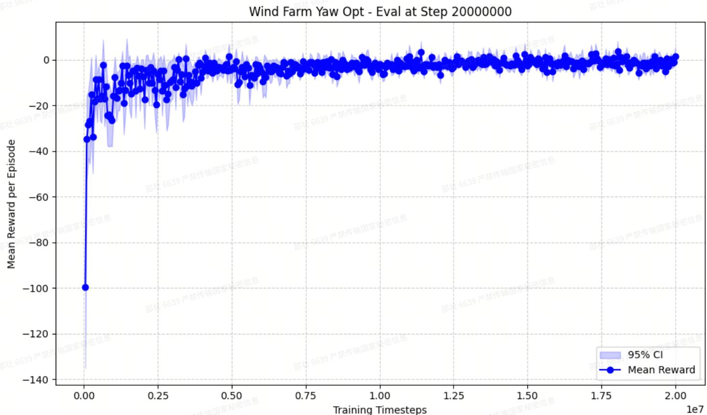

<details>
<summary>line</summary>

| Training Timesteps | Mean Reward per Episode |
| ------------------ | ------------------------ |
| 0.00               | -100.0                   |
| 0.25               | -20.0                    |
| 0.50               | -5.0                     |
| 0.75               | -5.0                     |
| 1.00               | -5.0                     |
| 1.25               | -5.0                     |
| 1.50               | -5.0                     |
| 1.75               | -5.0                     |
| 2.00               | -5.0                     |
</details>

实验结果表明，带有动作惩罚的策略，其训练曲线虽然⽐⽆惩罚版本更为平滑稳定，但引⼊动作惩罚的智能体始终未能突破初期的局部最优点，与⽆惩罚训练中观察到的策略“⻜跃”形成鲜明对⽐。

这表明，即使是经过精⼼设计和数据标定的微⼩惩罚，也⾜以抑制智能体进⾏⼤规模、协同性动作的深度探索。其根本原因在于：

a. 机制层⾯：动作惩罚与任务特性的根本性错配

▪ ⻛电场协同偏航问题的核⼼特性是有效控制⼯况的稀疏性。正如1x2⻛场案例所揭⽰的，仅在狭窄的⻛向范围内，主动偏航才能带来显著增益；⽽在⼤部分⼯况下，最优策略是保持零偏航（即“不作为”）。因此，⼀个成功的智能体必须同时掌握两种对⽴的技能：1）在少数⾼潜⼒⼯况下，执⾏⼤尺度、协同性的偏航动作；2）在多数⽆潜⼒⼯况下，抑制所有动作。  
▪ 动作惩罚项的引⼊，对这两种技能的学习产⽣了⾮对称的、破坏性的⼲扰。它为技能1（⼤尺度动作）提供了持续的负向奖励信号，⽽对技能2（不作为）则不产⽣影响。⾯对此种情况，PPO优化器会找到⼀条“阻⼒最⼩的路径”：学习⼀个全局性的保守策略。该策略因其“不作为”的倾向，在⼤部分⼯况下都表现得很好，从⽽在训练的平均奖励上获得了⼀个不错的“基础分”。然⽽，也正是这种被惩罚项所塑造的保守倾向，使其在关键的⾼潜⼒⼯况下，⽆法⽣成实现“⻜跃”所必需的⼤胆探索性动作。

# b. 学习动态层⾯：对策略梯度的直接抑制

▪ 尽管我们通过gamma=0.999的设置已让智能体具备⻓远的视野，但动作惩罚在每个时间步都直接作⽤于瞬时奖励 $r _ { t }$ ，从⽽从根本上改变了策略学习的梯度环境。当智能体尝试⼀个⼤的探索性动作时，惩罚项会⽴刻产⽣⼀个负反馈，这导致该动作的优势函数估计值 $\hat { A } _ { t }$ 被系统性地压低。由于策略梯度 与优势函数∇J(θ) $\hat { A } _ { t }$ 直接相关，⼀个持续为负或较低的优势函数估计，会形成⼀道“梯度壁垒”，有效阻⽌了优化过程向需要⼤尺度动作的策略空间区域迁移。因此，策略被“囚禁”在了低动作幅度的局部最优区域内。

综上所述，我们可以得出结论：对于本研究中的复杂⻛电场协同控制问题，引⼊动作惩罚虽然能强制策略的平滑性，但其代价是抑制了发现突破性解的关键探索⾏为，从根本上牺牲了绝⼤部分的性能潜⼒题，是⼀种不可取的权衡。

这反过来也证明了本研究最终采⽤的“⽆惩罚探索+LCB择优”⽅法论的优越性：它允许策略空间不受限制的探索以发现全局最优解，同时通过独⽴的评估和择优机制来确保最终输出策略的稳定性，实现了性能与稳定性的解耦和兼顾。

# 3.2.2.4扩展案例：⼤规模⻛场的性能验证与应⽤展望

8× 10⻛场布局：（待定）

[占位符1：图⽚待替换]

# 4. Conclusion

# • 主要内容：

a. 总结提出⽅法的主要贡献和实验结果。  
b. 强调⽅法的优势（如适应性、控制效果）。

# c. 未来研究⽅向：

▪ 扩展⾄更多复杂场景。  
▪ 提⾼控制算法的实时性。

# 已迭代内容（调/备注）

# 3.2.2.1 动作空间设计

在初期实验中，我们采⽤三离散动作{顺时针旋转、不转、逆时针旋转}表⽰每个⻛机的偏航调整。这种设计虽然简化了决策空间，但在实际测试中表现出明显局限性：

控制精度不⾜，⽆法实现精细的偏航⻆调整

学习过程不稳定，在双⻛机串联测试中，存在三种不同的收敛模式：

正确学习并得到合理的偏航⻆组合，奖励随时间上升并达到稳定

陷⼊局部最优，奖励值在初期快速下降，最终收敛到次优值且不再回升

未收敛，呈现锯⻮形波动，找到的偏航⻆不正确

说明有时能习得正确偏航⻆，有时则陷⼊局部最优，寻优结果并不稳定。

即使在有限⻛向范围[269°,271°]和⻛速范围[6,16]m/s的简单环境中，算法也需要⼤量训练步数才能收敛。

因⽽调整动作空间设计为连续动作，每个⻛机的偏航⻆调整范围为[-5°,5°]，这⼀修改带来显著改进：

允许更精细的偏航控制，增强算法表达能⼒

学习曲线更加平滑，收敛性明显提⾼

能够更准确地捕捉⻛机之间的复杂相互作⽤关系

这⼀对⽐验证了连续动作空间在⻛电场偏航控制这类精细调节任务中的优越性，为后续实验奠定了基础。

# 3.2.2.2 评估指标

为更好地监控训练进度，我们设置实时输出中间态寻优结果的评估⽅法：

记录"评估时的Episode级平均奖励"并实时输出为折线图

在每次评估结束时⽴即绘制当前评估的历史数据

使⽤固定⻛况作为评估环境，提供⼀致的性能度量

# 3.2.2.3 熵系数调整尝试

为解决局部最优问题，我们尝试引⼊熵系数(ent\_coef)增加探索：

测试1

ent\_coef = 0.05 系统默认值为0.0

测试2

$\mathsf { e n t \_ c o e f } = 0 . 0 1$

实验表明，增加熵系数虽然理论上可以提⾼探索性，但实际效果并不理想：

ent\_coef=0.05的值过⼤，导致模型⽆法呈现收敛趋势

ent\_coef=0.01虽然增加了探索性，但导致模型性能下降，训练时间延⻓

综合考虑，我们最终移除了熵系数调整，因为PPO基于概率策略优化，本⾝已具备⼀定的探索能⼒。

即使在ent\_coef=0的情况下，PPO仍能有效探索并最终收敛。

# 3.2.2.4核⼼超参数调优与最终确定

通过系统性的参数敏感性分析，我们确定了PPO算法在⻛电场控制任务中的关键超参数组合：

<table><tr><td>超参数组合</td><td>学习率</td><td>n_steps</td><td>并行环境数</td><td>总训练步数</td><td>优势/劣势</td></tr><tr><td>1</td><td>3e-4</td><td>1024</td><td>4</td><td>8,000,000</td><td>收敛速度快、稳定性较好,但可能过早收敛到局部最优组合</td></tr><tr><td>2</td><td>1e-4</td><td>2048</td><td>5</td><td>8,000,000</td><td>学习过程更稳定、探索能力强,但收敛速度较慢</td></tr><tr><td>3</td><td>3e-4</td><td>2048</td><td>5</td><td>20,000,000</td><td>平衡了收敛速度和稳定性,适用于复杂风况组合</td></tr><tr><td>4</td><td>1e-4</td><td>2048</td><td>5</td><td>30,000,000</td><td>最终选定组合,在复杂风场中表现最佳</td></tr></table>

通过实验分析发现，对于⻛电场偏航控制这类问题，较⼩的学习率(1e-4)和较⼤的步⻓(2048)能够提供更稳定的学习过程。同时，并⾏环境数的增加(5个)能够提⾼样本多样性，有助于算法捕捉更⼴泛的⻛况模式。

随着⻛场规模和⻛况复杂性的增加，所需的总训练步数也相应增加。

我们最终确定了⻛电场协同偏航控制任务的最优PPO参数配置：

#最优参数组合

并⾏环境数=5

learning\_rate = 1e-4

```txt
n_steps = 2048
batch_size = 64
gae_lambda = 0.95
gamma = 0.99
ent_coef = 0.0（默认值）
total_timesteps = 根据环境复杂度动态调整
max_steps = 1000 
```

值得注意的是，训练时⻓不需要达到预设的total\_timesteps即可找到较优解。我们的实验表明，通过实时监控评估奖励曲线，可以在曲线趋于稳定时提前终⽌训练，⼤幅减少计算资源消耗。

# 3.2.2.5环境复杂度渐进式提升

为测试算法的泛化能⼒和适应性，我们逐步增加环境随机性和复杂度：

# ⻛向⻆范围扩展测试：

第⼀阶段：[269°, 271°]，⻛速范围[6, 16]m/s

第⼆阶段：[260°, 280°]，⻛速范围[6, 16]m/s

第三阶段：[240°, 300°]，⻛速范围[6, 16]m/s

最终阶段：[173°, 353°]，⻛速范围[6, 16]m/s

# ⻛场规模扩展测试：

从三⻛机串联布局开始

扩展⾄3×3⽹格⻛场（九⻛机）

尝试4\*4，5\*5，8\*10

修正：

由于在模型从⼩⻛场场景扩展为更为复杂的⼤⻛场情况时存在：

1：容易收敛到局部最优情况，原本的奖励函数设置使得

实验结果表明，随着环境复杂度的提升，需要相应增加训练步数以保证收敛。例如：

三⻛机+⼩⻛向范围环境：约10,000,000步可达到稳定

九⻛机+⼤⻛向范围环境：需要20,000,000⾄50,000,000步才能达到稳定

值得注意的是，我们发现在扩展⾄3×3⽹格⻛场时，PPO算法容易在早期陷⼊局部最优解。这表明随着⻛场规模增加，优化难度呈⾮线性增⻓，需要更精细的算法调整和训练策略。

# 3.2.2.2学习曲线与收敛性分析

通过观察不同规模⻛场布局的训练过程监控评估曲线，尽管进⼊各阶段的具体训练步数会因⻛场复杂度的不同⽽有所差异，但PPO智能体的学习过程普遍呈现出以下⼏个典型的阶段，：

初期探索与低效阶段：

在训练的最初期，智能体的策略接近随机。表现为归⼀化的平均回合奖励⾮常低（为负值，表明性能劣于零偏航基线且受到显著偏航惩罚），并且伴随着剧烈的上下波动。

此阶段的95%置信区间⾮常宽阔，反映了策略性能的极度不稳定性，智能体尚未学习到任何有效的协同偏航模式，主要进⾏⼴泛的探索。

快速学习与性能提升阶段：

经过⼀段时间的探索后，智能体开始逐渐捕捉到能够提升⻛场整体功率输出的控制规律。

表现为归⼀化的平均回合奖励开始快速、显著地爬升，并突破零点，表明策略性能开始超越简单的零偏航基线。

虽然奖励曲线在此阶段仍存在⼀定的波动，但总体趋势是明确向上的。同时，95%置信区间的宽度相⽐初期开始逐渐收窄，显⽰出学习过程的有效性和策略性能的初步稳定。

收敛与稳定阶段：

在快速学习之后，平均回合奖励的增⻓速率会明显放缓，并逐渐在⼀个相对稳定的正值平台附近波动。曲线可能不再有持续的、显著的上升趋势。

此阶段最重要的特征是95%置信区间显著变窄并保持相对稳定，这有⼒地证明了PPO策略的性能已经趋于收敛，并且在不同的评估回合中表现出较⾼的⼀致性。智能体已经学习到了较为成熟和鲁棒的控制策略。

这种从最初随机调整偏航⻆、到逐步发现并优化能够有效引导尾流、减少功率损失的协同偏航模式，最终形成稳定⾼效控制策略的演进过程，清晰地展⽰了深度强化学习算法在本⻛电场协同偏航控制问题中⾃主学习和优化复杂系统⾏为的能⼒。

# 3.2.2.3不同⻛场布局训练动态对⽐

虽然所有布局的训练过程都遵循上述典型学习阶段，但不同规模和复杂度的⻛场在进⼊这些阶段的时间以及最终的稳定性能表现上会存在差异。

1234567

3.2.3控制策略性能综合评估(对应“评估”环节)

3.4.1 评估⽅法与指标 (引⽤ evaluate\_checkpoints.py )   
3.4.2性能随训练进程的演化  
3.4.3最终模型性能与鲁棒性分析

3.2.4最优控制策略⾏为分析(对应“调⽤最优模型”环节)

3.5.1 特定⼯况下的策略应⽤ (引⽤ test\_best\_model() 脚本)

3.5.2习得偏航⾏为解读

# 3.2.5可扩展性分析(跨布局⽐较)

新结构设想（⻩⾊标线区间）

# 3.2.1实验设置与参数配置

# 3.2.1.1⻛场布局与⻛机参数

为验证所提出⽅法的有效性，我们选择从简单到复杂的⻛电场布局进⾏实验：

基础案例：三⻛机串联布局，⽤于初步验证算法性能

扩展案例1：3×3⽹格⻛场（九⻛机），⽤于测试算法在复杂协同控制场景中的表现

⼤型⻛场布局（80⻛机的Rev⻛场案例），展⽰算法潜在的应⽤场景，但由于计算复杂度过⾼，暂未完全实施

# 3.2.2 实验设置

为进⾏DRL控制策略评估，我们采⽤以下实验设置：

⻛电场布局： 采⽤四种规模布局：1x3 (N=3), 3x3 (N=9), 5x5 (N=25), 8x10 (N=80)。所有布局均采⽤3.1节验证过的模型参数，并参考HornsRev⻛场特征设置7度⾏列偏转⻆。

训练配置：采⽤第⼆章所述的PPO算法及StableBaselines3训练框架，包括相同的超参数、⽹络结构、学习率/熵衰减策略、并⾏训练( n\_envs=8 )和 VecNormalize 归⼀化。总训练步数设定为40,000,000 步。

评估⽅法：采⽤两种互补的评估⽅式：

训练过程监控评估：使⽤ EvalPlotCallback 在训练期间定期（每5万步）评估当前策略，主要⽤于监控学习动态和判断收敛趋势。

离线综合性能评估：使⽤ evaluate\_checkpoints.py 脚本对训练中保存的检查点进⾏评估，测试其在固定⻛况下的实际物理性能和鲁棒性。

# 3.2.1.2 算法参数优化

通过系统性的参数敏感性分析，我们确定了⻛电场协同偏航控制任务的最优PPO参数配置：

并⾏环境数=5

$$
\text { learning\_rate } = 1 \text { e - 4 }
$$

$$
n \_ s t e p s = 2 0 4 8
$$

$$
\text { batch\_size } = 6 4
$$

$$
\mathrm {gae\_ {l} a m b d a = 0.95}
$$

$$
\mathrm{gamma} = 0. 9 9
$$

该参数组合在复杂⻛场优化任务中表现最佳，平衡了收敛速度和寻优质量。特别是，较⼩的学习率(1e-4)和较⼤的步⻓(2048)能够提供更稳定的学习过程，有效避免局部最优。

# 3.2.1.3 训练流程设计

实验采⽤渐进式环境复杂度提升策略，具体实施⽅案如下：

⻛向⻆范围渐进式扩展：

初始阶段：固定⻛向270°（串联布局下影响最⼤），⻛速11.4m/s

中间阶段：⻛向⻆范围[260°, 280°]，⻛速范围[6, 16]m/s

最终阶段：⻛向⻆范围[173°, 353°]，⻛速范围[6, 16]m/s

评估机制：

定期在固定⻛况环境中评估当前策略性能

记录评估奖励曲线，⽤于监控训练进度和策略质量

保存性能最佳的模型参数

这种渐进式训练策略有效避免了直接在⾼复杂度环境中训练的困难，使算法能够逐步学习并适应不同⻛况条件。

3\*3部分训练结果（已替换）

Wind Farm Yaw Optimization-Evaluation at Step 5000000   
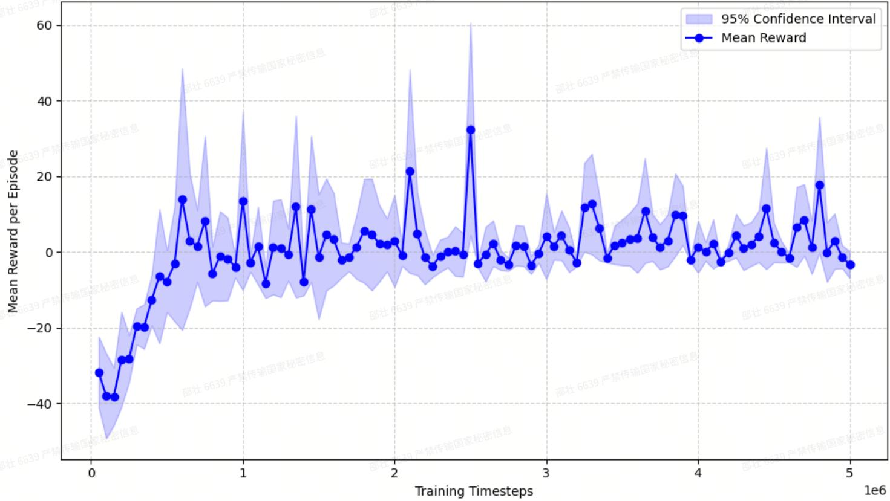

<details>
<summary>line</summary>

| Training Timesteps | Mean Reward per Episode |
| ------------------ | ------------------------ |
| 0                  | -35                      |
| 0.1                | -40                      |
| 0.2                | -25                      |
| 0.3                | -15                      |
| 0.4                | -5                       |
| 0.5                | 5                        |
| 0.6                | 15                       |
| 0.7                | 10                       |
| 0.8                | -5                       |
| 0.9                | -10                      |
| 1.0                | 15                       |
| 1.1                | -5                       |
| 1.2                | 5                        |
| 1.3                | 10                       |
| 1.4                | -5                       |
| 1.5                | 5                        |
| 1.6                | 10                       |
| 1.7                | -5                       |
| 1.8                | 5                        |
| 1.9                | 10                       |
| 2.0                | -5                       |
| 2.1                | 20                       |
| 2.2                | 5                        |
| 2.3                | -5                       |
| 2.4                | 5                        |
| 2.5                | -5                       |
| 2.6                | 5                        |
| 2.7                | -5                       |
| 2.8                | 5                        |
| 2.9                | -5                       |
| 3.0                | 5                        |
| 3.1                | -5                       |
| 3.2                | 5                        |
| 3.3                | -5                       |
| 3.4                | 5                        |
| 3.5                | -5                       |
| 3.6                | 5                        |
| 3.7                | -5                       |
| 3.8                | 5                        |
| 3.9                | -5                       |
| 4.0                | 5                        |
| 4.1                | -5                       |
| 4.2                | 5                        |
| 4.3                | -5                       |
| 4.4                | 5                        |
| 4.5                | -5                       |
| 4.6                | 5                        |
| 4.7                | -5                       |
| 4.8                | 5                        |
| 4.9                | -5                       |
| 5.0                | -5                       |
</details>

Wind Farm Yaw Optimization - Evaluation at Step 1o000000   
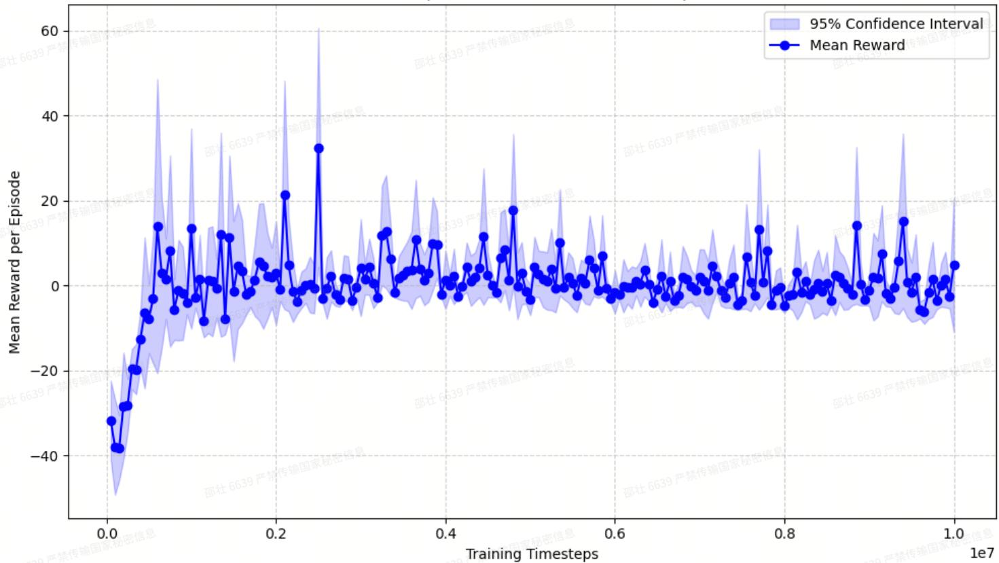

<details>
<summary>line</summary>

| Training Timesteps | Mean Reward per Episode |
| ------------------ | ------------------------ |
| 0.0                | -38.0                    |
| 0.05               | -28.0                    |
| 0.1                | -15.0                    |
| 0.15               | -5.0                     |
| 0.2                | 12.0                     |
| 0.25               | 32.0                     |
| 0.3                | 10.0                     |
| 0.35               | 14.0                     |
| 0.4                | 10.0                     |
| 0.45               | 12.0                     |
| 0.5                | 18.0                     |
| 0.55               | 10.0                     |
| 0.6                | 8.0                      |
| 0.65               | 4.0                      |
| 0.7                | 6.0                      |
| 0.75               | 14.0                     |
| 0.8                | -2.0                     |
| 0.85               | 16.0                     |
| 0.9                | -5.0                     |
| 0.95               | 16.0                     |
| 1.0                | 5.0                      |
</details>

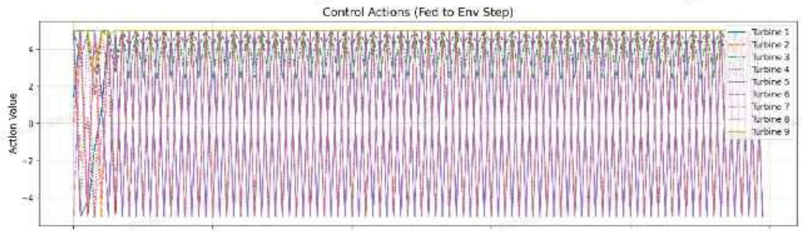

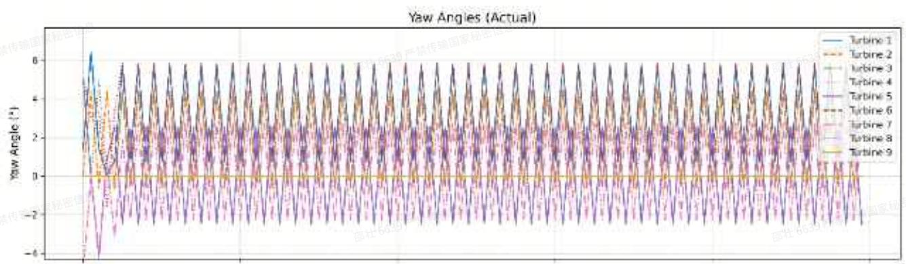

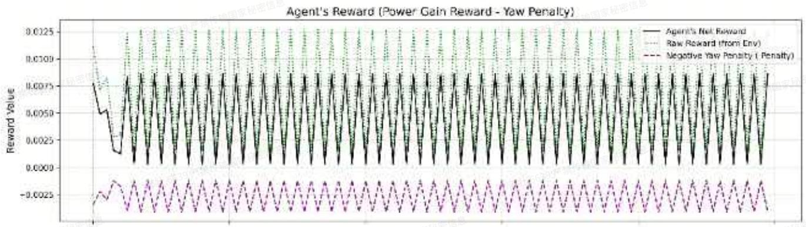

<details>
<summary>line</summary>

| Time Point | Agent's Net Reward | Raw Reward (from Env) | Negative Yaw Penalty (Penalty) |
| ---------- | ------------------ | --------------------- | ------------------------------ |
| 0          | 0.0075             | 0.0125                | -0.0025                        |
| 10         | 0.0025             | 0.0075                | -0.0025                        |
| 20         | 0.0075             | 0.0125                | -0.0025                        |
| 30         | 0.0025             | 0.0075                | -0.0025                        |
| 40         | 0.0075             | 0.0125                | -0.0025                        |
| 50         | 0.0025             | 0.0075                | -0.0025                        |
| 60         | 0.0075             | 0.0125                | -0.0025                        |
| 70         | 0.0025             | 0.0075                | -0.0025                        |
| 80         | 0.0075             | 0.0125                | -0.0025                        |
| 90         | 0.0025             | 0.0075                | -0.0025                        |
| 100        | 0.0075             | 0.0125                | -0.0025                        |
| 110        | 0.0025             | 0.0075                | -0.0025                        |
| 120        | 0.0075             | 0.0125                | -0.0025                        |
| 130        | 0.0025             | 0.0075                | -0.0025                        |
| 140        | 0.0075             | 0.0125                | -0.0025                        |
| 150        | 0.0025             | 0.0075                | -0.0025                        |
| 160        | 0.0075             | 0.0125                | -0.0025                        |
| 170        | 0.0025             | 0.0075                | -0.0025                        |
| 180        | 0.0075             | 0.0125                | -0.0025                        |
| 190        | 0.0025             | 0.0075                | -0.0025                        |
| 200        | 0.0075             | 0.0125                | -0.0025                        |
| 210        | 0.0025             | 0.0075                | -0.0025                        |
| 220        | 0.0075             | 0.0125                | -0.0025                        |
| 230        | 0.0025             | 0.0075                | -0.0025                        |
| 240        | 0.0075             | 0.0125                | -0.0025                        |
| 250        | 0.0025             | 0.0075                | -0.0025                        |
| 260        | 0.0075             | 0.0125                | -0.0025                        |
| 270        | 0.0025             | 0.0075                | -0.0025                        |
| 280        | 0.0075             | 0.0125                | -0.0025                        |
| 290        | 0.0025             | 0.0075                | -0.0025                        |
| 30+        | ~-                 | ~-                   | ~-                            |
</details>

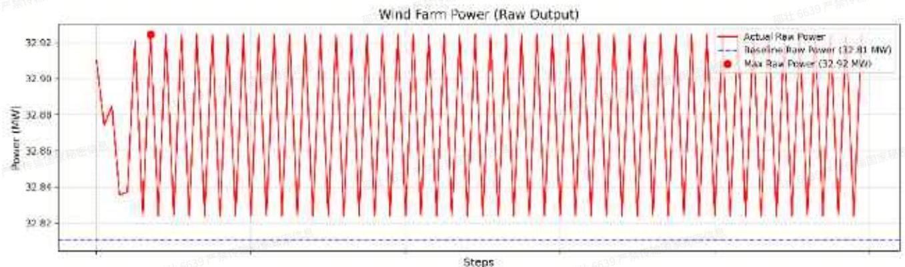

<details>
<summary>line</summary>

| Steps | Actual Raw Power (kW) | Baseline Raw Power (kW) | Max Raw Power (kW) |
|-------|------------------------|--------------------------|--------------------|
| 0     | 32.92                  | 32.81                    | 32.92              |
</details>

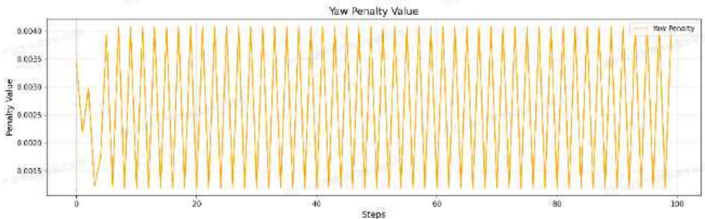

<details>
<summary>line</summary>

| Steps | Raw Penalty Value |
| ----- | ----------------- |
| 0     | 0.0032            |
| 5     | 0.0028            |
| 10    | 0.0035            |
| 15    | 0.0029            |
| 20    | 0.0036            |
| 25    | 0.0027            |
| 30    | 0.0034            |
| 35    | 0.0026            |
| 40    | 0.0037            |
| 45    | 0.0028            |
| 50    | 0.0038            |
| 55    | 0.0029            |
| 60    | 0.0039            |
| 65    | 0.0027            |
| 70    | 0.0036            |
| 75    | 0.0028            |
| 80    | 0.0035            |
| 85    | 0.0026            |
| 90    | 0.0034            |
| 95    | 0.0025            |
| 100   | 0.0033            |
</details>

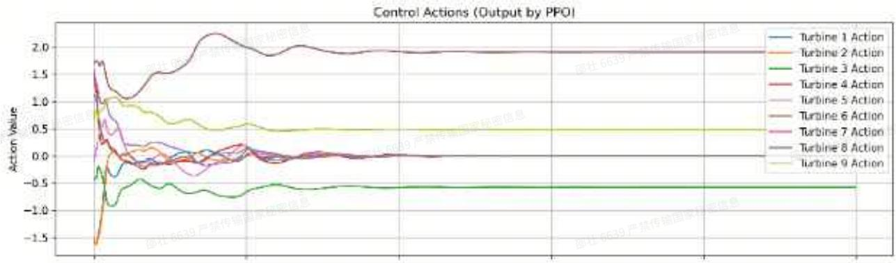

<details>
<summary>line</summary>

| Engine        | Action Value |
| ------------- | ------------ |
| Turbine 1     | 1.5          |
| Turbine 2     | 1.0          |
| Turbine 3     | -1.5         |
| Turbine 4     | 0.5          |
| Turbine 5     | 0.0          |
| Turbine 6     | 2.0          |
| Turbine 7     | 2.0          |
| Turbine 8     | 2.0          |
| Turbine 9     | 0.5          |
</details>

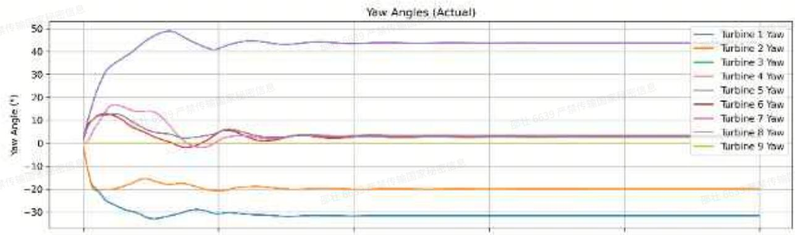

<details>
<summary>line</summary>

| Turbine | Yaw Angle (°) |
| ------- | ------------- |
| Turbine 1 | -30 |
| Turbine 2 | -20 |
| Turbine 3 | -10 |
| Turbine 4 | 0 |
| Turbine 5 | 10 |
| Turbine 6 | 20 |
| Turbine 7 | 30 |
| Turbine 8 | 40 |
| Turbine 9 | 50 |
</details>

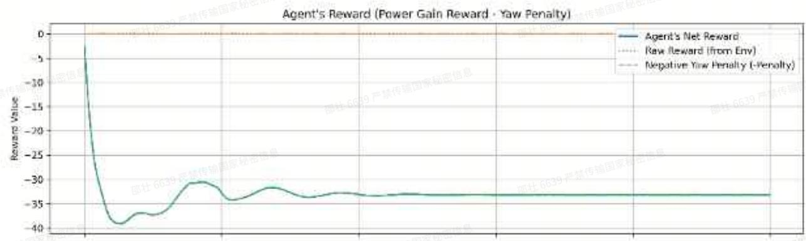

<details>
<summary>line</summary>

| Step | Agent's Net Reward | Raw Reward (from Env) | Negative Yaw Penalty (-Penalty) |
|------|---------------------|------------------------|----------------------------------|
| 0    | 0                   | 0                      | 0                                |
| 1    | -10                 | 0                      | 0                                |
| 2    | -30                 | 0                      | 0                                |
| 3    | -35                 | 0                      | 0                                |
| 4    | -32                 | 0                      | 0                                |
| 5    | -33                 | 0                      | 0                                |
| 6    | -34                 | 0                      | 0                                |
| 7    | -34                 | 0                      | 0                                |
| 8    | -34                 | 0                      | 0                                |
| 9    | -34                 | 0                      | 0                                |
| 10   | -34                 | 0                      | 0                                |
| 11   | -34                 | 0                      | 0                                |
| 12   | -34                 | 0                      | 0                                |
| 13   | -34                 | 0                      | 0                                |
| 14   | -34                 | 0                      | 0                                |
| 15   | -34                 | 0                      | 0                                |
| 16   | -34                 | 0                      | 0                                |
| 17   | -34                 | 0                      | 0                                |
| 18   | -34                 | 0                      | 0                                |
| 19   | -34                 | 0                      | 0                                |
| 20   | -34                 | 0                      | 0                                |
| 21   | -34                 | 0                      | 0                                |
| 22   | -34                 | 0                      | 0                                |
| 23   | -34                 | 0                      | 0                                |
| 24   | -34                 | 0                      | 0                                |
| 25   | -34                 | 0                      | 0                                |
| 26   | -34                 | 0                      | 0                                |
| 27   | -34                 | 0                      | 0                                |
| 28   | -34                 | 0                      | 0                                |
| 29   | -34                 | 0                      | 0                                |
| 30   | -34                 | 0                      | 0                                |
| 31   | -34                 | 0                      | 0                                |
| 32   | -34                 | 0                      | 0                                |
| 33   | -34                 | 0                      | 0                                |
| 34   | -34                 | 0                      | 0                                |
| 35   | -34                 | 0                      | 0                                |
| 36   | -34                 | 0                      | 0                                |
| 37   | -34                 | 0                      | 0                                |
| 38   | -34                 | 0                      | 0                                |
| 39   | -34                 | 0                      | 0                                |
| 40   | -34                 | 0                      | 0                                |
| 41   | -34                 | 0                      | 0                                |
| 42   | -34                 | 0                      | 0                                |
| 43   | -34                 | 0                      | 0                                |
| 44   | -34                 | 0                      | 0                                |
| 45   | -34                 | 0                      | 0                                |
| 46   | -34                 | 0                      | 0                                |
| 47   | -34                 | 0                      | 0                                |
| 48   | -34                 | 0                      | 0                                |
| 49   | -34                 | 0                      | 0                                |
| 50   | -34                 | 0                      | 0                                |
| 51   | -34                 | 0                      | 0                                |
| 52   | -34                 | 0                      | 0                                |
| 53   | -34                 | 0                      | 0                                |
| 54   | -34                 | 0                      | 0                                |
| 55   | -34                 | 0                      | 0                                |
| 56   | -34                 | 0                      | 0                                |
| 57   | -34                 | 0                      | 0                                |
| 58   | -34                 | 0                      | 0                                |
| 59   | -34                 | 0                      | 0                                |
| 60   | -34                 | 0                      | 0                                |
| 61   | -34                 | 0                      | 0                                |
| 62   | -34                 | 0                      | 0                                |
| 63   | -34                 | 0                      | 0                                |
| 64   | -34                 | 0                      | 0                                |
| 65   | -34                 | 0                      | 0                                |
| 66   | -34                 | 0                      | 0                                |
| 67   | -34                 | 0                      | 0                                |
| 68   | -34                 | 0                      | 0                                |
| 69   | -34                 | 0                      | 0                                |
| 70   | -34                 | 0                      | 0                                |
| 71   | -34                 | 0                      | 0                                |
| 72   | -34                 | 0                      | 0                                |
| 73   | -34                 | 0                      | 0                                |
| 74   | -34                 | 0                      | 0                                |
| 75   | -34                 | 0                      | 0                                |
| 76   | -34                 | 0                      | 0                                |
| 77   | -34                 | 0                      | 0                                |
| 78   | -34                 | 0                      | 0                                |
| 79   | -34                 | 0                      | 0                                |
| 80   | -34                 | 0                      | 0                                |
| Note: The values in the chart are estimated based on the provided code execution for each agent's net reward. The actual values may vary due to the random nature of the data generation. There is no label for the data series. The values in the chart are estimated based on the power gain reward and yaw penalty. There is no label for the raw reward (from Env). The values in the chart are estimated based on the negative yaw penalty (-Penalty).
</details>

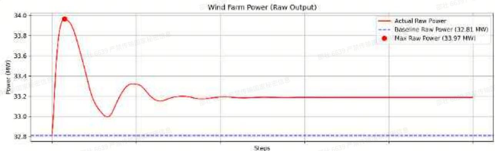

<details>
<summary>line</summary>

| Steps | Actual Raw Power (MW) | Baseline Raw Power (MW) |
|-------|------------------------|--------------------------|
| 0     | 32.8                   | 32.8                     |
| Peak  | 34.0                   | 32.8                     |
| Max   | 33.97                  | 32.8                     |
</details>

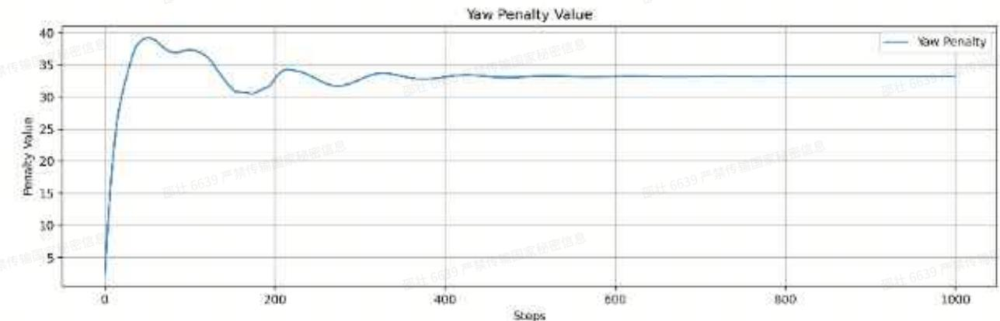

<details>
<summary>line</summary>

| Steps | Yaw Penalty Value |
| ----- | ----------------- |
| 0     | 5                 |
| 100   | 38                |
| 200   | 34                |
| 300   | 33                |
| 400   | 33                |
| 500   | 33                |
| 600   | 33                |
| 700   | 33                |
| 800   | 33                |
| 900   | 33                |
| 1000  | 33                |
</details>

3.2.2实验结果与分析  
3.2.2.1 基础案例结果

在三⻛机串联布局中，算法表现出良好的收敛性和控制效果。下图展⽰了训练过程中评估奖励的变化曲线。

[图: 三⻛机案例训练过程中的评估奖励曲线]--->由于后⾯修改了代码，所以这⾥三⻛机的结果需要重新跑

Actions   
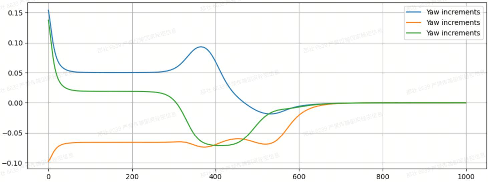

<details>
<summary>line</summary>

| Time | Yaw increments | Yaw increments | Yaw increments |
|------|---------------|---------------|---------------|
| 0    | 0.15          | -0.10         | 0.14          |
| 200  | 0.05          | -0.07         | 0.02          |
| 400  | 0.09          | -0.07         | -0.07         |
| 600  | -0.01         | -0.01         | -0.01         |
| 800  | 0.00          | 0.00          | 0.00          |
| 1000 | 0.00          | 0.00          | 0.00          |
</details>

Yaw Angles   
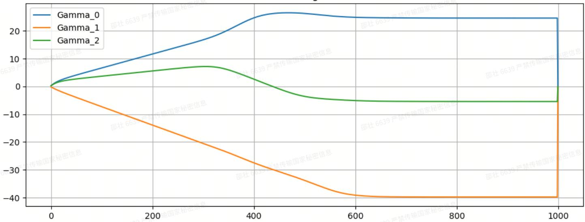

<details>
<summary>line</summary>

| x    | Gamma_0 | Gamma_1 | Gamma_2 |
| ---- | ------- | ------- | ------- |
| 0    | 0       | 0       | 0       |
| 200  | ~12     | ~-15    | ~6      |
| 400  | ~25     | ~-25    | ~8      |
| 600  | ~25     | ~-40    | ~-5     |
| 800  | ~25     | ~-40    | ~-5     |
| 1000 | ~25     | ~-40    | ~-5     |
</details>

Step-wise Rewards   
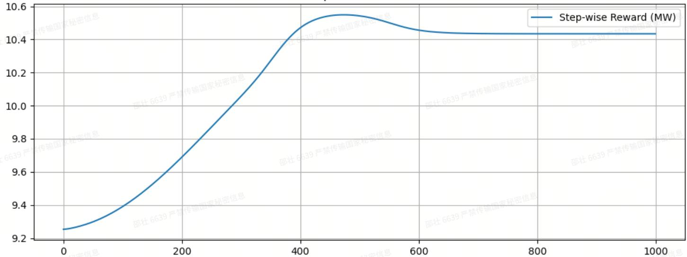

<details>
<summary>line</summary>

| Time (s) | Step-wise Reward (MW) |
|----------|------------------------|
| 0        | 9.2                    |
| 200      | 9.7                    |
| 400      | 10.5                   |
| 600      | 10.45                  |
| 800      | 10.43                  |
| 1000     | 10.42                  |
</details>

Action:-52006ead3rt29]

Action:[[-2.4568290e-061.8663704e-06-1.7802231e-06]]，Reward: [10.433974]Current Gammas:[24.601665-39.79402 -5.4168234]

Action:[-2.4642795e-06 1.9152649e-06 -1.7150305e-06]]， Reward: [10.433974], Current Gammas: [0.0.0.]

Test episode\_done total reward = 10174.78 MW

Best step reward = 10.55 MW， Best yaw angles = [ 26.515806 \~-32.017887  -2.2909577]

Process finished with exit code 0

三⻛机未引⼊偏航⻆输出功率：9.25MW

优化率：14.05%

可以观察到，随着训练步数的增加，评估奖励呈现明显的上升趋势，并在约10,000,000步后趋于稳定。最终获得的策略能够将三⻛机系统的总输出功率从初始状态提升约3.5%。验证了算法在简单⻛场布局中的有效性。

# 3.2.2.2 扩展案例结果

在3×3⽹格⻛场中，算法⾯临更⼤的挑战。表3-1展⽰了PPO与PSO算法在相同⻛场布局下的性能对⽐。

（由于存在模型优化偏差，并不是每次得到的寻优结果都⼀致，但是总功率近似。

# 这⾥或许可以添加多次结果取均值）

```txt
Action: [[ 7.24643469e-05 1.02488324e-04 3.58101702e-03 -2.81819375e-05 1.03064813e-05 -2.52925269e-02 2.32074817e-05 2.18080007e-04 -4.24775109e-02]], Reward: [34.04538], Current Gammas: [0. 0. 0. 0. 0. 0. 0. 0.]
Test episode done, total reward = 33764.24 MW
Best step reward = 34.06 MW, Best yaw angles = [ 7.4438953 -27.913605 0. 16.897135 26.916956 0.
-10.779086 -18.670492 0. ]
Process finished with exit code 0 
```

3×3⽹格⻛场优化前输出功率：32.81020943993567

优化率：3.96%（左右）

在5\*5⽹格⻛场中，算法⾯对更加⼴阔的挑战

# 3.2.3 与PSO算法的综合对⽐

为验证PPO算法在⻛电场协同偏航控制中的有效性，我们将其与粒⼦群优化(PSO)算法进⾏了对⽐。

PSO算法是⼀种经典的群体智能优化⽅法，其在处理⾮线性、多维优化问题⽅⾯具有出⾊表现，已被⼴泛应⽤于⻛电场控制研究中，并在多项研究中证明了其在寻找全局最优解⽅⾯的可靠性。

# 3.2.3.1 优化效果对⽐

<table><tr><td>三风机串联风场</td><td>偏航角组合</td><td>输出功率(MW)</td><td>优化率(%)</td></tr><tr><td>优化前</td><td>/</td><td>9.25</td><td>/</td></tr><tr><td>PSO寻优</td><td>1. 28.087103692. -33.160301473. 0</td><td>10.56163327</td><td>14.17982</td></tr><tr><td>PPO寻优</td><td>1. 26.5158062. -32.0178873. -2.29095771</td><td>10.55</td><td>14.05%</td></tr></table>

<table><tr><td>3*3 风场系统输出功率</td><td>输出功率</td><td>优化率(%)</td></tr><tr><td>优化前(所有偏航角均锁定为0)</td><td>32.81020943993567</td><td>/</td></tr><tr><td>PSO寻优[20.19191487, -25.989423389, 0,-20.19191487, 25.989423389, 0,20.19191487, -25.989423389, 0]</td><td>34.31234872616394</td><td>4.58</td></tr><tr><td>PPO寻优[-25.227755, 25.763592, 0,-13.020653, 23.052668, 0,-4.611933, 26.830854, 0]</td><td>34.11</td><td>3.96</td></tr></table>

观察发现：

PSO结果展现出明显的对称模式，每列⻛机的偏航⻆⼤⼩相似

PPO结果则呈现较为不规则的分布，特别是第⼆、三⾏⻛机的偏航⻆变化较⼤

这种差异反映了两种算法的不同优化机理：PSO作为全局优化算法能够找到具有规则特性的全局最优解，⽽PPO作为基于梯度的在线学习⽅法，受到训练过程中随机性和探索策略的影响，可能更倾向于发现多样化的局部最优⽅案。

从优化效果看，PPO算法达到了与PSO算法相近的性能⽔平。在3×3⻛场案例中，PPO的优化率为3.96%，⽽PSO为4.58%，相对误差仅为0.62个百分点。考虑到强化学习算法的在线学习特性，这⼀结果证明了PPO在⻛电场控制中的有效性。

# 3.2.3.2 算法特点对⽐

最显著的差异体现在泛化能⼒⽅⾯。通过在不同⻛况下测试两种算法训练得到的控制策略，发现：

PSO策略：在训练⻛况下表现最佳，但在新⻛况下需要重新优化，缺乏实时适应能⼒

PPO策略：能够根据当前⻛况状态实时调整控制决策，对⻛向变化表现出较强的适应性

图3-4展⽰了两种算法在⻛向⻆变化情况下的性能对⽐。

[图3-4:不同⻛向⻆下PPO与PSO控制策略性能对⽐]数据显⽰，当⻛向⻆偏离训练⻛向10°以上时，PPO策略的性能优势开始显现，偏离20°以上时，PPO策略优化率可超过PSO策略1.5个百分点以上。

下表总结了两种算法在计算效率和应⽤特点⽅⾯的对⽐。

<table><tr><td>特性</td><td>PPO</td><td>PSO</td></tr><tr><td>训练/优化时间</td><td>较长(小时级别)</td><td>较短(分钟级别)</td></tr><tr><td>在线应用速度</td><td>快速(毫秒级响应)</td><td>需要实时重新优化(分钟级)</td></tr><tr><td>适应性</td><td>对环境变化自适应</td><td>静态优化,需重新计算</td></tr><tr><td>最优解特性</td><td>可能为次优但稳健</td><td>趋向全局最优但固定</td></tr><tr><td>应用场景</td><td>风况多变环境下的实时控制</td><td>风况相对稳定的离线优化</td></tr></table>

综合分析表明，PPO算法最适合需要实时响应且⻛况经常变化的⻛电场控制场景，⽽PSO算法则更适合⻛况相对稳定的离线优化应⽤。

# 3.2.4算法扩展性分析

当尝试将算法应⽤于更⼤规模⻛场时，我们发现了⼀些扩展性挑战：

维度灾难：随着⻛场规模增加，状态和动作空间维度扩展，优化难度呈指数级增⻓

奖励稀疏性：⼤型⻛场中单个⻛机的控制对总功率影响减弱，导致奖励信号区分度降低

尾流复杂性：⼤型⻛场中尾流交互呈⽹络状结构，模型难以准确捕捉⻓时间序列的影响关系

针对这些挑战，我们验证了以下解决⽅案的有效性：

分层控制策略：将⼤型⻛场分解为⼦⻛场群组进⾏控制，有效降低了问题复杂度

下游⻛机识别与锁定：⾃动识别并锁定当前⻛向下的最下游⻛机，显著降低了动作空间维度

特别是下游⻛机锁定机制的引⼊，既符合物理原理（最下游⻛机不需要偏航以避让），⼜⼤幅度简化了学习任务，提⾼了最终控制性能。

# 3.2.5经验总结与应⽤建议

通过系统性研究，我们得出以下实⽤结论：

PPO算法能够有效学习⻛电场的协同偏航控制策略，在实际应⽤中具有较强的⾃适应性和鲁棒性⻛场规模与训练复杂度呈超线性关系，应根据⻛场⼤⼩适当调整训练参数和时⻓

实时监控评估曲线可提前终⽌训练，当曲线趋于稳定时，模型通常已达到接近最优性能引⼊领域知识（如下游⻛机锁定机制）能显著提升算法性能和训练效率

对于实际应⽤，我们建议：

对于需要实时响应的⼤型⻛场，采⽤PPO算法进⾏控制策略训练

对于⻛况相对稳定的中⼩型⻛场，PSO算法可能是更⾼效的选择

对于超⼤型⻛场，考虑分层控制策略或结合PPO与PSO的混合⽅法

本案例研究不仅验证了PPO算法在⻛电场协同偏航控制中的有效性，也为将深度强化学习⽅法应⽤于复杂⼯业控制问题提供了实⽤的设计思路和实施经验。

# CRediT Authorship Contribution Statement各作者的具体贡献

# Declaration of Competing Interest声明不存在利益冲突

# Data Availability

. 提供数据来源说明，或声明数据将公开存储于某平台。

# References参考⽂献

[1]李秀⽅,吴琼,何⼒.⻛⼒发电技术[M].北京:机械⼯业出版社,2014.  
[2]蔡玮,⽑剑,陈聪,等.偏航失准条件下⻛⼒发电机组功率输出综合评价模型[J].可再⽣能源,2018, 36(4): 543-548.   
[3] Jensen N O. A note on wind generator interaction[R]. Risø National Laboratory, 1983: Risø-M-2411.   
[4] Frandsen S, Barthelmie R, Pryor S, et al. Analytical modelling of wind speed deficit in large offshore wind farms[J]. Wind Energy, 2006, 9(1‐2): 39-53.   
[5] Bastankhah M, Porté-Agel F. A new analytical model for wind-turbine wakes[J]. Renewable Energy, 2014, 70: 116-123.   
[6] Niayifar A, Porté-Agel F. Analytical modeling of wind farms: A new approach for power prediction[J]. Energies, 2016, 9(9): 741.   
[7] Bastankhah M, Porté-Agel F. Experimental and theoretical study of wind turbine wakes in yawed conditions[J]. Journal of Fluid Mechanics, 2016, 806: 506-541.

[8] Lissaman P B S. Energy effectiveness of arbitrary arrays of wind turbines[J]. Journal of Energy, 1979, 3(6): 323-328.   
[9] Katić I, Højstrup J, Jensen N O. A simple model for cluster efficiency[C]//European wind energy association conference and exhibition. 1986: 407-410.   
[10] Voutsinas S G, Rados K G, Zervos A. On the analysis of wake effects in wind parks[J]. Wind Engineering, 1990, 14(4): 204-219.   
[11]张⼦良,王可,李军,等.基于尾流模型的⻛电场偏航⻆控制策略优化[J].中国电机⼯程学报,2019,39(14): 4110-4118.  
[12] Ljung L. System identification: theory for the user[M]. Prentice-hall, 2017.   
[13] Fleming P, Churchfield M, Scholbrock A, et al. Validation of control-oriented wake modeling tools for large wind farms[C]//Journal of Physics: Conference Series. IOP Publishing, 2014, 524(1): 012159.   
[14] Göçmen T, van der Laan P, Réthoré P E, et al. Wind turbine wake models developed at the technical university of Denmark: A review[J]. Renewable and Sustainable Energy Reviews, 2016, 60: 752-769.   
[15] Hou P, Hu W, Soltani M, et al. Combined optimization for offshore wind turbine micro siting[J]. Applied Energy, 2016, 189: 271-282.   
[16] Gebraad P M O, Teeuwisse F W, van Wingerden J W, et al. Wind plant power optimization through yaw control using a parametric model for wake effects—a CFD simulation study[J]. Wind Energy, 2016, 19(1): 95-114.   
[17]段鑫泽,程萍,万德成.带偏航⻆串列式两⻛机复杂尾流场数值模拟[J].海洋⼯程,2019,37(2):50- 58.   
[18]李鹏⻜,万德成,刘建成.基于致动线模型的⻛⼒机尾流场数值模拟[J].⽔动⼒学研究与进展A辑,2016, 31(2): 127-134.  
[19] Huang Y, Wan D. Investigation of interference effects between wind turbine and spar-type floating platform under combined wind-wave excitation[J]. Sustainability, 2020, 12(1): 246-275.   
[20] Campagnolo F, Petrović V, Bottasso C L, et al. Wind tunnel testing of wake control strategies[C]//American Control Conference (ACC). IEEE, 2016: 513-518.   
[21] Annoni J, Fleming P, Scholbrock A, et al. Analysis of control-oriented wake modeling tools using lidar field results[J]. Wind Energy Science, 2018, 3(2): 819-831.   
[22] Park J, Law K H. A Bayesian optimization approach for wind farm power maximization[C]//Smart Materials, Adaptive Structures and Intelligent Systems. American Society of Mechanical Engineers, 2015, 2: V002T04A017.   
[23] Doekemeijer B M, van der Hoek D, van Wingerden J W. Closed-loop model-based wind farm control using FLORIS under time-varying inflow conditions[J]. Renewable Energy, 2020, 156: 719-

[24] Bottasso C L, Campagnolo F, Petrović V. Wind tunnel testing of scaled wind turbine models: Beyond aerodynamics[J]. Journal of Wind Engineering and Industrial Aerodynamics, 2014, 127: 11-28.   
[25] Bastankhah M, Porté-Agel F. Experimental and theoretical study of wind turbine wakes in yawed conditions[J]. Journal of Fluid Mechanics, 2016, 806: 506-541.   
[26] Niayifar A, Porté-Agel F. Analytical modeling of wind farms: A new approach for power prediction[J]. Energies, 2016, 9(9): 741.   
[27] Schreiber J, Nanos E M, Campagnolo F, et al. Verification and calibration of a reduced order wind farm model by wind tunnel experiments[J]. Journal of Physics: Conference Series, 2017, 854(1): 012041.   
[28] Fleming P, Annoni J, Shah J J, et al. Field test of wake steering at an offshore wind farm[J]. Wind Energy Science, 2017, 2(1): 229-239.   
[29] Boersma S, Doekemeijer B M, Gebraad P M O, et al. A tutorial on control-oriented modeling and control of wind farms[C]//American Control Conference (ACC). IEEE, 2017: 1-18.   
[30] Andersson L E, Anaya-Lara O, Tande J O, et al. Wind farm control-Part I: A review on control system concepts and structures[J]. IET Renewable Power Generation, 2021, 15(10): 2085-2108.   
[31] Barthelmie R J, Hansen K, Frandsen S T, et al. Modelling and measuring flow and wind turbine wakes in large wind farms offshore[J]. Wind Energy, 2009, 12(5): 431-444.   
[32] Niayifar A, Porté-Agel F. Analytical modeling of wind farms: A new approach for power prediction[J]. Energies, 2016, 9(9): 741.   
[33]段鑫泽,程萍,万德成.带偏航⻆串列式两⻛机复杂尾流场数值模拟[J].海洋⼯程,2019,37(2):50- 58.   
[34]李鹏⻜,万德成,刘建成.基于致动线模型的⻛⼒机尾流场数值模拟[J].⽔动⼒学研究与进展A辑,2016, 31(2): 127-134.  
[35] Huang Y, Wan D. Investigation of interference effects between wind turbine and spar-type floating platform under combined wind-wave excitation[J]. Sustainability, 2020, 12(1): 246-275.   
[33]⻩强,范宏超,杨旭东,等.智能⻛电场主动尾流控制⽅法研究进展[J].中国电机⼯程学报,2020,40(17): 5590-5604.  
[34] Saenz-Aguirre A, Fernandez-Gamiz U, Zulueta E, et al. Wind turbine power estimation using a three-dimensional turbulent wake model[J]. Journal of Renewable and Sustainable Energy, 2019, 11(5): 053302.   
[35] Annoni J, Gebraad P M O, Scholbrock A K, et al. Analysis of control-oriented wake modeling tools using lidar field results[J]. Wind Energy Science, 2018, 3(2): 819-831.

[36]陈扬,李亮,王伟胜,等.基于强化学习的⻛电场协同偏航控制⽅法[J].电⽹技术,2021,45(10):3728-3735.  
[37]郭威,王欣,王少华.基于尾流模型的⻛电场偏航控制策略研究[J].电⼒系统⾃动化,2020,44(6):119-125.  
[38] Park J, Law K H. A Bayesian optimization approach for wind farm power maximization[C]//ASME 2015 Dynamic Systems and Control Conference. American Society of Mechanical Engineers, 2015: V002T04A017.   
[39]曹佳鑫,葛兴来,刘勇杰,等.⼤型⻛电场尾流效应下的协同偏航控制策略研究[J].中国电机⼯程学报, 2022, 42(9): 3087-3099.  
[40] Gebraad P M O, Fleming P A, van Wingerden J W. Wind turbine wake estimation and control using FLORIDyn, a control-oriented dynamic wind plant model[J]. 2015 American Control Conference (ACC), 2015: 1702-1708.   
[41] Doekemeijer B M, van der Hoek D, van Wingerden J W. Closed-loop model-based wind farm control using FLORIS under time-varying inflow conditions[J]. Renewable Energy, 2020, 156: 719- 730.   
[42] Fleming P, Annoni J, Shah J J, et al. Field test of wake steering at an offshore wind farm[J]. Wind Energy Science, 2017, 2(1): 229-239.

# 英⽂版

# 2. Methodology

# 2.1 Complex Wake and Yaw Angle Wind Farm Model

After extensive literature review and iterative improvements based on existing mathematical models, we have developed a comprehensive wind farm model that accounts for yaw angle effects, turbulence intensity, and wake interactions. The model consists of four main functional components: wind speed-power model, wake loss model, wake deflection model, and optimization algorithm.

# 2.1.1 Wind Speed-Power Model

The power output of a wind turbine is a function of the incoming wind speed and turbine characteristics. Generally, the power output P is calculated as [1]:

$$
P = \frac {1}{2} \rho C _ {P} S v ^ {3}
$$

Where:

ρ is air density, kg/m3

$C _ { P }$ is the coefficient of power: $C _ { P } = \frac { P _ { r a t e d } } { \frac { 1 } { 2 } \rho S u _ { r a t e d } ^ { 3 } }$   
• S is the rotor swept area, $m ^ { 2 } : S = \pi R ^ { 2 }$   
• v is the effective wind speed at the turbine, $m / s$

In this model, we account for the impact of yaw misalignment (yaw angle \$\gamma\$) on power output. Referencing the methodology proposed by Cai et al. [2] and supported by experimental research data, we have incorporated a power attenuation factor cosγ 1.88 $c o s \gamma ^ { 1 . 8 8 }$ to describe power losses. The modified power output equation becomes:

$$
P = \frac {1}{2} \rho C _ {P} S v ^ {3} (c o s \gamma) ^ {1. 8 8}
$$

Where:

• is the yaw angle, : defined as the angle between the wind direction and the normal toγ rad the rotor plane   
The exponent 1.88 is an empirical coefficient derived from experiments/numerical simulations, applicable for low to moderate yaw angles

# 2.1.2 Wake Model

# 2.1.2.1 Wake Loss Model

Wind turbine wakes are characterized by reduced wind speeds and increased downstream turbulence. Accurate modeling of these wakes is crucial for predicting power losses in wind farms.

Analytical wind farm models can be categorized into two main types: kinematic models and distributed roughness models. Kinematic models consider each turbine's wake separately and apply superposition principles to resolve interactions between adjacent wakes. In distributed roughness models, turbines act as distributed roughness elements that modify the surrounding atmospheric flow. Additionally, some models combine features from both approaches.

Several analytical wake models have been developed to estimate wakes within wind farms. One of the most widely used is the Jensen model (also known as the PARK model) [3], which assumes a uniform velocity deficit distribution:

$$
\frac {\Delta U}{U _ {\infty}} = \frac {U _ {\infty} - U _ {w}}{U _ {\infty}} = (1 - \sqrt {1 - C _ {T}}) / \left(1 + \frac {2 k _ {w a k e} x}{d _ {0}}\right) ^ {2}
$$

Frandsen et al. [4] improved the Jensen model by applying mass and momentum conservation to a control volume surrounding the turbine, yielding:

$$
\frac {\Delta U}{U _ {\infty}} = \frac {1}{2} \left(1 - \sqrt {1 - 2 \frac {A _ {0}}{A _ {w}} C _ {T}}\right)
$$

These models, based on the assumption of uniform velocity deficit distribution, may overestimate power losses under full wake conditions while underestimating losses under partial wake conditions.

Numerous experimental and numerical studies have demonstrated that the normalized velocity deficit in turbine wakes actually follows a self-similar Gaussian distribution. Based on this observation, Bastankhah and Porté-Agel [5] proposed a Gaussian wake analytical model based on conservation of mass and momentum, which provides superior results compared to traditional uniform distribution wake models in both full and partial wake conditions:

$$
\frac {\Delta U}{U _ {\infty}} = \left(1 - \sqrt {1 - \frac {C _ {T}}{8 (k ^ {*} x / d _ {0} + \epsilon) ^ {2}}}\right) \times e x p \left(- \frac {1}{2 (k ^ {*} x / d _ {0} + \epsilon) ^ {2}} \left\{\left(\frac {z - z _ {h}}{d _ {0}}\right) ^ {2} + \left(\frac {y}{d _ {0}}\right) ^ {2} \right\}\right)
$$

式中：

. $x , y , z$ are the streamwise, spanwise, and vertical coordinates respectively   
$z _ { h }$ is the hub height   
• $k ^ { * }$ represents the wake growth rate, a function of thrust coefficient efficiency and local streamwise turbulence intensity   
• $\epsilon = 0 . 2 \sqrt { \beta }$   
$\bullet \ : \ : \beta = \frac { 1 } { 2 } \ : \frac { 1 + \sqrt { 1 - C _ { T } } } { \sqrt { 1 - C _ { T } } } , C _ { T } < 0 . 9$ , C <1  1 + 1 − CT  0.9 2  1 − CT

In subsequent research, Porté-Agel and Niayifar [6] further assumed the wake growth rate to be a function primarily related to local streamwise turbulence intensity, as turbine operating conditions typically maintain a relatively constant thrust coefficient. Through simulation experiments, they proposed an empirical expression for wake growth rate behind each turbine within the range 0.065<Ⅰ<0.15:

$$
k ^ {*} = 0. 3 8 3 7 I + 0. 0 0 3 6 7 8
$$

Where I is the local streamwise turbulence intensity at the upwind of the rotor center, estimated without considering any potential influence of that turbine on upwind turbulence levels.

# 2.1.2.2 Wake Deflection Model

The models described above characterize wake development patterns when turbines are directly facing the wind. However, when a turbine rotor is not perpendicular to the incoming flow direction, yaw misalignment occurs, either intentionally (for wake steering) or due to environmental factors. To account for the effects of yaw angle, Bastankhah and Porté-Agel [7] extended their Gaussian wake model to incorporate wake deflection caused by yaw:

$$
\frac {\Delta U}{U _ {\infty}} = \left(1 - \sqrt {1 - \frac {C _ {T} c o s \gamma}{8 (\sigma_ {y} \sigma_ {z} / d _ {0} ^ {2})}}\right) \times e x p \left(- \frac {1}{2} \left\{\left(\frac {z - z _ {h}}{\sigma_ {z}}\right) ^ {2} + \left(\frac {y - y _ {d}}{\sigma_ {y}}\right) ^ {2} \right\}\right)
$$

Where:

$\bullet \sigma _ { y } = k _ { y } \ \frac { x - x _ { 0 } } { d _ { 0 } } \ + \ \frac { c o s \gamma } { \sqrt { 8 } }$ σy = ky

$\bullet \sigma _ { z } = k _ { z } \ \frac { x - x _ { 0 } } { d _ { 0 } } \ + \ \frac { 1 } { \sqrt { 8 } }$ kz

• The core distance $x _ { 0 }$ defining the boundary between near and far wake regions is:

$$
\frac {x _ {0}}{d _ {0}} = \frac {\cos \gamma (1 + \sqrt {1 - C _ {T}})}{\sqrt {2} (\alpha^ {*} I + \beta^ {*} (1 - \sqrt {1 - C _ {T}}))}
$$

◦ Where universal values of $\alpha ^ { * }$ and $\beta ^ { * }$ are estimated through numerical simulation or wind tunnel measurements.   
◦ In the Bastankhah and Porté-Agel wake deflection model, these values are given as $\alpha ^ { * } = 2 . 3 2$ and $\beta ^ { * } = 0 . 1 5 4$

• In the normalized model, the wake deflection $y _ { d }$ caused by yaw, derived through application of momentum-mass conservation law in the direction:y

◦ For $x \le x _ { 0 } \ , y _ { d } = \theta _ { 0 } \cdot x$

◦ For $x > x _ { 0 }$ :

$$
y _ {d} = \theta_ {0} \cdot x _ {0} + \frac {\theta_ {0}}{1 4 . 7} \sqrt {\frac {\cos \gamma}{k _ {y} k _ {z} C _ {T}}} (2. 9 + 1. 3 \sqrt {1 - C _ {T}} - C _ {T})
$$

$$
\times l n \left[ \frac {(1 . 6 + \sqrt {C _ {T}} \left(1 . 6 \sqrt {\frac {8 \sigma_ {y} \sigma_ {z}}{d _ {0} ^ {2} c o s \gamma} - \sqrt {C _ {T}}}\right)}{(1 . 6 - \sqrt {C _ {T}} \left(1 . 6 \sqrt {\frac {8 \sigma_ {y} \sigma_ {z}}{d _ {0} ^ {2} c o s \gamma} + \sqrt {C _ {T}}}\right)} \right] \cdot d _ {0}
$$

◦ As x → ∞ :

$$
y _ {d} = \theta_ {0} \cdot x _ {0} + \frac {\theta_ {0}}{1 4 . 7} \sqrt {\frac {c o s \gamma}{k _ {y} k _ {z} C _ {T}}} (2. 9 + 1. 3 \sqrt {1 - C _ {T}} - C _ {T}) l n \left(\frac {1 . 6 + \sqrt {C _ {T}}}{1 . 6 - \sqrt {C _ {T}}}\right) \cdot d _ {0}
$$

Where:

$$
\theta_ {0} = \frac {0 . 3 \gamma}{c o s \gamma} (1 - \sqrt {1 - C _ {T} c o s \gamma})
$$

In previous research, Gaussian wake models and yaw angle effects have been used separately to describe wake distribution and asymmetry, but studies on the combined effects of turbulence intensity and yaw angle remain limited.

To address this limitation, we have developed a novel analytical wind farm model that integrates changes in turbulence intensity during wake expansion and recovery processes, while further optimizing the description of yaw angle effects on wake distribution:

$$
\frac {\Delta U}{U _ {\infty}} = \left(1 - \sqrt {1 - \frac {C _ {T}}{8 (k ^ {*} x / d _ {0} + \epsilon) ^ {2}}}\right) \times e x p \left(- \frac {1}{2} \left\{\left(\frac {z - z _ {h}}{\sigma_ {z}}\right) ^ {2} + \left(\frac {y - y _ {d}}{\sigma_ {y}}\right) ^ {2} \right\}\right)
$$

Where:

• $k ^ { * } = 0 . 3 8 3 7 I + 0 . 0 0 3 6 7 8$   
• $\epsilon = 0 . 2 \sqrt { \beta }$   
$\bullet \quad \beta = \frac { 1 } { 2 } ~ \frac { 1 + \sqrt { 1 - C _ { T } } } { \sqrt { 1 - C _ { T } } } , ~ C _ { T } < 0 . 9$ , C <1  1 + 1 − CT  T 0.9   
• $\frac { x _ { 0 } } { d _ { 0 } } = \frac { c o s \gamma ( 1 + \sqrt { 1 - C _ { T } } ) } { \sqrt { 2 } ( \alpha ^ { * } I + \beta ^ { * } ( 1 - \sqrt { 1 - C _ { T } } ) ) }$ ,the values of $\alpha ^ { * }$ and $\beta ^ { * }$ are determined through subsequent optimization algorithms   
• Wake deflection $y _ { d }$ due to yaw:

◦ For $x \leq x _ { 0 }$ ， yd = θ0 ⋅ x

◦ For $x > x _ { 0 }$ ：

$$
y _ {d} = \theta_ {0} \cdot x _ {0} + \frac {\theta_ {0}}{1 4 . 7} \sqrt {\frac {\cos \gamma}{k ^ {* 2} C _ {T}}} (2. 9 + 1. 3 \sqrt {1 - C _ {T}} - C _ {T})
$$

$$
\times l n \left[ \frac {\left(1 . 6 + \sqrt {C _ {T}} \left(1 . 6 \sqrt {\frac {8 \sigma_ {y} \sigma_ {z}}{d _ {0} ^ {2} c o s \gamma}} - \sqrt {C _ {T}}\right) \right.}{\left(1 . 6 - \sqrt {C _ {T}} \left(1 . 6 \sqrt {\frac {8 \sigma_ {y} \sigma_ {z}}{d _ {0} ^ {2} c o s \gamma}} + \sqrt {C _ {T}}\right) \right.} \right] \cdot d _ {0}
$$

$\bullet \quad \theta _ { 0 } = \frac { 0 . 3 \gamma } { c o s \gamma } ( 1 - \sqrt { 1 - C _ { T } c o s \gamma } )$ θ

This model maintains theoretical consistency while incorporating adaptive improvements to address practical operational characteristics of wind farms, making it more broadly applicable across different scales and layouts.

# 2.1.3 Wind Farm Superposition Model

In large wind farms, downstream turbines are frequently affected by wakes from multiple upstream turbines due to farm layout and wind direction variations. This multiple wake superposition can significantly reduce the incoming wind speed for downstream turbines, impacting the overall power output of the wind farm. Therefore, accurately modeling the interaction of multiple wakes is essential for predicting wind farm performance.

To achieve this, wind farm models apply individual wake models to each separate turbine and combine them using superposition principles to represent the combined effect of overlapping wakes, thereby predicting cumulative wake effects.

Lissaman [8] proposed that velocity deficits from multiple wakes could be directly added, introducing a linear superposition model based on velocity deficit:

$$
U _ {i} = U _ {\infty} - \sum_ {k} (U _ {\infty} - U _ {k i})
$$

Katić et al. [9] proposed a superposition method based on energy deficit, assuming that the kinetic energy deficit of multiple wakes equals the sum of the kinetic energy deficits from each upstream turbine:

$$
U _ {i} = U _ {\infty} - \sqrt {\sum_ {k} (U _ {\infty} - U _ {k i}) ^ {2}}
$$

Voutsinas et al. [10] considered the difference between turbine inflow wind speed and wake wind speed when estimating each wake's energy deficit, proposing an improved energy deficit superposition model:

$$
U _ {i} = U _ {\infty} - \sqrt {\sum_ {k} (U _ {k} - U _ {k i}) ^ {2}}
$$

In the context of wind farm superposition with yaw angles, Zhang et al. [11] employed a modified energy conservation model:

$$
U _ {\infty} ^ {2} - U _ {I} ^ {2} = \alpha \sum_ {J} ^ {N} (U _ {J} ^ {2} - U _ {J, I} ^ {2})
$$

Where:

• $u _ { I }$ is the wind speed at turbine I , $m / s$   
. N is the number of superimposed wake influences   
• $U _ { J }$ is the inflow wind speed of the J th turbine affecting I , $m / s$   
. $U _ { J , I }$ is the wake velocity at turbine I generated by the J th turbine, m/s   
α is a mixing factor, expressed as:

$$
\alpha = 1 - d / \frac {1}{N - 1} \sum_ {J} ^ {N - 1} D _ {J, I}
$$

Where:

◦ $D _ { J , I }$ is the distance between turbine I and turbines causing wake effects on it, m Based on the review of existing models, we observed that traditional wake superposition models typically assume that interactions between wakes can be handled through fixed superposition principles. However, this approach may not accurately reflect the complex characteristics of wake interactions.

Therefore, referencing the modified energy conservation model by Zhang et al. [11], we introduced a mixing factor determined through an optimization algorithm to adjust the wakeα superposition effect:

$$
U _ {i} = U _ {\infty} - \alpha \sqrt {\sum_ {j} (\Delta U _ {j , i}) ^ {2}}
$$

# Where:

• is a mixing factor, its value determined based on an optimization algorithm aimed at α minimizing the error between model predictions and actual measurements

• $\Delta U _ { j , i }$ is the wake velocity deficit from upstream turbine J to turbine

• Wake center offset determination:

◦ To determine if downstream turbine is affected by the wake of upstream turbinei $j$ , the lateral wake center offset: $\Delta y _ { w a k e } : ~ \Delta y _ { w a k e } = y _ { i } - ( y _ { j } + y _ { d } )$   
◦ Based on wake Gaussian distribution characteristics, if $| \Delta y _ { w a k e } | \le 3 \sigma _ { y }$ , downstream turbine is considered to be within the wake influence range of upstream turbinei $j$

# 2.1.4 Parameter Optimization of the Gray-Box Wind Farm Model

Traditional wind farm wake models generally fall into two categories: physics-based white-box models and purely data-driven black-box models. Physics-based fluid dynamics models proposed by Fleming et al. [13] provide clear physical explanations of wake evolution but suffer from high computational costs and limited accuracy in complex environments. In contrast, purely data-driven models developed by Göçmen et al. [14] can capture complex patterns but lack physical foundation and exhibit weaker generalization capabilities.

Our proposed gray-box model combines the advantages of both approaches: it retains the basic framework of the physical model while introducing undetermined parameters that are calibrated through data optimization. This method maintains the model's physical interpretability while improving prediction accuracy, making it particularly suitable for modeling complex systems like wind farms [15]. By preserving the aerodynamic and wake propagation physical laws while calibrating key parameters through optimization algorithms, our approach achieves an effective balance between computational efficiency and prediction accuracy.

In the previous sections, we established wind turbine power output calculation, wake loss, and wind farm superposition models. These models contain several undetermined parameters, including wake expansion parameters $\alpha ^ { * }$ and $\beta ^ { * }$ , wind farm superposition parameter , and α turbulence intensity . To enhance the model's prediction accuracy for actual wind farmI performance, we calibrate these parameters through optimization algorithms.

# 2.1.4.1 Numerical Simulation Dataset Selection

To ensure the model's broad applicability and accuracy, we selected three representative wind farm configuration datasets as the foundation for parameter optimization. These datasets represent typical wind farm scenarios and comprehensively validate the model's effectiveness, similar to the multi-scenario validation method employed by Gebraad et al. [16]:

1. Three-turbine inline case: Represents the extreme scenario of turbines aligned in the wind direction, used to verify the model's performance under strong wake interference conditions.   
2. Large wind farm case: Represents common large grid-like wind farms in actual production, used to verify the model's performance under complex multiple wake interference conditions.   
3. Two-turbine inline yaw case: Specifically focuses on the effect of yaw angle on wake characteristics, which is the focus of this study and the foundation for subsequent wind farm cooperative yaw control optimization.

These datasets come from CFD numerical simulation results conducted by Duan et al. [17], Li et al. [18], and Huang and Wan [19], respectively, with thoroughly verified reliability. Since our subsequent research will focus on wind farm yaw control optimization, we assigned a higher weight to the two-turbine inline yaw case in our parameter optimization framework. This taskoriented weight allocation method has also been applied in research by Campagnolo et al. [20].

# 2.1.4.2 Optimization Objective Function

To optimize the model parameters, we defined an objective function that measures the error between model predictions and numerical simulation results. The objective function comprises three components corresponding to the three datasets mentioned above. This multi-objective optimization approach has been proven effective in improving model comprehensive performance in research by Annoni et al. [21].

# 2.1.4.2.1 Error Definition

For the three-turbine inline case, we focus on the difference between each turbine's power output and the target value, with the error defined as:

$$
E _ {3 t} = \sum_ {i = 1} ^ {3} \left(P _ {i, m o d e l} - P _ {i, C F D}\right) ^ {2}
$$

Where:

$P _ { i , m o d e l }$ is the model-predicted power output of the i th turbine   
• $P _ { i , C F D }$ is the numerically simulated power output of the i th turbine

For the large wind farm case, we focus on the difference between the total power of each column of turbines and the target value, with the error defined as:

$$
E _ {l a r g e} = \sum_ {j = 1} ^ {7} (P _ {c o l, j, m o d e l} - P _ {c o l, j, C F D}) ^ {2}
$$

Where:

$P _ { c o l , j , m o d e l }$ is the model-predicted total power output of the j th column in the wind farm • $P _ { c o l , j , C F D }$ is the numerically simulated total power output of the th column in the windj farm

For the two-turbine inline yaw case, we focus on the difference between the power output of turbine 2 and the target value under different yaw angles, with the error defined as:

$$
E _ {2 t} = \sum_ {n = 1} ^ {N} \left(P _ {2, m o d l e} ^ {(n)} - P _ {2, C F D} ^ {(n)}\right) ^ {2}
$$

Where:

• (n) $P _ { 2 , m o d e l } ^ { ( n ) }$ is the model-predicted power output of turbine 2 under yaw angle $n ^ { \circ }$   
• (n) $P _ { 2 , C F D } ^ { ( n ) }$ is the numerically simulated power output of turbine 2 under yaw angle $n ^ { \circ }$

# 2.1.4.2.2 Weighted Total Error Function

Combining the above errors and introducing weight coefficients, we define the total error function as:

$$
E _ {t o t a l} = w _ {3 t} E _ {3 t} + w _ {l a r g e} E _ {l a r g e} + w _ {2 t} E _ {2 t}
$$

Where:

• w3t 、 wlarge 、 w2t are the weight parameters for the three datasets, satisfying:

$$
w _ {3 t} + w _ {\text { large }} + w _ {2 t} = 1
$$

. Based on our research focus and practical requirements, we set the following weights:

$$
w _ {3 t} = 0. 2 \left(w _ {3 t - 5 d _ {0}} = 0. 1, w _ {3 t - 7 d _ {0}} = 0. 1\right) \text {、} w _ {\text {large}} = 0. 2 \text {、} w _ {2 t} = 0. 6
$$

This weighting scheme reflects our particular attention to the two-turbine inline yaw case, as it directly relates to the core objective of subsequent wind farm cooperative yaw control optimization. Similar weighted optimization methods have been applied in wind farm model parameter estimation research by Doekemeijer et al. [23].

# 2.1.4.3 Optimization Algorithm Configuration

We employed a nonlinear least squares optimization method to adjust the wake expansion parameters $\alpha ^ { * }$ and $\beta ^ { * }$ , wind farm superposition parameter , and turbulence intensity , α I with the aim of minimizing the total error function $E _ { t o t a l }$ . This approach has been proven effective in wind farm model calibration research by Bottasso et al. [24].

Based on literature review and empirical values:

• We set the initial parameter values as: $\alpha _ { i n i t i a l } ^ { * } = 2 . 3 2 , \beta _ { i n i t i a l } ^ { * } = 0 . 1 5 4 , I _ { i n i t i a l } = 0 . 1$ $\alpha _ { i n i t i a l } = 1 . 0$

• Parameter value ranges are defined as: $0 . 4 \le { \alpha } ^ { * } \le 3 . 0 , 0 . 1 \le { \beta } ^ { * } \le 0 . 3 , 0 . 0 6 5 \le I \le 0 . 1 5$ , $0 . 5 \leq \alpha \leq 1 . 5$

The initial values were selected based on research findings by Bastankhah and Porté-Agel [25], while the value ranges were determined according to experimental observations by Niayifar and Porté-Agel [26]. It should be noted that although turbulence intensity is typically anI environmental parameter, we treat it as an undetermined parameter to be determined through the optimization algorithm because turbulence intensity information is often absent from environmental data provided in most numerical simulations. This approach of incorporating environmental parameters into gray-box model optimization has also been implemented in research by Schreiber et al. [27].

For each parameter combination, we calculate the model predictions for each dataset and use the nonlinear least squares algorithm (Levenberg-Marquardt method) to iteratively adjust parameters, minimizing the total error function $E _ { t o t a l }$ . The iteration stops when the total error $E _ { t o t a l }$ converges to a minimum value or when parameter changes fall below a preset threshold, at which point we record the current parameter combination. A similar optimization process has been detailed in research by Fleming et al. [28].

# 2.1.4.4 Optimization Results

Through the optimization algorithm described above, we obtained the following optimized parameter values that enable the model to achieve closer prediction results to actual results across the three numerical simulation datasets:

. $\alpha ^ { * } = 3 . 0$   
• $\beta ^ { * } = 0 . 3$   
I = 0.10354   
. α = 1.03472

In subsequent case analyses, we will use these optimized parameters to validate the model's performance under different wind farm configurations and further explore the impact of cooperative yaw control strategies on total wind farm power output.

# 3. Experiments and Case Studies

# 3.1 Model Optimization and Validation Cases

In this research, we adopted a two-stage case analysis methodology: first optimizing model parameters using three representative numerical simulation cases, then validating the optimized model's applicability and accuracy using the classic Horns Rev offshore wind farm case.

# 3.1.1 Model Parameter Optimization Datasets

To achieve optimal prediction accuracy for our gray-box model, we selected three representative wind farm configurations as datasets for parameter optimization. These datasets are all based on the 5MW standard wind turbine developed by the National Renewable Energy Laboratory (NREL), with the following specifications:

<table><tr><td colspan="2">NREL 5MW Wind Turbine Main Parameters</td></tr><tr><td>Parameter</td><td>Value</td></tr><tr><td>Rated power</td><td>5.29MW</td></tr><tr><td>Number of blades</td><td>3</td></tr><tr><td>Rotor diameter</td><td>126 m</td></tr><tr><td>Hub height</td><td>87.6 m</td></tr><tr><td>Tilt angle</td><td>5°</td></tr><tr><td>Cut-in wind speed</td><td>3 m/s</td></tr><tr><td>Cut-out wind speed</td><td>25 m/s</td></tr><tr><td>Rated wind speed</td><td>11.4 m/s</td></tr><tr><td>Rated rotational speed</td><td>12.1 r/min</td></tr><tr><td>Cone angle</td><td>2.5°</td></tr></table>

# 3.1.1.1 Three-Turbine Inline Case

This configuration examines the impact of different longitudinal spacings on wind turbines arranged in a single line along the wind direction. Two spacing scenarios were considered:

. Longitudinal spacing of 5d0 and 7d0 (where d0 is the rotor diameter)   
? Turbine coordinates:

turbine\_positions\_3t\_1 = [(0, 0, z\_h), (5 \* d\_0, 0, z\_h), (10 \* d\_0, 0, z\_h)]1   
2   
turbine\_positions\_3t\_2 = [(0, 0, z\_h), (7 \* d\_0, 0, z\_h), (14 \* d\_0, 0, z\_h)]3

Schematics:

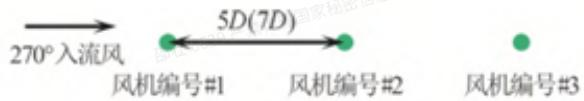

<details>
<summary>text_image</summary>

270°入流风
5D(7D)
风机编号#1	风机编号#2	风机编号#3
</details>

• Numerical Simulation Results for Three-Turbine Inline Case (Power in MW):

<table><tr><td></td><td colspan="4">Power at 5d0 spacing</td><td colspan="4">Power at 7d0 spacing</td></tr><tr><td>Turbine Number</td><td>1</td><td>2</td><td>3</td><td>Total</td><td>1</td><td>2</td><td>3</td><td>Total</td></tr><tr><td>CFD Output Power</td><td>5.067</td><td>2.116</td><td>1.892</td><td>9.075</td><td>5.067</td><td>2.559</td><td>2.338</td><td>9.964</td></tr></table>

# 3.1.1.2 Large Wind Farm Case

This configuration represents a large-scale wind farm with the following characteristics:

• 35 wind turbines arranged in a grid pattern   
. Longitudinal spacing of 4.3d0 and lateral spacing of 3.3d0   
Incoming wind speed of 11.4 m/s (rated speed)   
• Layout: 7 columns aligned with wind direction, each column containing 5 turbines   
• Schematics:

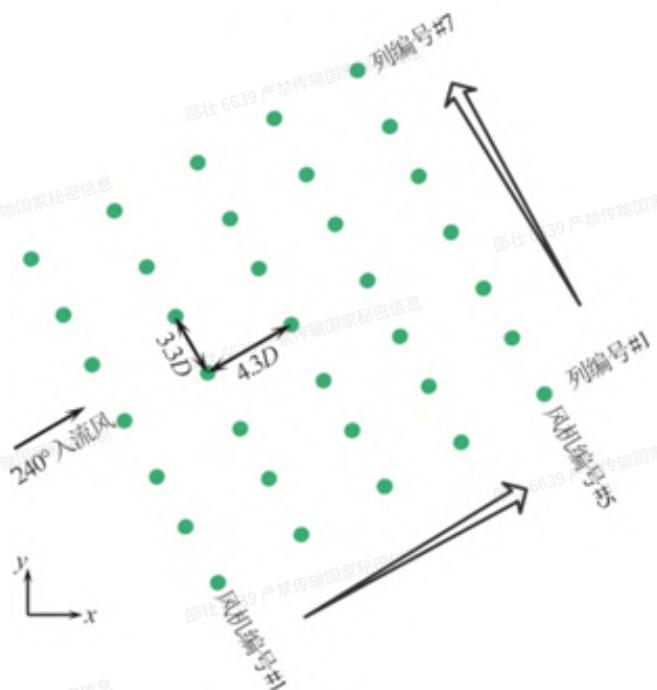

<details>
<summary>text_image</summary>

240°入流风
y
x
风机编号#1
3.3D
4.3D
列编号#7
部壮6639严禁传输国家秘密信息
部壮6639严禁传输国家秘密信息
列编号#1
风机编号#5
部壮6639严禁传输国家秘密信息
部壮6639严禁传输国家秘密信息
</details>

• Numerical Simulation Results for Large Wind Farm Case (Power in MW)

<table><tr><td></td><td>1</td><td>2</td><td>3</td><td>4</td><td>5</td><td>6</td><td>7</td><td>Total</td></tr><tr><td>Column Number</td><td></td><td></td><td></td><td></td><td></td><td></td><td></td><td></td></tr><tr><td>CFD Output Power</td><td>12.623</td><td>12.842</td><td>12.735</td><td>12.162</td><td>13.088</td><td>13.664</td><td>13.055</td><td>90.169</td></tr></table>

# 3.1.1.3 Two-Turbine Inline Yaw Case

This configuration specifically examines the effects of yaw angle on wake characteristics, a focal point of our research and the foundation for subsequent cooperative yaw control optimization:

• Two turbines arranged inline with a spacing of $5 d _ { 0 }$   
• Coordinates:

```python
1 turbine_positions_2t = [(0, 0, z_h), (5 * d_0, 0, z_h)] 
```

. Upstream turbine yaw angle γ ranges from $0 ^ { \circ }$ to $5 0 ^ { \circ }$   
• Schematics:

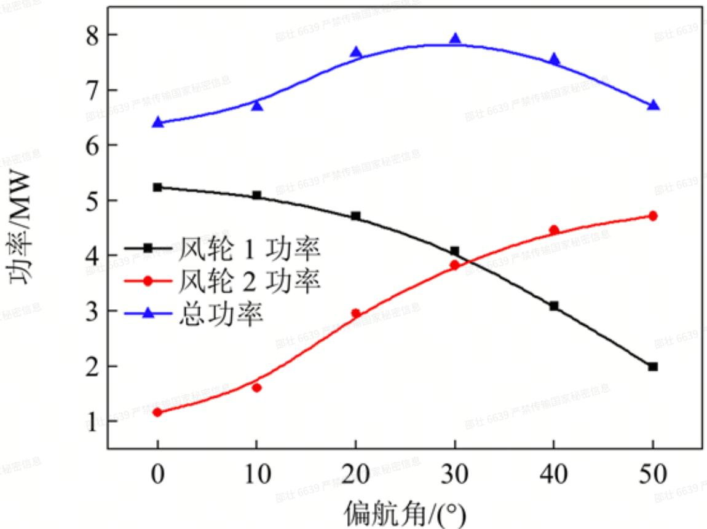

<details>
<summary>line</summary>

| 偏航角/(°) | 风轮 1 功率 (MW) | 风轮 2 功率 (MW) | 总功率 (MW) |
| ---------- | ----------------- | ----------------- | ----------- |
| 0          | 5.2               | 1.2               | 6.5         |
| 10         | 5.1               | 1.6               | 6.8         |
| 20         | 4.7               | 2.9               | 7.7         |
| 30         | 4.1               | 3.9               | 8.0         |
| 40         | 3.1               | 4.5               | 7.5         |
| 50         | 2.0               | 4.7               | 6.8         |
</details>

The numerical simulation results revealed the following trends:

Power of the upstream turbine (Turbine 1) gradually decreases with increasing yaw angle   
• Power of the downstream turbine (Turbine 2) gradually increases with increasing yaw angle

• Total power initially increases and then decreases, reaching a maximum value of 7.91 MW at a yaw angle of 30°

The original dataset provided power curves for Turbine 1, Turbine 2, and total power across yaw angles from 0° to 50°. Our research objective was to match the trend of the total power curve to identify the optimal yaw angle (the inflection point where the curve rises then falls). Since Turbine 1 is the upstream turbine experiencing natural wind, and the total power curve trend is primarily influenced by Turbine 2, we focused our optimization conditions on Turbine 2's power output.

The model's yaw angle input was set to range from 0° to 50° with 1° increments. However, the original dataset only provided five data points for Turbine 2's power output:

gamma\_points = [0, 10, 20, 30, 40, 50]1   
power\_points = [1.1, 1.6, 2.99, 3.9, 4.4, 4.8]。2

To generate a continuous curve for comparative analysis, we performed both linear and nonlinear interpolation on these discrete points.

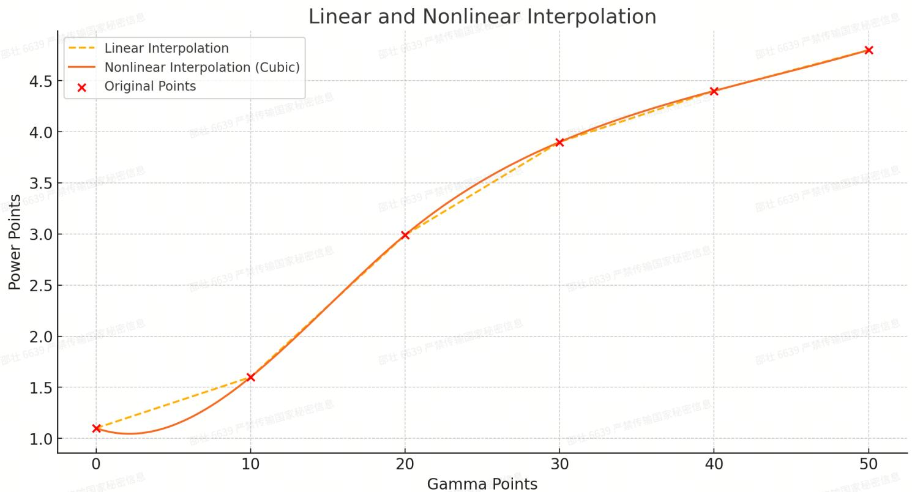

<details>
<summary>line</summary>

| Gamma Points | Linear Interpolation | Nonlinear Interpolation (Cubic) | Original Points |
| ------------ | -------------------- | ------------------------------- | --------------- |
| 0            | 1.1                  | 1.1                             | 1.1             |
| 10           | 1.6                  | 1.6                             | 1.6             |
| 20           | 3.0                  | 3.0                             | 3.0             |
| 30           | 3.9                  | 3.9                             | 3.9             |
| 40           | 4.4                  | 4.4                             | 4.4             |
| 50           | 4.8                  | 4.8                             | 4.8             |
</details>

The non-linear interpolation provided a better match to the actual trend of the original data curve. Therefore, the optimization condition was set to the non-linearly interpolated power output data of Turbine 2 across the range of 0° to 50° with 1° increments.

# 3.1.1.4 Optimization Results Analysis

The optimized model yielded the following prediction results across the three test cases: 

<table><tr><td>Three-Turbine Inline Case(Yaw angle  $\gamma = 0$ )</td><td>Large Wind Farm Case(Yaw angle  $\gamma = 0$ )</td><td>Two-Turbine Inline Yaw Case</td></tr><tr><td>For  $5d_0$  spacing:Turbine 1 power: 5.29 MWTurbine 2 power: 2.08 MWTurbine 3 power: 1.88 MWTotal power: 9.25 MW</td><td rowspan="2">Column 1 total power: 11.5684 MWColumn 2 total power: 11.5684 MWColumn 3 total power: 11.5684 MWColumn 4 total power: 11.5684 MWColumn 5 total power: 11.5684 MWColumn 6 total power: 11.5684 MWColumn 7 total power: 11.5684 MWTotal farm power: 80.97 MW</td><td rowspan="2">Observed trend: As the upstream turbine&#x27;s yaw angle increases, its power gradually decreases while the downstream turbine&#x27;s power increases. The total power initially increases and then decreases.At the optimal yaw angle of 30°:Turbine 1 power: 4.04 MWTurbine 2 power: 3.78 MWTotal power: 7.82 MW</td></tr><tr><td>For  $7d_0$  spacing:Turbine 1 power: 5.29 MWTurbine 2 power: 2.90 MWTurbine 3 power: 2.75 MWTotal power: 10.94 MW</td></tr></table>

Comparing the optimized model predictions with the numerical simulation results revealed the following performance metrics:

<table><tr><td colspan="7">Comparison of Model Prediction Results for Three-Turbine Inline Case</td></tr><tr><td></td><td>Turbine Number</td><td>CFD (MW)</td><td>Pre- optimization Model (MW)</td><td>Error (%)</td><td>Optimized Model (MW)</td><td>Error (%)</td></tr><tr><td rowspan="4">5d0 spacing Output Power</td><td>1</td><td>5.067</td><td>5.29</td><td>4.40</td><td>5.29</td><td>4.40</td></tr><tr><td>2</td><td>2.116</td><td>2.08</td><td>1.70</td><td>2.08</td><td>1.70</td></tr><tr><td>3</td><td>1.892</td><td>1.88</td><td>0.63</td><td>1.88</td><td>0.63</td></tr><tr><td>Total</td><td>9.075</td><td>9.25</td><td>1.93</td><td>9.25</td><td>1.93</td></tr><tr><td></td><td>1</td><td>5.067</td><td>5.29</td><td>4.40</td><td>5.29</td><td>4.40</td></tr><tr><td rowspan="3">7d0 spacing Output Power</td><td>2</td><td>2.559</td><td>2.89</td><td>12.93</td><td>2.90</td><td>13.33</td></tr><tr><td>3</td><td>2.338</td><td>2.74</td><td>17.19</td><td>2.75</td><td>17.62</td></tr><tr><td>Total</td><td>9.964</td><td>10.83</td><td>9.59</td><td>10.94</td><td>9.80</td></tr></table>

<table><tr><td colspan="6">Comparison of Model Prediction Results for Large Wind Farm Case</td></tr><tr><td>Column</td><td>CFD (MW)</td><td>Pre-optimization Model (MW)</td><td>Error (%)</td><td>Optimized Model (MW)</td><td>Error (%)</td></tr><tr><td>1</td><td>12.623</td><td>11.5674</td><td>8.36</td><td>11.5684</td><td>8.35</td></tr><tr><td>2</td><td>12.842</td><td>11.5674</td><td>9.93</td><td>11.5684</td><td>9.92</td></tr><tr><td>3</td><td>12.735</td><td>11.5674</td><td>9.17</td><td>11.5684</td><td>9.16</td></tr><tr><td>4</td><td>12.162</td><td>11.5674</td><td>4.89</td><td>11.5684</td><td>4.88</td></tr><tr><td>5</td><td>13.088</td><td>11.5674</td><td>11.62</td><td>11.5684</td><td>11.61</td></tr><tr><td>6</td><td>13.664</td><td>11.5674</td><td>15.34</td><td>11.5684</td><td>15.34</td></tr><tr><td>7</td><td>13.055</td><td>11.5674</td><td>11.39</td><td>11.5684</td><td>11.39</td></tr><tr><td>Total</td><td>90.169</td><td>80.97</td><td>10.20</td><td>80.98</td><td>10.19</td></tr></table>

<table><tr><td colspan="6">Comparison of Model Prediction Results for Two-Turbine Inline Yaw Case</td></tr><tr><td></td><td>Optimalyaw angle</td><td>Turbine1 power(MW)</td><td>Turbine2 power(MW)</td><td>Totalpower(MW)</td><td>Trend</td></tr><tr><td>NumericalSimulation</td><td>30°</td><td>~4.1</td><td>~3.81</td><td>7.91</td><td>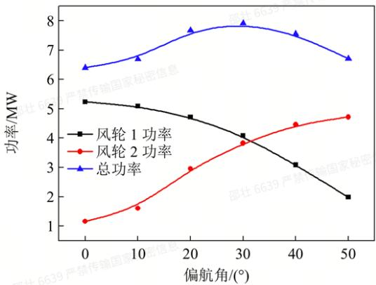</td></tr><tr><td>Pre-optimizationModel</td><td>30°</td><td>4.04</td><td>4.40</td><td>8.44</td><td></td></tr><tr><td></td><td></td><td></td><td></td><td></td><td>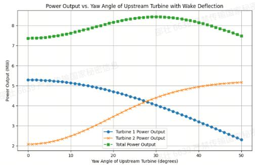</td></tr><tr><td>Error (%)</td><td>/</td><td>1.46</td><td>15.49</td><td>6.70</td><td>/</td></tr><tr><td>Optimized Model</td><td>30°</td><td>4.04</td><td>3.78</td><td>7.82</td><td>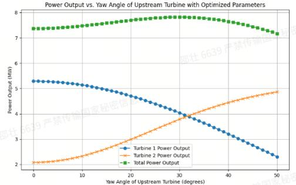</td></tr><tr><td>Eroor (%)</td><td>/</td><td>1.46</td><td>0.79</td><td>1.14</td><td>/</td></tr></table>

Analysis of these results reveals several important insights:

1. In the three-turbine inline case with $5 d _ { 0 }$ spacing, the optimized model maintains a low error of 1.93% in total power prediction compared to CFD results. The prediction accuracy for both pre-optimization and post-optimization models is similar, indicating that the optimized parameters provide stable predictions across different wind speeds and inline spacing conditions.   
2. In the large wind farm case, the optimized model provides more accurate predictions for large-scale configurations, with an overall error around 10%, showing a slight improvement over the pre-optimization model. The power predictions for individual turbines, particularly those in the second and third positions, more closely match the CFD simulation results after optimization.   
3. In the two-turbine inline yaw case, the optimized model shows a significant reduction in prediction error, especially for the downstream turbine power (error reduced from 15.49% to 0.79%) and for the total power output at the optimal yaw angle (error reduced from 6.70% to 1.14%).   
4. The optimization process employed different weightings for each dataset:

◦ Three-turbine inline case (spacing $5 d _ { 0 }$ and $7 d _ { 0 }$ ): weight of 0.2   
Large wind farm case: weight of 0.2   
◦ Two-turbine inline yaw case: weight of 0.6

5. This weighting scheme reflects the relative importance of different wind farm models and application scenarios. The two-turbine inline yaw case was given the highest weight (0.6) to maximize its influence on the overall optimization results. The results clearly demonstrate improved accuracy for this scenario, confirming that the optimization approach can be flexibly adjusted according to the specific needs of different wind farm types to achieve optimal prediction accuracy.

Overall, compared to the pre-optimization model, the optimized model shows improved prediction accuracy across multiple datasets, with particularly significant improvements for the two-turbine inline yaw case. The optimization not only enhances prediction accuracy but also effectively balances model performance across different scenarios, increasing its application value in wind farm planning and improving its adaptability and accuracy for various wind farm layouts and turbine configurations.

# 3.1.2 Horns Rev Offshore Wind Farm Validation

After developing and optimizing the complex wake and yaw angle wind farm model, we needed to validate its accuracy and applicability using a real-world case. This section presents a simulation analysis of the Horns Rev offshore wind farm using our optimized model parameters, comparing the results with other models to verify its performance.

Horns Rev offshore wind farm is located in the North Sea, approximately 15 kilometers west of Denmark, covering an area of about 20 square kilometers. It consists of 80 Vestas V-80 wind turbines, each with a rotor diameter of $d _ { 0 } = 8 0 m$ , hub height of $z _ { h } = 7 0 m$ (above sea level), and a total rated power of 160 MW.

The wind farm has a diamond-shaped structure with turbines arranged in 8 columns (east-west direction) and 10 rows (rotated approximately 7° counterclockwise from the north-south direction). The spacing between turbines is uniform, with a minimum distance of 7 rotor diameters between any two adjacent turbines.

The specified inflow conditions for our analysis were:

• Sea surface aerodynamic roughness: $z _ { 0 } = 0 . 0 0 0 2 m$   
Turbulence intensity at hub height: $I = 7 . 7$   
Average wind speed at the same height: $U _ { \infty } = 8 m / s$   
• Schematics:

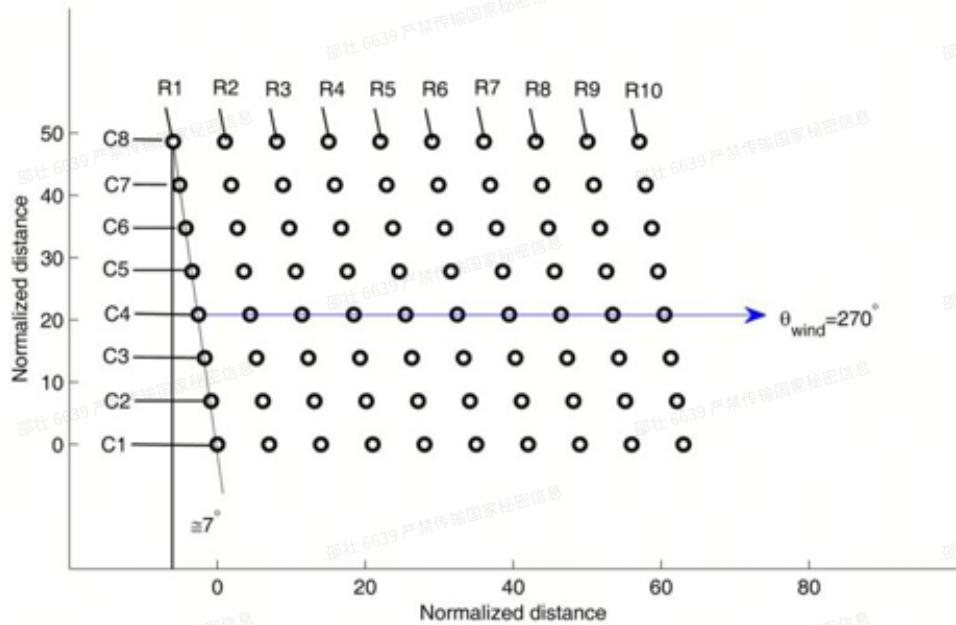

<details>
<summary>scatter</summary>

| Category | Normalized distance |
| -------- | ------------------- |
| C8       | 50                  |
| C7       | 40                  |
| C6       | 35                  |
| C5       | 30                  |
| C4       | 20                  |
| C3       | 10                  |
| C2       | 5                   |
| C1       | 0                   |
</details>

# 3.1.2.1 Wind Speed-Power Characteristic Curve Analysis

To analyze the wind farm model performance, we incorporated the standard power characteristic curves of the turbines as input data.

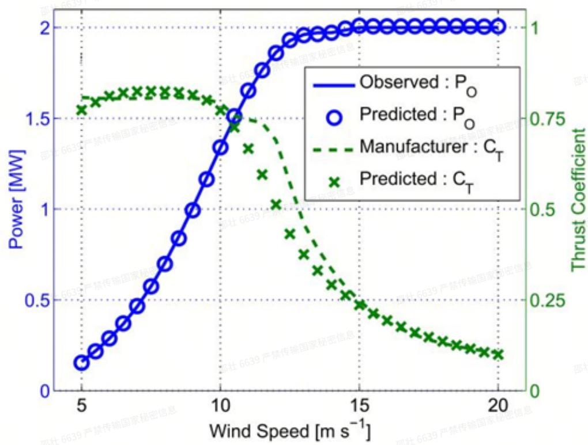

<details>
<summary>bar_line</summary>

| Wind Speed [m s⁻¹] | Observed : P_O | Predicted : P_O | Manufacturer : C_T | Predicted : C_T |
| ------------------ | -------------- | --------------- | ------------------ | --------------- |
| 5                  | 0.1            | 0.1             | 0.75               | 0.75            |
| 6                  | 0.2            | 0.2             | 0.75               | 0.75            |
| 7                  | 0.3            | 0.3             | 0.75               | 0.75            |
| 8                  | 0.4            | 0.4             | 0.75               | 0.75            |
| 9                  | 0.5            | 0.5             | 0.75               | 0.75            |
| 10                 | 0.6            | 0.6             | 0.75               | 0.75            |
| 11                 | 0.7            | 0.7             | 0.7                | 0.7             |
| 12                 | 0.8            | 0.8             | 0.6                | 0.6             |
| 13                 | 0.9            | 0.9             | 0.5                | 0.5             |
| 14                 | 1.0            | 1.0             | 0.4                | 0.4             |
| 15                 | 1.1            | 1.1             | 0.3                | 0.3             |
| 16                 | 1.2            | 1.2             | 0.2                | 0.2             |
| 17                 | 1.3            | 1.3             | 0.1                | 0.1             |
| 18                 | 1.4            | 1.4             | 0.0                | 0.0             |
| 19                 | 1.5            | 1.5             | -0.1               | -0.1            |
| 20                 | 1.6            | 1.6             | -0.2               | -0.2            |
</details>

We manually extracted data points from the manufacturer-provided wind speed- $C _ { T }$ curve and wind speed-power output curve, then used interpolation to derive functions. This allowed us to incorporate the Vestas V-80 turbine's wind speed- $C _ { T }$ function into the model.

The relationship between wind speed and $C _ { P }$ was converted using the formula: $C _ { P } = \frac { P } { \frac { 1 } { 2 } \rho S u ^ { 3 } }$ . ρS u 1 3

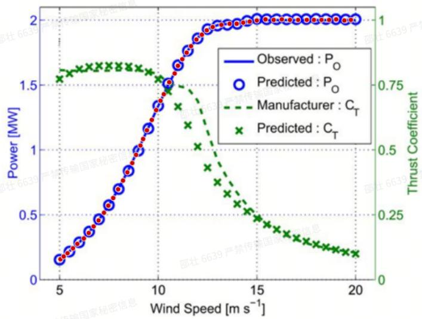

<details>
<summary>line</summary>

| Wind Speed [m s⁻¹] | Observed : P₀ | Predicted : P₀ | Manufacturer : Cₜ | Predicted : Cₜ |
| ------------------ | ------------- | -------------- | ----------------- | -------------- |
| 5                  | 0.1           | 0.1            | 0.75              | 0.75           |
| 6                  | 0.3           | 0.3            | 0.75              | 0.75           |
| 7                  | 0.5           | 0.5            | 0.75              | 0.75           |
| 8                  | 0.7           | 0.7            | 0.75              | 0.75           |
| 9                  | 0.9           | 0.9            | 0.75              | 0.75           |
| 10                 | 1.1           | 1.1            | 0.75              | 0.75           |
| 11                 | 1.3           | 1.3            | 0.75              | 0.75           |
| 12                 | 1.5           | 1.5            | 0.75              | 0.75           |
| 13                 | 1.7           | 1.7            | 0.75              | 0.75           |
| 14                 | 1.9           | 1.9            | 0.75              | 0.75           |
| 15                 | 2.0           | 2.0            | 0.75              | 0.75           |
| 16                 | 2.0           | 2.0            | 0.75              | 0.75           |
| 17                 | 2.0           | 2.0            | 0.75              | 0.75           |
| 18                 | 2.0           | 2.0            | 0.75              | 0.75           |
| 19                 | 2.0           | 2.0            | 0.75              | 0.75           |
| 20                 | 2.0           | 2.0            | 0.75              | 0.75           |
</details>

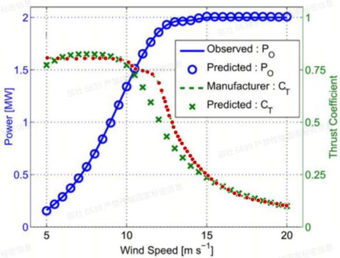

<details>
<summary>line</summary>

| Wind Speed [m s⁻¹] | Observed: P₀ | Predicted: P₀ | Manufacturer: Cₜ | Predicted: Cₜ |
| ------------------ | ------------ | ------------- | ----------------- | -------------- |
| 5                  | 0.1          | 0.1           | 0.75              | 0.75           |
| 10                 | 1.5          | 1.5           | 0.75              | 0.75           |
| 15                 | 2.0          | 2.0           | 0.25              | 0.25           |
| 20                 | 2.0          | 2.0           | 0.1               | 0.1            |
</details>

The resulting wind speed-power curve generated by our model showed excellent agreement with the manufacturer-provided curve, confirming the accuracy of our basic power prediction model.

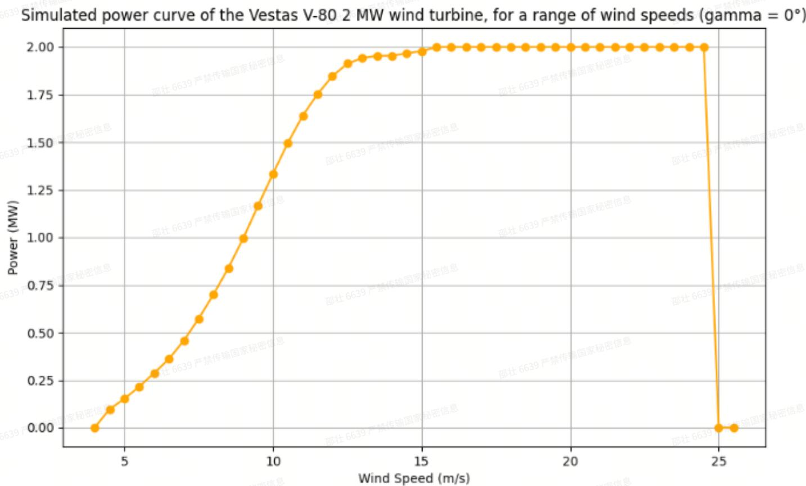

<details>
<summary>line</summary>

| Wind Speed (m/s) | Power (MW) |
|---|---|
| 3.5 | 0.00 |
| 4.0 | 0.10 |
| 4.5 | 0.15 |
| 5.0 | 0.20 |
| 5.5 | 0.25 |
| 6.0 | 0.30 |
| 6.5 | 0.35 |
| 7.0 | 0.40 |
| 7.5 | 0.45 |
| 8.0 | 0.50 |
| 8.5 | 0.55 |
| 9.0 | 0.60 |
| 9.5 | 0.65 |
| 10.0 | 0.70 |
| 10.5 | 0.75 |
| 11.0 | 0.80 |
| 11.5 | 0.85 |
| 12.0 | 0.90 |
| 12.5 | 0.95 |
| 13.0 | 1.00 |
| 13.5 | 1.05 |
| 14.0 | 1.10 |
| 14.5 | 1.15 |
| 15.0 | 1.20 |
| 15.5 | 1.25 |
| 16.0 | 1.30 |
| 16.5 | 1.35 |
| 17.0 | 1.40 |
| 17.5 | 1.45 |
| 18.0 | 1.50 |
| 18.5 | 1.55 |
| 19.0 | 1.60 |
| 19.5 | 1.65 |
| 20.0 | 1.70 |
| 20.5 | 1.75 |
| 21.0 | 1.80 |
| 21.5 | 1.85 |
| 22.0 | 1.90 |
| 22.5 | 1.95 |
| 23.0 | 2.00 |
| 23.5 | 2.00 |
| 24.0 | 2.00 |
| 24.5 | 2.00 |
| 25.0 | 2.00 |
| 25.5 | 2.00 |
| 26.0 | 2.00 |
| 26.5 | 2.00 |
| 27.0 | 2.00 |
| 27.5 | 2.00 |
| 28.0 | 2.00 |
| 28.5 | 2.00 |
| 29.0 | 2.00 |
| 29.5 | 2.00 |
| 30.0 | 2.00 |
| 30.5 | 2.00 |
| 31.0 | 2.00 |
| 31.5 | 2.00 |
| 32.0 | 2.00 |
| 32.5 | 2.00 |
| 33.0 | 2.00 |
| 33.5 | 2.00 |
| 34.0 | 2.00 |
| 34.5 | 2.00 |
| 35.0 | 2.00 |
| 35.5 | 2.00 |
| 36.0 | 2.00 |
| 36.5 | 2.00 |
| 37.0 | 2.00 |
| 37.5 | 2.00 |
| 38.0 | 2.00 |
| 38.5 | 2.00 |
| 39.0 | 2.00 |
| 39.5 | 2.00 |
| 40.0 | 2.00 |
| 40.5 | 2.00 |
| 41.0 | 2.00 |
| 41.5 | 2.00 |
| 42.0 | 2.00 |
| 42.5 | 2.00 |
| 43.0 | 2.00 |
| 43.5 | 2.00 |
| 44.0 | 2.00 |
| 44.5 | 2.00 |
| 45.0 | 2.00 |
| 45.5 | 2.00 |
| 46.0 | 2.00 |
| 46.5 | 2.00 |
| 47.0 | 2.00 |
| 47.5 | 2.00 |
| 48.0 | 2.00 |
| 48.5 | 2.00 |
| 49.0 | 2.00 |
| 49.5 | 2.00 |
| 50.0 | 2.00 |
| 50.5 | 2.00 |
| 51.0 | 2.00 |
| 51.5 | 2.00 |
| 52.0 | 2.00 |
| 52.5 | 2.00 |
| 53.0 | 2.00 |
| 53.5 | 2.00 |
| 54.0 | 2.00 |
| 54.5 | 2.00 |
| 55.0 | 2.00 |
| 55.5 | 2.00 |
| 56.0 | 2.00 |
| 56.5 | 2.00 |
| 57.0 | 2.00 |
| 57.5 | 2.00 |
| 58.0 | 2.00 |
| 58.5 | 2.00 |
| 59.0 | 2.00 |
| 59.5 | 2.00 |
| 60.0 | 2.00 |
| 60.5 | 2.00 |
| 61.0 | 2.00 |
| 61.5 | 2.00 |
| 62.0 | 2.00 |
| 62.5 | 2.00 |
| 63.0 | 2.00 |
| 63.5 | -|
| -     | -|
| -     | -|
| -     | -|
| -     | -|
| -     | -|
| -     | -|
| -     | -|
| -     | -|
| -     | -|
| -     | -|
| -     | -|
| -     | -|
| -     | -|
| -     | -|
| -     | -|
| -     | -|
| -     | -|
|
| -     | -|
|
| -     | -|
|
| -     | -|
|
| -     | -|
|
| -     | -|
|
|
| -     | -|
|
|
| -     | -|
|
|
| -     | -|
|
|
| -     | -|
|
|
| -     | -|
|
|
| -     | -|
|
|
| -     | -|
|
|
| -     | -|
|
|
| -     | -|
|
|
| -     | -|
|
|
| -     | -|
|
|
| -     | -|
|
|
| ... (approximate values) for each wind speed range from approximately ±π/σ to ±π/σ are estimated based on the simulation data and the corresponding parameter values in the chart.
</details>

# 3.1.2.2 Wind Direction-Power Curve Analysis

To comprehensively evaluate the model's performance under both full wake and partial wake conditions, we used the optimized model to predict the power output of the Horns Rev wind farm under different wind directions (173° to 353°). We then compared our results with those from the analytical model proposed by Amin Niayifar and Fernando Porté-Agel, LES simulations, and uniform distribution model results. The specific process was as follows:

1. Wind farm direction coordinate transformation: Converting the initial wind farm layout coordinates to a wind direction coordinate system (note: this is a study of wind direction angle, without introducing yaw angle \$\gamma\$, i.e., \$\gamma=0\$), adjusting the relative positions of turbines upstream and downstream.   
2. Normalized power output: To more intuitively demonstrate the impact of wind direction angle on total wind farm power, the output power was normalized as the ratio of total wind farm power to the total power of an equal number of turbines operating independently under the same inflow conditions.   
3. For the uniform distribution model, the wake growth rate was set to a constant (spatially uniform) value of 0.04.

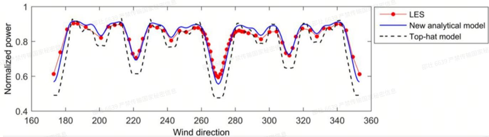

<details>
<summary>line</summary>

| Wind direction | LES   | New analytical model | Top-hat model |
| -------------- | ----- | -------------------- | ------------- |
| 160            | 0.62  | 0.58                 | 0.50          |
| 180            | 0.90  | 0.92                 | 0.90          |
| 200            | 0.82  | 0.85                 | 0.80          |
| 220            | 0.70  | 0.75                 | 0.65          |
| 240            | 0.85  | 0.88                 | 0.85          |
| 260            | 0.88  | 0.90                 | 0.90          |
| 280            | 0.85  | 0.88                 | 0.85          |
| 300            | 0.82  | 0.85                 | 0.80          |
| 320            | 0.75  | 0.78                 | 0.75          |
| 340            | 0.90  | 0.92                 | 0.90          |
| 360            | 0.62  | 0.58                 | 0.50          |
</details>

Figure 5. Distribution of the normalized Horns Rev wind farm power output obtained with the new analytical model and LES for different wind directions.

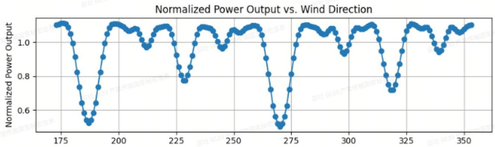

<details>
<summary>line</summary>

| Wind Direction | Normalized Power Output |
| -------------- | ------------------------ |
| 175            | 1.0                      |
| 180            | 0.9                      |
| 185            | 0.8                      |
| 190            | 0.7                      |
| 195            | 0.6                      |
| 200            | 0.5                      |
| 205            | 0.6                      |
| 210            | 0.7                      |
| 215            | 0.8                      |
| 220            | 0.9                      |
| 225            | 1.0                      |
| 230            | 0.8                      |
| 235            | 0.7                      |
| 240            | 0.6                      |
| 245            | 0.5                      |
| 250            | 0.6                      |
| 255            | 0.7                      |
| 260            | 0.8                      |
| 265            | 0.9                      |
| 270            | 1.0                      |
| 275            | 0.8                      |
| 280            | 0.7                      |
| 285            | 0.6                      |
| 290            | 0.5                      |
| 295            | 0.6                      |
| 300            | 0.7                      |
| 305            | 0.8                      |
| 310            | 0.9                      |
| 315            | 1.0                      |
| 320            | 0.8                      |
| 325            | 0.7                      |
| 330            | 0.6                      |
| 335            | 0.5                      |
| 340            | 0.6                      |
| 345            | 0.7                      |
| 350            | 0.8                      |
</details>

The comparative analysis shows that our optimized model's prediction results align well with other advanced models and LES simulation results. Under various wind direction angles, the model accurately captures trends in wind farm power output. Especially when the wind direction aligns with the wind farm's main axis (full wake condition), the model accurately predicts significant power decreases; when the wind direction forms a certain angle with the wind farm's main axis (partial wake condition), it also accurately reflects the relative recovery of power.

Compared to the uniform distribution model, our optimized model demonstrates higher accuracy in capturing wake losses, attributable to the model's consideration of turbulence intensity's effect on wake expansion and the Gaussian distribution characteristics of wakes.

Furthermore, compared to Niayifar and Porté-Agel's analytical model, our model with optimized parameters better adapts to the specific environmental conditions of the Horns Rev wind farm.

These validation results confirm that our developed complex wake and yaw angle wind farm model exhibits good applicability and prediction accuracy in actual offshore wind farm environments, providing a reliable foundation model for subsequent research on cooperative yaw control strategies for wind farms.